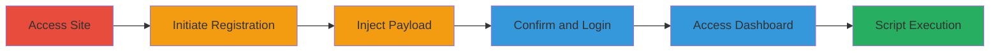

# Stored XSS in User Registration Full Name Field Leading to Persistent Script Execution

Multi-stage attack chain demonstrating a complete workflow for exploiting a stored XSS vulnerability in the 8x8 web application at https://www.easycontactnow.com/, where malicious JavaScript is injected into the full name field during registration and executes when the dashboard is accessed.

## Chain Metrics Dashboard

| Metric | Value |
|--------|-------|
| Chain Status | Unverified |
| Total Steps | 6 |
| Execution Time | ~5 minutes |
| Skill Level | Beginner |
| Complexity | Low |
| Impact Level | High |

## Attack Flow Visualization

## Prerequisites & Requirements

### Required Tools

- Web browser (e.g., Chrome, Firefox)

### Target Environment

- Web platform
- Access to https://www.easycontactnow.com/
- Valid email for registration confirmation

### Initial Access Requirements

- Public internet access
- No prior credentials needed

## Detailed Attack Procedures

### Step 1: Navigate to Target Website
procedure: [[procedures/Access-and-Register-on-Target-Site]]

**Objective**: Gain access to the registration form to begin the exploitation process.

**Instructions**: Open a web browser and navigate to the target URL.

**Expected Output**: Homepage loads, displaying the 'Try For Free' button.

**Success Indicators**:
- Site is accessible without errors
- Registration option is visible

### Step 2: Initiate Sign-Up Process
procedure: [[procedures/Access-and-Register-on-Target-Site]]

**Objective**: Start the user registration to reach the input form.

**Instructions**: Click the 'Try For Free' button on the homepage to open the registration form.

**Expected Output**: Form titled 'Enter your details to get started' appears.

**Success Indicators**:
- Registration form loads
- Fields for full name, email, etc., are present

### Step 3: Enter Malicious Payload in Full Name Field
procedure: [[procedures/Inject-Stored-XSS-Payload-in-Full-Name]]

**Objective**: Inject a JavaScript payload into the unsanitized full name field to store malicious code in the backend.

**Instructions**: In the full name field, enter the payload `'>` and fill other required fields with legitimate data (e.g., valid email and password). Submit the form.

**Expected Output**: Registration completes, and a confirmation email is sent.

**Success Indicators**:
- Form submits without validation errors
- Email confirmation received

### Step 4: Confirm Email and Log In
procedure: [[procedures/Access-and-Register-on-Target-Site]]

**Objective**: Complete registration and gain authenticated access to trigger the stored payload.

**Instructions**: Check the email inbox for the confirmation link, click it to verify, then log in using the provided credentials.

**Expected Output**: Successful login redirects to the dashboard.

**Success Indicators**:
- Account is activated
- Login succeeds without issues

### Step 5: Access the Dashboard
procedure: [[procedures/Trigger-and-Verify-XSS-Execution]]

**Objective**: Load the page where the stored full name is rendered to execute the injected script.

**Instructions**: After login, navigate to the dashboard or any section displaying the user's full name.

**Expected Output**: Dashboard loads, and the injected name appears in the UI.

**Success Indicators**:
- User profile or dashboard displays the full name
- No immediate errors on page load

### Step 6: Observe Script Execution
procedure: [[procedures/Trigger-and-Verify-XSS-Execution]]

**Objective**: Confirm the XSS vulnerability by observing the payload execution.

**Instructions**: Monitor the browser for the alert box triggered by the script.

**Expected Output**: An alert box with '1' pops up, confirming JavaScript execution.

**Success Indicators**:
- Alert dialog appears
- Browser console shows script execution (if dev tools open)

## Attack Chain Summary

### Key Achievements

1. Successful injection of persistent JavaScript via unsanitized input
2. Storage of malicious code in the backend database
3. Execution of the payload in the victim's browser context upon dashboard access

## Technique & Tactic Coverage

### MITRE ATT&CK Techniques

- [[JavaScript]]

### MITRE ATT&CK Tactics

- [[Execution]]
- [[Collection]]

---
*Last updated: 2024-01-01T00:00:00Z*
