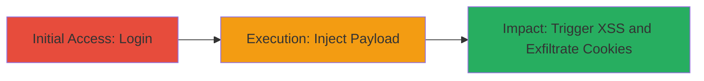

---
tags:
  - xss
  - stored-xss
  - cookie-theft
  - web
type: attack_chain
tools: []
tactics:
  - '[[Execution]]'
  - '[[Collection]]'
commands: []
platforms:
  - Web
complexity: medium
procedures:
  - '[[procedures/Login-to-OWOX-Finance-Application]]'
  - '[[procedures/Inject-XSS-Payload-into-Username-Field]]'
  - '[[procedures/Trigger-Stored-XSS-on-Account-List-Page]]'
step_count: 3
techniques:
  - '[[JavaScript]]'
description: >-
  A multi-step attack exploiting a stored XSS vulnerability in the username
  field of the OWOX Finance account creation feature to execute JavaScript and
  steal user cookies.
skill_level: intermediate
impact_level: high
id: 77eb0711-65e3-4c59-9711-6f7b813bc7c7
created_at: '2025-12-14T03:47:18.453Z'
updated_at: '2025-12-14T03:47:18.453Z'
verified: false
validated: true
submitted: true
mitre_tactics:
  - '[[Execution]]'
  - '[[Collection]]'
mitre_techniques:
  - '[[JavaScript]]'
---
# Stored XSS in Username Field Leading to Cookie Theft on OWOX Finance

## Overview

This attack chain demonstrates a stored cross-site scripting (XSS) vulnerability in the OWOX Finance application at finance.owox.com. An attacker authenticates to the platform, injects a malicious JavaScript payload into the username field during account creation, and then triggers the payload execution when any user views the account list page. This leads to arbitrary JavaScript execution in the victim's browser, enabling cookie theft, session hijacking, or other client-side attacks. The vulnerability stems from improper escaping of HTML entities and quotes in the stored username, allowing the payload to render and execute unescaped.

## Chain Metrics Dashboard

| Metric | Value |
|--------|-------|
| Chain Status | Unverified |
| Total Steps | 3 |
| Execution Time | ~5 minutes |
| Skill Level | Intermediate |
| Complexity | Medium |
| Impact Level | High |

## Attack Flow Visualization

## Prerequisites & Requirements

### Required Tools

- Web browser (e.g., Chrome, Firefox)

### Target Environment

- Web platform: finance.owox.com
- Required services/ports: HTTPS on port 443
- Network access requirements: Internet access to the target domain

### Initial Access Requirements

- Valid credentials for the OWOX Finance application (attacker must have an account or use stolen credentials)
- Network position: External, no internal access needed
- Prior access needed: None beyond authentication

## Detailed Attack Procedures

### Step 1: Initial Access
procedure: [[procedures/Login-to-OWOX-Finance-Application]]

**Objective**: Authenticate to the OWOX Finance application to access customer features required for account management.

**Instructions**: Open a web browser and navigate to the login page of finance.owox.com. Enter valid credentials to log in, establishing a session for subsequent actions.

**Expected Output**: Successful login redirect to the customer dashboard, with session cookies set in the browser.

**Success Indicators**:
- Dashboard loads without errors
- Account menu or customer features are accessible

### Step 2: Execution
procedure: [[procedures/Inject-XSS-Payload-into-Username-Field]]

**Objective**: Create a new account with a malicious XSS payload in the username field, storing the unescaped script on the server.

**Instructions**: From the authenticated session, navigate to the account addition page and submit a form with the payload "> in the username field. Complete any other required fields and submit the form.

**Expected Output**: Account creation success message, with the new account added to the system without visible errors.

**Success Indicators**:
- New account appears in the list (if immediately visible)
- No server-side validation errors on payload submission

### Step 3: Impact
procedure: [[procedures/Trigger-Stored-XSS-on-Account-List-Page]]

**Objective**: View the account list to render the stored payload, executing JavaScript in the browser and demonstrating cookie theft.

**Instructions**: Navigate to the account list page, where the username from the injected account is rendered. The payload executes automatically, alerting the document cookies or performing other actions like exfiltrating data to an attacker-controlled server.

**Expected Output**: JavaScript alert box displaying cookie contents, or network request to external endpoint with stolen data.

**Success Indicators**:
- Alert pops up with session cookies
- Browser console shows script execution errors or network logs confirm exfiltration

## Attack Chain Summary

### Key Achievements

1. Successful authentication and access to account management features
2. Storage of unescaped XSS payload in the database via username field
3. Execution of arbitrary JavaScript on any user viewing the account list, enabling data theft

## Technique & Tactic Coverage

### MITRE ATT&CK Techniques

- [[JavaScript]]

### MITRE ATT&CK Tactics

- [[Execution]]
- [[Collection]]

---
*Last updated: 2023-10-01*
