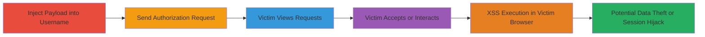

---
tags:
  - xss
  - stored-xss
  - web-vulnerability
  - authorization-bypass
type: attack_chain
tools: []
tactics:
  - '[[Execution]]'
verified: false
platforms:
  - Web
submitted: true
complexity: medium
created_at: '2023-10-01T00:00:00Z'
procedures:
  - '[[procedures/Inject-XSS-Payload-into-Username]]'
  - '[[procedures/Send-Authorization-Request-to-Victim]]'
  - '[[procedures/Victim-Views-Authorization-Requests-Page]]'
  - '[[procedures/Victim-Accepts-Request-Triggering-XSS]]'
  - '[[procedures/Victim-Cancels-Authorization-Triggering-XSS]]'
  - '[[procedures/Victim-Views-Easypay-Section-Triggering-XSS]]'
step_count: 6
techniques:
  - '[[JavaScript]]'
updated_at: '2025-12-14T03:15:35.748Z'
description: >-
  A multi-stage attack exploiting stored XSS in the username field of the Mobile
  Vikings web application, where the payload executes in the victim's browser
  during authorization request handling.
skill_level: intermediate
impact_level: high
id: 2f7b114c-90e9-4d73-944f-dcba463a72e0
validated: true
mitre_tactics:
  - '[[Execution]]'
mitre_techniques:
  - '[[JavaScript]]'
---
# Stored XSS in Username Triggering Execution in Victim's Browser via Authorization Interactions

Multi-stage attack chain demonstrating a complete stored XSS workflow in the Mobile Vikings web application, where an attacker injects a malicious script into their username, which is stored unsanitized and reflected back to victims during authorization interactions, leading to arbitrary JavaScript execution in the victim's browser.

## Chain Metrics Dashboard

| Metric | Value |
|--------|-------|
| Chain Status | Unverified |
| Total Steps | 6 |
| Execution Time | ~5 minutes |
| Skill Level | Intermediate |
| Complexity | Medium |
| Impact Level | High |

## Attack Flow Visualization

## Prerequisites & Requirements

### Required Tools

- Web browser (e.g., Chrome with developer tools for payload testing)

### Target Environment

- Web platform: Mobile Vikings application (https://mobilevikings.com)
- Required services/ports: HTTPS on port 443
- Network access requirements: Internet access to the target site

### Initial Access Requirements

- Attacker account on Mobile Vikings
- Victim's email address for sending authorization requests
- No prior victim access needed; relies on social engineering via email notification

## Detailed Attack Procedures

### Step 1: Inject XSS Payload into Username
procedure: [[procedures/Inject-XSS-Payload-into-Username]]

**Objective**: Store a malicious JavaScript payload in the attacker's username field without sanitization, setting up the stored XSS.

**Instructions**: Log in to the attacker's account, navigate to account settings, and update the username to include the payload, such as `name`.

**Expected Output**: Username updated successfully; payload stored in backend without encoding.

**Success Indicators**:
- Username change confirmation
- Payload visible in account profile without execution (indicating storage)

### Step 2: Send Authorization Request to Victim
procedure: [[procedures/Send-Authorization-Request-to-Victim]]

**Objective**: Initiate an authorization request to the victim, embedding the malicious username for later reflection.

**Instructions**: From the attacker's account, locate the authorization or sharing feature and send a request to the victim's username or email (User B).

**Expected Output**: Request sent; victim receives email notification with link to requests page.

**Success Indicators**:
- Confirmation of request dispatch
- Victim email delivery (if accessible)

### Step 3: Victim Views Authorization Requests Page
procedure: [[procedures/Victim-Views-Authorization-Requests-Page]]

**Objective**: Lure the victim to the requests page where the unsanitized username is reflected.

**Instructions**: Victim clicks the email link or navigates manually to https://mobilevikings.com/account/requests/ to view pending requests.

**Expected Output**: Page loads displaying the attacker's username, potentially setting up for further interaction.

**Success Indicators**:
- Page loads without errors
- Attacker's username visible in the interface

### Step 4: Victim Accepts Request Triggering XSS
procedure: [[procedures/Victim-Accepts-Request-Triggering-XSS]]

**Objective**: Trigger the XSS payload execution via the x:confirm parameter during acceptance.

**Instructions**: On the requests page, victim clicks 'Accept' on the authorization request, causing the unsanitized username to be reflected and the script to execute.

**Expected Output**: Alert or payload executes in victim's browser (e.g., alert(1) popup).

**Success Indicators**:
- JavaScript alert or console error indicating execution
- Potential cookie access or DOM manipulation

### Step 5: Victim Cancels Authorization Triggering XSS
procedure: [[procedures/Victim-Cancels-Authorization-Triggering-XSS]]

**Objective**: Exploit an additional reflection point during authorization cancellation.

**Instructions**: Victim navigates to https://mobilevikings.be/en/account/authorization/overview/ and clicks 'Cancel my authorization', reflecting the username and firing the XSS.

**Expected Output**: Payload executes upon cancellation action.

**Success Indicators**:
- XSS trigger on cancel button interaction
- Repeated execution if multiple interactions occur

### Step 6: Victim Views Easypay Section Triggering XSS
procedure: [[procedures/Victim-Views-Easypay-Section-Triggering-XSS]]

**Objective**: Trigger XSS in the easypay display section using username and easy payment name fields.

**Instructions**: Victim visits https://mobilevikings.be/en/account/requests/#easypay, where the unsanitized fields are displayed, executing the payload.

**Expected Output**: Multiple XSS firings in the easypay context.

**Success Indicators**:
- Payload execution in the specific section
- Increased attack surface exposure

## Attack Chain Summary

### Key Achievements

1. Successful storage of XSS payload in username without sanitization
2. Reflection and execution in victim's browser across multiple interaction points
3. Potential for session hijacking, data theft, or phishing escalation

## Technique & Tactic Coverage

### MITRE ATT&CK Techniques

- [[JavaScript]]

### MITRE ATT&CK Tactics

- [[Execution]]

---
*Last updated: 2023-10-01T00:00:00Z*
