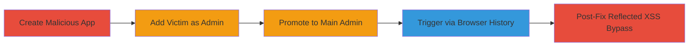

---
tags:
  - xss
  - stored-xss
  - reflected-xss
  - javascript-injection
  - browser-history
  - vk.com
type: attack_chain
tools: []
tactics:
  - '[[Initial Access]]'
  - '[[Collection]]'
verified: false
platforms:
  - Web
submitted: true
complexity: medium
created_at: '2023-10-01T00:00:00Z'
procedures:
  - '[[procedures/Create-Malicious-VK-App-with-XSS-Payload]]'
  - '[[procedures/Add-Victim-as-App-Administrator]]'
  - '[[procedures/Promote-Victim-to-Main-Administrator]]'
  - '[[procedures/Trigger-Stored-XSS-via-Browser-History]]'
  - '[[procedures/Exploit-Post-Fix-Reflected-XSS-in-URL-Parameter]]'
step_count: 5
techniques:
  - '[[Drive-by Compromise]]'
  - '[[JavaScript]]'
updated_at: '2025-12-14T03:16:14.156Z'
description: >-
  A multi-stage attack exploiting a stored XSS vulnerability in VK.com's
  developer application name field, allowing JavaScript injection that executes
  when victims access the Login widget page through browser navigation, with a
  follow-up reflected XSS bypass post-fix.
skill_level: intermediate
impact_level: high
id: 6c43d405-5f41-4e48-898c-ee18192cd17e
validated: true
mitre_tactics:
  - '[[Initial Access]]'
  - '[[Collection]]'
mitre_techniques:
  - '[[Drive-by Compromise]]'
  - '[[JavaScript]]'
---
# Stored XSS in VK.com App Name Leading to Arbitrary JavaScript Execution via Browser History

Multi-stage attack chain demonstrating a complete attack workflow exploiting insufficient sanitization in VK.com's application naming for stored XSS, enabling client-side JavaScript execution on victim browsers, potentially leading to session hijacking or data theft. The attack relies on social engineering to make victims admins of a malicious app, with execution triggered via browser back navigation. Post-fix, a reflected XSS in the URL parameter allows direct payload delivery through encoded bypasses.

## Chain Metrics Dashboard

| Metric | Value |
|--------|-------|
| Chain Status | Unverified |
| Total Steps | 5 |
| Execution Time | ~10 minutes |
| Skill Level | Intermediate |
| Complexity | Medium |
| Impact Level | High |

## Attack Flow Visualization

## Prerequisites & Requirements

### Required Tools

- Web browser for app creation and navigation
- VK.com developer account

### Target Environment

- VK.com platform (Web)
- PHP-based backend
- Access to VK app management interface

### Initial Access Requirements

- Attacker must have a VK.com account with developer privileges
- Victim must be a VK user who can be added as app admin (social engineering required)
- No special network access beyond internet connectivity

## Detailed Attack Procedures

### Step 1: Create Malicious App
procedure: [[procedures/Create-Malicious-VK-App-with-XSS-Payload]]

**Objective**: Set up an application with a JavaScript payload in the name field to store the XSS.

**Instructions**: Log into VK.com developer console, create a new app for the Login widget, and set the name to a payload like `javascript:alert(1);//`.

**Expected Output**: App created successfully with the malicious name stored.

**Success Indicators**:
- App appears in developer dashboard with injected name
- No immediate errors during creation

### Step 2: Add Victim as Admin
procedure: [[procedures/Add-Victim-as-App-Administrator]]

**Objective**: Grant the victim access to the app settings where the XSS will trigger.

**Instructions**: In the app management interface, invite or assign the target user as an admin.

**Expected Output**: Victim receives invitation and can access app admin features.

**Success Indicators**:
- Victim listed as admin in app settings
- Invitation accepted by victim

### Step 3: Promote to Main Admin
procedure: [[procedures/Promote-Victim-to-Main-Administrator]]

**Objective**: Elevate victim's role to ensure they become the primary viewer of the injected payload.

**Instructions**: In app settings, promote the victim to chief admin role.

**Expected Output**: Victim's role updated to main admin.

**Success Indicators**:
- Victim's admin status shows as chief in the interface
- Victim can manage app without restrictions

### Step 4: Trigger Stored XSS
procedure: [[procedures/Trigger-Stored-XSS-via-Browser-History]]

**Objective**: Cause the payload to execute in the victim's browser upon page access.

**Instructions**: Have the victim visit another site, then use the browser back button to navigate to https://vk.com/dev/Login, where the app name payload executes.

**Expected Output**: JavaScript alert or arbitrary code runs in victim's browser.

**Success Indicators**:
- Payload executes (e.g., alert pops up)
- Potential cookie theft or other client-side actions succeed

### Step 5: Exploit Post-Fix Reflected XSS
procedure: [[procedures/Exploit-Post-Fix-Reflected-XSS-in-URL-Parameter]]

**Objective**: Bypass the fix by exploiting the reflected XSS in the URL parameter.

**Instructions**: Craft and send URLs like https://vk.com/dev.php?aid=6216706&method=Login&url=javas%03cript%3Aalert(1)%3B// or variants with newline (%0a) or other encodings.

**Expected Output**: Immediate JS execution upon URL visit.

**Success Indicators**:
- Payload triggers without storage
- Bypasses any basic sanitization

## Attack Chain Summary

### Key Achievements

1. Stored XSS injection via app name for persistent payload
2. Social engineering trigger via admin promotion and browser history
3. Reflected XSS bypass post-fix using encoding techniques
4. Arbitrary JS execution enabling session theft
5. Demonstration of client-side attack impact on VK.com developers

## Technique & Tactic Coverage

### MITRE ATT&CK Techniques

- [[Drive-by Compromise]]
- [[JavaScript]]

### MITRE ATT&CK Tactics

- [[Initial Access]]
- [[Collection]]

---

*Last updated: 2023-10-01T00:00:00Z*
