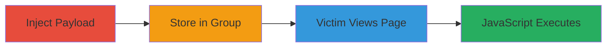

# Stored XSS in VK.com Group App Deletion Box for JavaScript Execution on Group Pages

Multi-stage attack chain demonstrating exploitation of a stored XSS vulnerability in VK.com groups, allowing arbitrary JavaScript execution when users view affected group pages.

## Chain Metrics Dashboard

| Metric | Value |
|--------|-------|
| Chain Status | Unverified |
| Total Steps | 2 |
| Execution Time | ~5 minutes |
| Skill Level | Intermediate |
| Complexity | Medium |
| Impact Level | High |

## Attack Flow Visualization

## Prerequisites & Requirements

### Required Tools

- Browser developer tools for payload testing
- Access to a VK.com account with group administration privileges

### Target Environment

- VK.com web platform
- Group pages with app management features
- No specific ports or services beyond standard HTTPS (443)

### Initial Access Requirements

- Valid VK.com user account
- Membership or admin rights in a target group
- Network access to vk.com (no VPN or proxy required unless restricted)

## Detailed Attack Procedures

### Step 1: Payload Injection and Storage
procedure: [[procedures/Inject-Malicious-Script-into-VK-Group-App-Deletion-Box]]

**Objective**: Identify the vulnerable app deletion box in a VK group and inject a malicious JavaScript payload that gets stored without proper sanitization.

**Instructions**: Log in to VK.com with an account that has group admin privileges. Navigate to the group's app management section and locate the app deletion input field. Craft a payload such as `` or a more advanced one like ``. Enter the payload into the deletion box and submit to store it.

**Expected Output**: The payload is saved in the group without execution at injection time, but persists in the group's data.

**Success Indicators**:
- Payload appears in the group app deletion interface without errors
- No immediate sanitization or stripping observed

### Step 2: Trigger Execution on Page View
procedure: [[procedures/Trigger-XSS-on-Group-Page-View]]

**Objective**: Cause the stored payload to execute when other users (including admins or members) load the affected group page, potentially stealing session data or performing other malicious actions.

**Instructions**: Share the group link with victims or wait for natural views. When a user accesses the group page, the unsanitized content from the app deletion box renders, executing the JavaScript in the browser context of the viewer.

**Expected Output**: JavaScript alert or data exfiltration to attacker-controlled server upon page load.

**Success Indicators**:
- Alert box appears or network request to attacker server is observed in dev tools
- Victim's cookies or session data captured

## Attack Chain Summary

### Key Achievements

1. Successful storage of malicious script in VK group app deletion box
2. Arbitrary JavaScript execution in the context of group page viewers
3. Potential for session hijacking, data theft, or further phishing attacks on group members

## Technique & Tactic Coverage

### MITRE ATT&CK Techniques

- [[JavaScript]]
- [[Exploit Public-Facing Application]]

### MITRE ATT&CK Tactics

- [[Execution]]
- [[Collection]]

---
*Last updated: 2023-10-01T00:00:00Z*
