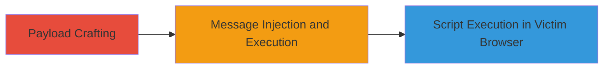

---
tags:
  - xss
  - stored-xss
  - web-vulnerability
  - session-hijacking
type: attack_chain
tools: []
tactics:
  - '[[Execution]]'
verified: false
platforms:
  - Web
submitted: true
complexity: medium
created_at: '2023-10-01T00:00:00Z'
procedures:
  - '[[procedures/Inject-Malicious-META-Tags-for-Stored-XSS-in-VK-Messages]]'
step_count: 1
techniques:
  - '[[JavaScript]]'
updated_at: '2025-12-13T23:52:55.546Z'
description: >-
  A stored cross-site scripting attack exploiting insufficient filtering of META
  tags in VK.com's message previews, allowing persistent script injection for
  session hijacking.
skill_level: intermediate
impact_level: medium
id: 0c165314-0363-4ef2-bab0-2acda7d454cb
validated: true
mitre_tactics:
  - '[[Execution]]'
mitre_techniques:
  - '[[JavaScript]]'
---
# Stored XSS in VK.com Personal Messages via META Tag Injection

Multi-stage attack chain demonstrating a complete attack workflow exploiting a stored XSS vulnerability in VK.com's instant messenger service.

## Chain Metrics Dashboard

| Metric | Value |
|--------|-------|
| Chain Status | Unverified |
| Total Steps | 1 |
| Execution Time | ~5 minutes |
| Skill Level | Intermediate |
| Complexity | Medium |
| Impact Level | Medium |

## Attack Flow Visualization

## Prerequisites & Requirements

### Required Tools

- None specific; uses standard web development tools like a text editor and browser.

### Target Environment

- VK.com web platform
- Instant messenger service (personal messages)
- Web browser for crafting and testing payloads

### Initial Access Requirements

- Attacker must have a VK.com account to send messages
- Victim must be a contact or receive the message
- No special credentials beyond standard user access

## Detailed Attack Procedures

### Step 1: Exploit Stored XSS via META Tag Injection
procedure: [[procedures/Inject-Malicious-META-Tags-for-Stored-XSS-in-VK-Messages]]

**Objective**: Inject a malicious script into a message preview by manipulating META tags on a controlled webpage, causing the script to execute in the victim's browser when they view the message.

**Instructions**: Create a malicious webpage with injected META tags containing JavaScript, then share its URL in a VK.com private message. When the victim views the message, VK.com generates a preview from the META tags without proper sanitization, executing the script.

**Expected Output**: The victim's browser executes the injected JavaScript, potentially alerting, stealing cookies, or hijacking the session.

**Success Indicators**:
- Message sent successfully with the malicious link
- Victim views the message and the script triggers (e.g., console log or alert)
- Evidence of session data exfiltration if payload includes it

## Attack Chain Summary

### Key Achievements

1. Persistent script injection via unfiltered META tags in message previews
2. Execution of arbitrary JavaScript in the victim's authenticated session
3. Potential for session hijacking or data theft without direct interaction

## Technique & Tactic Coverage

### MITRE ATT&CK Techniques

- [[JavaScript]]

### MITRE ATT&CK Tactics

- [[Execution]]

---
*Last updated: 2023-10-01T00:00:00Z*
