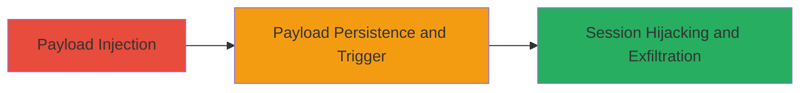

---
tags:
  - xss
  - stored-xss
  - session-hijacking
  - web
type: attack_chain
tools: []
tactics:
  - '[[Execution]]'
  - '[[Collection]]'
verified: false
platforms:
  - Web
submitted: true
complexity: medium
created_at: '2023-10-01T00:00:00Z'
procedures:
  - '[[procedures/Inject-Stored-XSS-Payload-in-Video-Selection]]'
  - '[[procedures/Trigger-XSS-for-Session-Hijacking]]'
step_count: 2
techniques:
  - '[[JavaScript]]'
updated_at: '2025-12-14T03:15:53.386Z'
description: >-
  A multi-stage attack exploiting a stored XSS vulnerability in VK.com's video
  selection feature to inject malicious JavaScript, leading to session theft and
  unauthorized actions on behalf of victims.
skill_level: intermediate
impact_level: high
id: 3d8b5e80-3e22-4578-aa31-e16359db9732
validated: true
mitre_tactics:
  - '[[Execution]]'
  - '[[Collection]]'
mitre_techniques:
  - '[[JavaScript]]'
---
# Stored XSS in VK.com Video Selection for Session Hijacking

Multi-stage attack chain demonstrating exploitation of a stored XSS vulnerability in VK.com's al_video.php?act=a_choose_video_box endpoint to inject and trigger malicious JavaScript, enabling session hijacking and data theft from authenticated users.

## Chain Metrics Dashboard

| Metric | Value |
|--------|-------|
| Chain Status | Unverified |
| Total Steps | 2 |
| Execution Time | ~5 minutes |
| Skill Level | Intermediate |
| Complexity | Medium |
| Impact Level | High |

## Attack Flow Visualization

## Prerequisites & Requirements

### Required Tools

- Browser with developer tools (e.g., Chrome DevTools)
- Optional: Proxy tool like Burp Suite for payload crafting

### Target Environment

- VK.com platform (web application)
- PHP-based backend
- Authenticated access to video upload/selection feature

### Initial Access Requirements

- Valid VK.com account credentials
- Network access to https://vk.com
- No prior elevated privileges needed

## Detailed Attack Procedures

### Step 1: Payload Injection
procedure: [[procedures/Inject-Stored-XSS-Payload-in-Video-Selection]]

**Objective**: Inject a malicious JavaScript payload into the video selection input field, exploiting insufficient sanitization to store the script persistently.

**Instructions**: Log in to VK.com with a test account. Navigate to the video upload or selection interface at al_video.php?act=a_choose_video_box. In the user input field for video details (e.g., title or description), append a script tag with a payload that captures session data, such as ``. Submit the video selection to store the payload.

**Expected Output**: The payload is stored without sanitization and appears in the video box interface for the attacker.

**Success Indicators**:
- Payload reflected in the stored video data without escaping
- No immediate errors during submission

### Step 2: Trigger XSS for Session Hijacking
procedure: [[procedures/Trigger-XSS-for-Session-Hijacking]]

**Objective**: Cause the stored payload to execute in the context of other authenticated users viewing the affected video, leading to session cookie theft and potential account takeover.

**Instructions**: Share the manipulated video with other users or wait for victims to interact with the video selection box. When a victim views the video, the payload executes, sending their session cookies to the attacker's controlled server. Monitor the attacker's server for incoming requests containing stolen cookies, then use them to impersonate the victim.

**Expected Output**: HTTP requests to attacker's domain with victim session data (e.g., cookies).

**Success Indicators**:
- Execution of JS in victim's browser (observable via network logs)
- Receipt of stolen session tokens on attacker's endpoint
- Ability to perform actions as the victim using hijacked session

## Attack Chain Summary

### Key Achievements

1. Successful injection and storage of XSS payload in video selection feature
2. Triggering of payload execution across multiple user sessions
3. Achievement of session hijacking, enabling data theft and unauthorized platform actions

## Technique & Tactic Coverage

### MITRE ATT&CK Techniques

- [[JavaScript]]

### MITRE ATT&CK Tactics

- [[Execution]]
- [[Collection]]

---
*Last updated: 2023-10-01T00:00:00Z*
