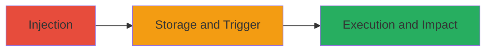

# Stored XSS in Veris Access Rules for Malicious Script Injection

Multi-stage attack chain demonstrating exploitation of a stored XSS vulnerability in the Veris application's Access Rules feature, allowing attackers to inject malicious scripts that execute when other users view the rules.

## Chain Metrics Dashboard

| Metric | Value |
|--------|-------|
| Chain Status | Unverified |
| Total Steps | 2 |
| Execution Time | ~5 minutes |
| Skill Level | Intermediate |
| Complexity | Medium |
| Impact Level | High |

## Attack Flow Visualization

## Prerequisites & Requirements

### Required Tools

- Browser developer tools for payload crafting
- Proxy tool like Burp Suite (optional for interception)

### Target Environment

- Veris web application
- Access to user account with permission to edit Access Rules
- Web platform with JavaScript enabled

### Initial Access Requirements

- Valid user credentials for Veris
- Network access to the Veris application
- No prior elevated access needed, but authenticated session required

## Detailed Attack Procedures

### Step 1: Inject Malicious Payload
procedure: [[procedures/Inject-Stored-XSS-in-Access-Rules]]

**Objective**: Submit a malicious JavaScript payload to the Access Rules feature, where it is stored without proper sanitization.

**Instructions**: Authenticate to the Veris application and navigate to the Access Rules editing interface. Craft a payload such as `` or more advanced like ``. Submit the rule with the payload in a field like rule description or name.

**Expected Output**: The payload is saved in the database and appears in the Access Rules list without escaping.

**Success Indicators**:
- Payload visible in the rules list when viewed by the injector
- No immediate errors on submission

### Step 2: Trigger Execution on Victim View
procedure: [[procedures/Trigger-XSS-Execution-on-View]]

**Objective**: Have a victim user view the affected Access Rules, causing the stored script to execute in their browser context.

**Instructions**: Share the Access Rules view with another user or wait for administrative/authorized users to access the rules page. The payload executes automatically upon rendering.

**Expected Output**: JavaScript runs in the victim's browser, potentially alerting, stealing cookies, or performing other actions.

**Success Indicators**:
- Alert or network request to attacker's server observed
- Session hijacking or data exfiltration confirmed

## Attack Chain Summary

### Key Achievements

1. Successful injection of persistent malicious script into Access Rules
2. Execution of arbitrary JavaScript in victim browsers
3. Potential for session hijacking, data theft, or phishing attacks

## Technique & Tactic Coverage

### MITRE ATT&CK Techniques

- [[JavaScript]]

### MITRE ATT&CK Tactics

- [[Execution]]

---
*Last updated: 2023-10-01T00:00:00Z*
