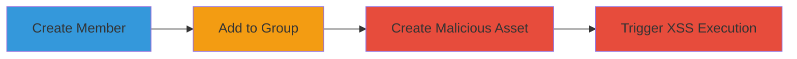

---
tags:
  - xss
  - stored-xss
  - web-vulnerability
  - javascript-execution
type: attack_chain
tools: []
tactics:
  - '[[Execution]]'
verified: false
platforms:
  - Web
submitted: true
complexity: medium
created_at: '2023-10-01T00:00:00Z'
procedures:
  - '[[procedures/Create-Member-in-Veris]]'
  - '[[procedures/Add-Member-to-Group-in-Veris]]'
  - '[[procedures/Create-Malicious-Asset-in-Veris]]'
  - '[[procedures/Trigger-Stored-XSS-in-Members-View]]'
step_count: 4
techniques:
  - '[[JavaScript]]'
updated_at: '2025-12-14T03:15:31.481Z'
description: >-
  A multi-step attack exploiting a stored XSS vulnerability in the Veris web
  application's asset name field, allowing arbitrary JavaScript execution when
  viewing associated member details.
skill_level: intermediate
impact_level: high
id: 66ade7f5-d78b-458e-8b7b-2a9dad0fb619
validated: true
mitre_tactics:
  - '[[Execution]]'
mitre_techniques:
  - '[[JavaScript]]'
---
# Stored XSS in Veris Asset Name via Member and Group Association

Multi-stage attack chain demonstrating a complete stored XSS exploitation workflow in the Veris web application.

## Chain Metrics Dashboard

| Metric | Value |
|--------|-------|
| Chain Status | Unverified |
| Total Steps | 4 |
| Execution Time | ~5 minutes |
| Skill Level | Intermediate |
| Complexity | Medium |
| Impact Level | High |

## Attack Flow Visualization

## Prerequisites & Requirements

### Required Tools

- Web browser (e.g., Chrome with developer tools for payload testing)

### Target Environment

- Veris web application (sandbox.veris.in/portal)
- Authenticated access to member, group, and asset management sections
- No specific services/ports beyond standard HTTPS (443)

### Initial Access Requirements

- Valid user credentials for the Veris portal
- Network access to https://sandbox.veris.in
- No prior access needed beyond login

## Detailed Attack Procedures

### Step 1: Create a Member
procedure: [[procedures/Create-Member-in-Veris]]

**Objective**: Establish a test member account to associate with groups and assets for the XSS payload delivery.

**Instructions**: Navigate to the members creation page and fill in basic details to create a new member account. No special payloads are needed here; use standard input.

- Access https://sandbox.veris.in/portal/members/
- Click 'Create Member' or equivalent button
- Enter name, email, and other required fields (e.g., 'Test Member', 'test@example.com')
- Submit the form to create the account

**Expected Output**: Confirmation of member creation, with the new member listed on the members page.

**Success Indicators**:
- New member appears in the members list
- Member ID or details are visible for reference

### Step 2: Add the Member to a Group
procedure: [[procedures/Add-Member-to-Group-in-Veris]]

**Objective**: Link the created member to an existing group, enabling asset association that will trigger the XSS in the members view.

**Instructions**: Go to the groups management page, select an existing group, and add the newly created member.

- Navigate to https://sandbox.veris.in/portal/groups/
- Select any existing group (e.g., 'Default Group')
- Click 'Add Member' or similar
- Search for and select the created member (e.g., 'Test Member')
- Save the changes

**Expected Output**: Member successfully added to the group, visible in the group's member list.

**Success Indicators**:
- Member shows as part of the group
- No errors during addition

### Step 3: Create an Asset with Malicious Payload
procedure: [[procedures/Create-Malicious-Asset-in-Veris]]

**Objective**: Store a malicious JavaScript payload in the asset name field, which will be persisted and later rendered unsanitized.

**Instructions**: Access the assets creation page and input the XSS payload directly into the asset name field.

- Go to https://sandbox.veris.in/portal/assets/
- Click 'Create Asset'
- In the 'Name' field, enter: ``
- Fill other fields minimally (e.g., description: 'Test Asset', associate with the member/group if prompted)
- Submit to create the asset

**Expected Output**: Asset created successfully, listed on the assets page without immediate execution.

**Success Indicators**:
- Asset appears in the assets list with the payload in the name
- No sanitization errors during creation

### Step 4: Trigger the XSS by Viewing Members and Clicking the Symbol
procedure: [[procedures/Trigger-Stored-XSS-in-Members-View]]

**Objective**: Render the malicious asset name in the members view, executing the JavaScript payload in the victim's browser context.

**Instructions**: Return to the members page and interact with the affected member's details to load the unsanitized asset information.

- Navigate back to https://sandbox.veris.in/portal/members/
- Locate the created member (e.g., 'Test Member')
- Click on the symbol or icon next to the member (likely an asset/group indicator, as shown in report screenshots)
- Observe the payload execution

**Expected Output**: JavaScript alert popup displaying '1', confirming XSS execution.

**Success Indicators**:
- Alert box appears with the payload message
- Browser console shows JavaScript execution errors or logs if enhanced payload used

## Attack Chain Summary

### Key Achievements

1. Successful storage of XSS payload in asset name without detection
2. Association of payload via member-group-asset chain to reach victim view
3. Arbitrary JavaScript execution in authenticated user sessions
4. Potential for session hijacking or data exfiltration in real scenarios

## Technique & Tactic Coverage

### MITRE ATT&CK Techniques

- [[JavaScript]]

### MITRE ATT&CK Tactics

- [[Execution]]

---
*Last updated: 2023-10-01T00:00:00Z*
