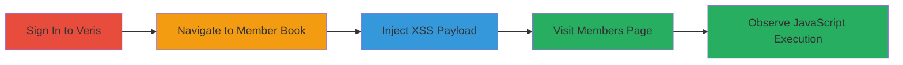

# Stored XSS in Veris Member Book for Arbitrary JavaScript Execution

Multi-stage attack chain demonstrating a complete attack workflow exploiting a stored XSS vulnerability in the Veris sandbox portal.

## Chain Metrics Dashboard

| Metric | Value |
|--------|-------|
| Chain Status | Unverified |
| Total Steps | 5 |
| Execution Time | ~5 minutes |
| Skill Level | Intermediate |
| Complexity | Medium |
| Impact Level | High |

## Attack Flow Visualization

## Prerequisites & Requirements

### Required Tools

- Web browser (e.g., Chrome, Firefox)

### Target Environment

- Veris sandbox portal at https://sandbox.veris.in/portal/
- Web platform with JavaScript enabled

### Initial Access Requirements

- Valid Veris account credentials
- Direct network access to the Veris portal

## Detailed Attack Procedures

### Step 1: Authenticate to Veris Portal
procedure: [[procedures/Authenticate-to-Veris-Portal]]

**Objective**: Gain authenticated access to the Veris sandbox portal to interact with protected features like the Member Book.

**Instructions**: Open a web browser and navigate to the Veris login page. Enter valid credentials to sign in.

**Expected Output**: Successful login redirect to the portal dashboard.

**Success Indicators**:
- User is logged in and can access member-related pages
- No authentication errors

### Step 2: Navigate to Member Book and Add New Member
procedure: [[procedures/Navigate-to-Member-Book-and-Add-New-Member]]

**Objective**: Access the Member Book feature to prepare for payload injection.

**Instructions**: From the dashboard, navigate to the members section and select the option to add a new member.

**Expected Output**: Form for adding a new member loads, including Name and Description fields.

**Success Indicators**:
- Add new member form is visible
- Input fields for Name and Description are accessible

### Step 3: Inject XSS Payload into Name and Description
procedure: [[procedures/Inject-XSS-Payload-into-Name-and-Description]]

**Objective**: Store malicious JavaScript in the member data without sanitization.

**Instructions**: Enter the payload `<svg onload=alert(1)>` into both the Name and Description fields, then submit the form.

**Expected Output**: Member is added successfully without errors, payload stored in backend.

**Success Indicators**:
- Form submission succeeds
- New member appears in the list (without immediate execution)

### Step 4: Navigate to Members Page to Trigger XSS
procedure: [[procedures/Navigate-to-Members-Page-to-Trigger-XSS]]

**Objective**: Render the stored malicious data to trigger JavaScript execution.

**Instructions**: Return to the members page or access a related feature like adding members from groups.

**Expected Output**: Page loads with the injected content rendered in the browser.

**Success Indicators**:
- Members page loads without errors
- Injected content is displayed

### Step 5: Observe XSS Execution
procedure: [[procedures/Observe-XSS-Execution]]

**Objective**: Confirm arbitrary JavaScript execution and assess potential impact.

**Instructions**: Monitor the page for execution of the payload, such as an alert dialog.

**Expected Output**: Alert box with '1' appears, indicating successful XSS.

**Success Indicators**:
- JavaScript alert triggers
- Browser console shows execution (if inspected)

## Attack Chain Summary

### Key Achievements

1. Successful authentication and navigation to vulnerable feature
2. Injection and storage of unsanitized XSS payload
3. Triggering of stored XSS leading to JavaScript execution
4. Demonstration of potential for session hijacking or data theft

## Technique & Tactic Coverage

### MITRE ATT&CK Techniques

- [[JavaScript]]

### MITRE ATT&CK Tactics

- [[Execution]]

---
*Last updated: 2023-10-01T00:00:00Z*
