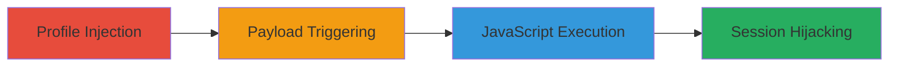

---
tags:
  - xss
  - stored-xss
  - flash
  - javascript-execution
  - session-hijacking
type: attack_chain
tools:
  - '[[tools/xss-swf-Malicious-Flash-File]]'
tactics:
  - '[[Execution]]'
  - '[[Collection]]'
verified: false
platforms:
  - Web
submitted: true
complexity: medium
created_at: '2023-10-01T00:00:00Z'
procedures:
  - '[[procedures/Inject-Malicious-Payload-into-Vimeo-User-Profile]]'
  - '[[procedures/Trigger-Stored-XSS-on-Vimeo-Hubnut-Pages]]'
step_count: 2
techniques:
  - '[[JavaScript]]'
  - '[[Drive-by Compromise]]'
updated_at: '2025-12-14T03:15:47.426Z'
description: >-
  A multi-stage attack exploiting a stored XSS vulnerability in Vimeo's Hubnut
  widget by injecting a malicious payload into the user's display name, which is
  rendered unescaped in a Flash file, leading to arbitrary JavaScript execution
  on vimeo.com and player.vimeo.com domains.
skill_level: intermediate
impact_level: high
id: 39a084b4-cbaf-4bea-a423-a3af31c353a5
validated: true
mitre_tactics:
  - '[[Execution]]'
  - '[[Collection]]'
mitre_techniques:
  - '[[JavaScript]]'
  - '[[Drive-by Compromise]]'
---
# Stored XSS in Vimeo Hubnut Widget via Flash File Injection

Multi-stage attack chain demonstrating a stored XSS vulnerability in Vimeo's Hubnut widget, where a malicious payload is injected into the user's display name and rendered without escaping in a Flash file (hubnut.swf), allowing the loading of an external SWF that executes arbitrary JavaScript when victims view the affected Hubnut page.

## Chain Metrics Dashboard

| Metric | Value |
|--------|-------|
| Chain Status | Unverified |
| Total Steps | 2 |
| Execution Time | ~5 minutes |
| Skill Level | Intermediate |
| Complexity | Medium |
| Impact Level | High |

## Attack Flow Visualization

## Prerequisites & Requirements

### Required Tools

- [[tools/xss-swf-Malicious-Flash-File]]

### Target Environment

- Web platform (Vimeo.com and player.vimeo.com)
- Access to a Vimeo account with profile editing permissions
- No specific services/ports required beyond standard HTTPS (443)
- Network access to external hosts for payload hosting (e.g., u00f1.xyz)

### Initial Access Requirements

- Valid Vimeo user credentials for profile modification
- No prior network position needed; attack relies on victim viewing the Hubnut page
- Host a malicious SWF file externally

## Detailed Attack Procedures

### Step 1: Inject Payload into User Profile
procedure: [[procedures/Inject-Malicious-Payload-into-Vimeo-User-Profile]]

**Objective**: Store a malicious HTML payload in the user's display name to be rendered unescaped in the Hubnut Flash widget.

**Instructions**: Log in to your Vimeo account, navigate to account settings, and update the display name with the payload ''. Save the changes to persist the injection in the profile.

**Expected Output**: Profile updated successfully; the payload is now stored and will be fetched when Hubnut pages load.

**Success Indicators**:
- Display name updated without errors
- Profile page reflects the injected payload in the HTML source

### Step 2: Trigger XSS on Hubnut Pages
procedure: [[procedures/Trigger-Stored-XSS-on-Vimeo-Hubnut-Pages]]

**Objective**: Visit the attacker's Hubnut page on both vimeo.com and player.vimeo.com to load the Flash file, which fetches and executes the external malicious SWF, running arbitrary JavaScript.

**Instructions**: Retrieve your Vimeo URL identifier from profile settings (e.g., 'user36690798'). Then, navigate to https://player.vimeo.com/hubnut/user/[identifier] and https://vimeo.com/hubnut/user/[identifier]. The Flash file at https://f.vimeocdn.com/p/flash/hubnut/2.0.11/hubnut.swf will render the injected  tag, loading the external SWF and executing JavaScript like alert(document.domain).

**Expected Output**: Alert box pops up displaying 'vimeo.com' or 'player.vimeo.com', confirming JavaScript execution.

**Success Indicators**:
- JavaScript alert triggered on page load
- Potential for cookie theft or session hijacking if payload is modified

## Attack Chain Summary

### Key Achievements

1. Successful injection of stored XSS payload into Vimeo user profile via display name.
2. Triggering of arbitrary JavaScript execution across two domains (vimeo.com and player.vimeo.com) via Flash rendering.
3. Demonstration of high-impact client-side attack potential, including session hijacking.

## Technique & Tactic Coverage

### MITRE ATT&CK Techniques

- [[JavaScript]]
- [[Drive-by Compromise]]

### MITRE ATT&CK Tactics

- [[Execution]]
- [[Collection]]

---

*Last updated: 2023-10-01T00:00:00Z*
