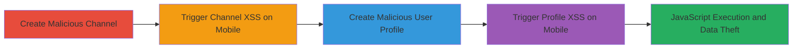

---
tags:
  - xss
  - stored-xss
  - vimeo
  - mobile-web
  - javascript-execution
type: attack_chain
tools: []
tactics:
  - '[[Execution]]'
verified: false
platforms:
  - Web
submitted: true
complexity: medium
created_at: '2023-10-01T00:00:00Z'
procedures:
  - '[[procedures/Create-Malicious-Channel-Name-for-Stored-XSS]]'
  - '[[procedures/Trigger-Channel-XSS-on-Mobile]]'
  - '[[procedures/Create-Malicious-User-Profile-for-Stored-XSS]]'
  - '[[procedures/Trigger-Profile-XSS-on-Mobile]]'
step_count: 4
techniques:
  - '[[JavaScript]]'
updated_at: '2025-12-14T03:16:20.712Z'
description: >-
  A multi-stage stored XSS attack exploiting unescaped user/channel names in
  Vimeo's mobile web version to execute JavaScript in victims' browsers.
skill_level: intermediate
impact_level: high
id: 9265f5e2-e667-45b3-a92f-b512903c6ba5
validated: true
mitre_tactics:
  - '[[Execution]]'
mitre_techniques:
  - '[[JavaScript]]'
---
# Stored XSS in Vimeo Mobile Follow Button via Malicious Channel and User Names

Multi-stage attack chain demonstrating a complete stored XSS workflow in Vimeo's mobile web interface, where attackers inject payloads into channel or user names to execute JavaScript when victims interact with or load affected pages.

## Chain Metrics Dashboard

| Metric | Value |
|--------|-------|
| Chain Status | Unverified |
| Total Steps | 4 |
| Execution Time | ~10 minutes |
| Skill Level | Intermediate |
| Complexity | Medium |
| Impact Level | High |

## Attack Flow Visualization

## Prerequisites & Requirements

### Required Tools

- Web browser (desktop for setup, mobile for exploitation)
- Vimeo account with channel creation privileges

### Target Environment

- Vimeo.com mobile web version
- No specific services/ports required beyond standard HTTPS (443)
- Internet access to vimeo.com

### Initial Access Requirements

- Valid Vimeo user account
- Ability to create channels and edit profile
- Victim must access affected pages on mobile browser

## Detailed Attack Procedures

### Step 1: Create Malicious Channel
procedure: [[procedures/Create-Malicious-Channel-Name-for-Stored-XSS]]

**Objective**: Inject a payload into a channel name to store malicious JavaScript that will be rendered unescaped in the mobile '+ Follow' button.

**Instructions**: Use a desktop browser to navigate to channel creation and input the payload.

**Expected Output**: Channel created with the malicious name, URL saved for later use.

**Success Indicators**:
- Channel URL generated (e.g., https://vimeo.com/channels/963609)
- Payload visible in channel name without errors

### Step 2: Trigger Channel XSS on Mobile
procedure: [[procedures/Trigger-Channel-XSS-on-Mobile]]

**Objective**: As a victim user, load the channel page on mobile to interact with the tainted '+ Follow' button, executing the injected JavaScript.

**Instructions**: Open the channel URL in a mobile browser with a different account and touch the button.

**Expected Output**: Alert box or script execution (e.g., alert(document.domain)).

**Success Indicators**:
- JavaScript executes on button touch
- Potential cookie theft or further actions

### Step 3: Create Malicious User Profile
procedure: [[procedures/Create-Malicious-User-Profile-for-Stored-XSS]]

**Objective**: Modify the user profile name with a payload that auto-executes on mobile profile page loads.

**Instructions**: Edit profile settings on desktop to insert the payload into the name field.

**Expected Output**: Profile updated, URL saved (e.g., https://vimeo.com/user36690798).

**Success Indicators**:
- Name change saved successfully
- Payload embedded in profile without sanitization

### Step 4: Trigger Profile XSS on Mobile
procedure: [[procedures/Trigger-Profile-XSS-on-Mobile]]

**Objective**: Load the profile page on mobile as a victim, causing automatic JavaScript execution without interaction.

**Instructions**: Visit the profile URL in mobile browser with another account.

**Expected Output**: Script loads and executes immediately (e.g., <script src=//u00f1.xyz>).

**Success Indicators**:
- Page loads with auto-execution
- Arbitrary code runs in victim's context

## Attack Chain Summary

### Key Achievements

1. Stored malicious payloads in channel and user names
2. Exploited mobile rendering flaws for JavaScript execution
3. Enabled client-side attacks like session hijacking without server compromise

## Technique & Tactic Coverage

### MITRE ATT&CK Techniques

- [[JavaScript]]

### MITRE ATT&CK Tactics

- [[Execution]]

---
*Last updated: 2023-10-01T00:00:00Z*
