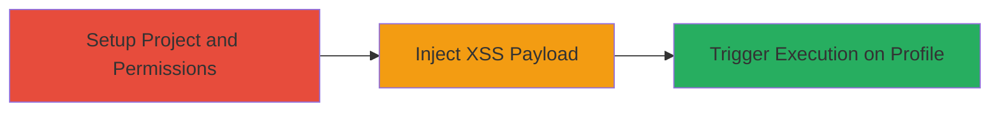

---
tags:
  - xss
  - stored-xss
  - weblate
  - django
type: attack_chain
tools:
  - '[[tools/Docker]]'
tactics:
  - '[[Execution]]'
verified: false
platforms:
  - Web
submitted: true
complexity: medium
created_at: '2023-10-01T00:00:00Z'
procedures:
  - '[[procedures/Setup-Weblate-Project-and-User-Permissions]]'
  - '[[procedures/Inject-XSS-Payload-into-Project-Name]]'
  - '[[procedures/Trigger-Stored-XSS-on-Profile-Page]]'
step_count: 3
techniques:
  - '[[JavaScript]]'
updated_at: '2025-12-14T03:46:37.366Z'
description: >-
  A multi-stage attack exploiting a stored XSS vulnerability in Weblate's
  project name field to execute arbitrary JavaScript on any user's profile page.
skill_level: intermediate
impact_level: high
id: 4ea2db11-c28d-44aa-9a8f-44f56cc07c12
validated: true
mitre_tactics:
  - '[[Execution]]'
mitre_techniques:
  - '[[JavaScript]]'
---
# Stored XSS in Weblate Project Name Leading to Arbitrary JavaScript Execution

Multi-stage attack chain demonstrating a complete attack workflow exploiting a stored XSS vulnerability in Weblate's project creation and management feature.

## Chain Metrics Dashboard

| Metric | Value |
|--------|-------|
| Chain Status | Unverified |
| Total Steps | 3 |
| Execution Time | ~5 minutes |
| Skill Level | Intermediate |
| Complexity | Medium |
| Impact Level | High |

## Attack Flow Visualization

## Prerequisites & Requirements

### Required Tools

- [[tools/Docker]]

### Target Environment

- Web application running Weblate (Python/Django-based)
- Access to a local or remote Weblate instance
- No specific ports required beyond standard HTTP/HTTPS (e.g., 80/443)

### Initial Access Requirements

- Authorized user account with project management permissions
- Administrator access for project creation (or equivalent privileges)
- Network access to the Weblate instance

## Detailed Attack Procedures

### Step 1: Setup Project and User Permissions
procedure: [[procedures/Setup-Weblate-Project-and-User-Permissions]]

**Objective**: Create a new project in Weblate and assign user permissions to enable subsequent injection by an authorized user.

**Instructions**: Access the Weblate admin interface to create a project and add a user with appropriate roles.

**Expected Output**: Project created successfully with user added to the project team.

**Success Indicators**:
- Project appears in the list of watched projects for the user
- User can access project management settings

### Step 2: Inject XSS Payload into Project Name
procedure: [[procedures/Inject-XSS-Payload-into-Project-Name]]

**Objective**: Inject a malicious JavaScript payload into the project name field, which is stored without sanitization.

**Instructions**: Log in as the authorized user, navigate to the project's settings, and update the project name with the XSS payload.

**Expected Output**: Project name updated successfully; no immediate errors.

**Success Indicators**:
- Payload saved in the project name without rejection
- No validation errors on form submission

### Step 3: Trigger Stored XSS on Profile Page
procedure: [[procedures/Trigger-Stored-XSS-on-Profile-Page]]

**Objective**: Visit the user profile page to trigger the stored payload, executing arbitrary JavaScript in the victim's browser.

**Instructions**: Navigate to the /accounts/profile/ endpoint as any user, including admins or those without project access.

**Expected Output**: JavaScript alert (or other payload effects) executes, such as alerting the document domain.

**Success Indicators**:
- Alert box pops up displaying the domain
- Arbitrary JS executes in the context of the profile page

## Attack Chain Summary

### Key Achievements

1. Bypassed input validation in project name to store malicious HTML/JS
2. Achieved execution of arbitrary JavaScript on any user's profile page
3. Demonstrated widespread impact across all application users

## Technique & Tactic Coverage

### MITRE ATT&CK Techniques

- [[JavaScript]]

### MITRE ATT&CK Tactics

- [[Execution]]

---
*Last updated: 2023-10-01T00:00:00Z*
