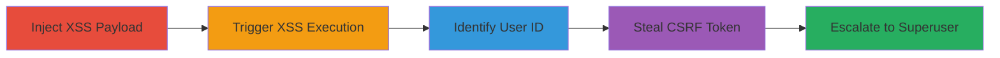

---
tags:
  - xss
  - stored-xss
  - privilege-escalation
  - csrf
  - django
  - weblate
type: attack_chain
tools:
  - '[[tools/payload-js]]'
tactics:
  - '[[Initial Access]]'
  - '[[Execution]]'
  - '[[Privilege Escalation]]'
verified: false
platforms:
  - Web
submitted: true
created_at: '2023-10-01T00:00:00Z'
procedures:
  - '[[procedures/Inject-XSS-Payload-into-Weblate-Project-Name]]'
  - '[[procedures/Trigger-Stored-XSS-on-Weblate-Engage-Page]]'
  - '[[procedures/List-Users-via-Weblate-Admin-Endpoint]]'
  - '[[procedures/Steal-CSRF-Token-from-Weblate-User-Change-Page]]'
  - '[[procedures/Escalate-Privileges-to-Superuser-via-Weblate-Admin-POST]]'
step_count: 5
techniques:
  - '[[JavaScript]]'
  - '[[Exploitation for Privilege Escalation]]'
  - '[[Exploit Public-Facing Application]]'
updated_at: '2025-12-14T03:16:20.259Z'
description: >-
  A multi-stage attack exploiting stored XSS in Weblate's project name field to
  execute JavaScript, steal CSRF tokens, and escalate privileges to superuser
  via automated admin requests.
id: be3b6641-8de9-4bea-beed-a43a59d1025e
validated: true
mitre_tactics:
  - '[[Initial Access]]'
  - '[[Execution]]'
  - '[[Privilege Escalation]]'
mitre_techniques:
  - '[[JavaScript]]'
  - '[[Exploitation for Privilege Escalation]]'
  - '[[Exploit Public-Facing Application]]'
---
# Stored XSS in Weblate Project Name Leading to Superuser Privilege Escalation

Multi-stage attack chain demonstrating a complete attack workflow exploiting a stored XSS vulnerability in Weblate's project name field to achieve superuser privilege escalation.

## Chain Metrics Dashboard

| Metric | Value |
|--------|-------|
| Chain Status | Unverified |
| Total Steps | 5 |
| Execution Time | ~5 minutes |
| Skill Level | Intermediate |
| Complexity | Medium |
| Impact Level | High |

## Attack Flow Visualization

## Prerequisites & Requirements

### Required Tools

- [[tools/payload-js]]

### Target Environment

- Web platform running Weblate (Python/Django-based translation management system)
- Required services/ports: HTTP/HTTPS on standard web ports (80/443)
- Network access requirements: Ability to create/edit projects and access engage pages

### Initial Access Requirements

- Authenticated access to Weblate as a regular user (project maintainer or admin)
- Network position: Direct access to the Weblate instance
- Prior access needed: Valid session for project modification

## Detailed Attack Procedures

### Step 1: Inject XSS Payload
procedure: [[procedures/Inject-XSS-Payload-into-Weblate-Project-Name]]

**Objective**: Introduce a stored XSS payload into the project name field to persist malicious script execution.

**Instructions**: Create or edit a project, setting the name to a payload that loads an external script, such as ``. This bypasses the 60-character limit by using an external source.

**Expected Output**: Project saved successfully with the injected name; no immediate errors.

**Success Indicators**:
- Project name updated in the admin interface
- No sanitization warnings displayed

### Step 2: Trigger Stored XSS Execution
procedure: [[procedures/Trigger-Stored-XSS-on-Weblate-Engage-Page]]

**Objective**: Render the vulnerable page to execute the injected script under the application's origin.

**Instructions**: Navigate to `/engage/<project_slug>`, where `<project_slug>` corresponds to the injected project. The unescaped project name will render the script tag, loading and executing `payload.js`.

**Expected Output**: External JavaScript loads and runs silently in the browser context.

**Success Indicators**:
- Network request to adversary domain observed in browser dev tools
- Console logs or alerts from payload.js (if added for testing)

### Step 3: Identify Attacker's User ID
procedure: [[procedures/List-Users-via-Weblate-Admin-Endpoint]]

**Objective**: Use the executed JavaScript to query the admin user list and extract the attacker's user ID for targeted escalation.

**Instructions**: From within `payload.js`, issue a GET request to `/admin/weblate_auth/user/` using `fetch` or XMLHttpRequest to retrieve the user list HTML and parse for the attacker's ID (e.g., ID 5).

**Expected Output**: HTML response containing user table with IDs.

**Success Indicators**:
- User ID successfully extracted and stored in script variables
- No authentication errors (runs in authenticated context)

### Step 4: Steal CSRF Token
procedure: [[procedures/Steal-CSRF-Token-from-Weblate-User-Change-Page]]

**Objective**: Fetch the user's change form to extract the Django CSRF token needed for protected POST requests.

**Instructions**: Using the identified ID, send a GET request from `payload.js` to `/admin/weblate_auth/user/<ID>/change/` and parse the response HTML for the `csrfmiddlewaretoken` value.

**Expected Output**: HTML form with embedded CSRF token.

**Success Indicators**:
- CSRF token value captured (e.g., a 64-character hex string)
- Token valid for immediate use in POST requests

### Step 5: Escalate to Superuser
procedure: [[procedures/Escalate-Privileges-to-Superuser-via-Weblate-Admin-POST]]

**Objective**: Submit a POST request to the user change endpoint using the stolen token to set `is_superuser` to true.

**Instructions**: From `payload.js`, send a POST to `/admin/weblate_auth/user/<ID>/change/` with the CSRF token and `is_superuser=1` parameter to update permissions.

**Expected Output**: Success response (e.g., 302 redirect or confirmation HTML).

**Success Indicators**:
- Attacker's account now has superuser privileges
- Login as superuser grants full admin access

## Attack Chain Summary

### Key Achievements

1. Persistent XSS injection bypassing length and CSP limits via external script
2. Automated CSRF token theft and privilege escalation without direct session hijacking
3. Full superuser access achieved through chained JavaScript execution

## Technique & Tactic Coverage

### MITRE ATT&CK Techniques

- [[JavaScript]]
- [[Exploitation for Privilege Escalation]]
- [[Exploit Public-Facing Application]]

### MITRE ATT&CK Tactics

- [[Initial Access]]
- [[Execution]]
- [[Privilege Escalation]]

---
*Last updated: 2023-10-01T00:00:00Z*
