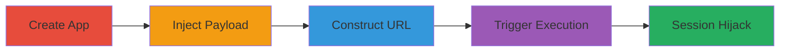

# Stored XSS in WordPress Developer App Description Leading to Arbitrary JavaScript Execution

Multi-stage attack chain demonstrating exploitation of a stored XSS vulnerability in the WordPress Developer platform to inject malicious JavaScript into an app description, which is then reflected and executed in victims' browsers via the OAuth authorize endpoint.

## Chain Metrics Dashboard

| Metric | Value |
|--------|-------|
| Chain Status | Unverified |
| Total Steps | 5 |
| Execution Time | ~10 minutes |
| Skill Level | Intermediate |
| Complexity | Medium |
| Impact Level | High |

## Attack Flow Visualization

## Prerequisites & Requirements

### Required Tools

- Web browser (e.g., Chrome with developer tools)

### Target Environment

- WordPress.com Developer platform
- Access to https://developer.wordpress.com/apps/
- No special services or ports required beyond standard HTTPS (443)

### Initial Access Requirements

- Valid WordPress.com account with developer access
- No prior network position needed; public-facing web application

## Detailed Attack Procedures

### Step 1: Create New Application
procedure: [[procedures/Create-New-WordPress-Developer-Application]]

**Objective**: Initiate the creation of a new application to access the description field for payload injection.

**Instructions**: Navigate to the My Apps page on the WordPress Developer platform and select the option to create a new application.

**Expected Output**: Form for entering application details, including name, website URL, redirect URL, and description.

**Success Indicators**:
- Application creation form loaded successfully
- Able to proceed to field population

### Step 2: Populate Basic Fields
procedure: [[procedures/Populate-Basic-Application-Fields]]

**Objective**: Fill in non-malicious fields to complete the app setup without triggering early validation errors.

**Instructions**: Enter generic data such as a name like "Test App", a website URL like "https://example.com", and set the redirect URL to "https://google.com".

**Expected Output**: Fields populated and ready for description input.

**Success Indicators**:
- Basic fields accepted without errors
- Form advances to description field

### Step 3: Inject XSS Payload
procedure: [[procedures/Inject-XSS-Payload-into-App-Description]]

**Objective**: Inject a crafted JavaScript payload into the app description to store malicious code server-side.

**Instructions**: In the Description field, paste the payload: `'>
<head><base href="javascript://"></head><body><a href="/. /, /' onmouseover=confirm(document.domain); abc=abc">TESTLINK` and save the application. Note the generated client ID upon successful creation.

**Expected Output**: Application saved with the payload stored; client ID displayed (e.g., a numeric value like 123456).

**Success Indicators**:
- App created without sanitization errors
- Client ID obtained for next steps

### Step 4: Construct OAuth URL
procedure: [[procedures/Construct-OAuth-Authorize-URL]]

**Objective**: Build a malicious OAuth authorize URL that reflects the stored payload in a victim-facing context.

**Instructions**: Substitute the obtained client ID into the template: `https://public-api.wordpress.com/oauth2/authorize?client_id=YOUR_CLIENT_ID&redirect_uri=https://google.com&response_type=code&blog=` and access the URL in a browser.

**Expected Output**: OAuth authorization page loads, displaying the unsanitized app description with the injected HTML and JavaScript.

**Success Indicators**:
- Page renders with reflected description containing the payload
- No immediate execution; payload dormant until interaction

### Step 5: Trigger Payload Execution
procedure: [[procedures/Trigger-JavaScript-Payload-Execution]]

**Objective**: Interact with the reflected content to execute the stored JavaScript, demonstrating arbitrary code execution.

**Instructions**: On the loaded OAuth page, mouse over the "TESTLINK" text in the reflected description to trigger the onmouseover event.

**Expected Output**: Browser alert dialog appears with the domain name (e.g., confirm("public-api.wordpress.com")), confirming JavaScript execution.

**Success Indicators**:
- Alert box pops up
- JavaScript executes in the context of the victim's WordPress.com session

## Attack Chain Summary

### Key Achievements

1. Successful storage of XSS payload in app description without sanitization
2. Reflection of payload in OAuth authorize endpoint accessible to any user
3. Arbitrary JavaScript execution leading to potential session hijacking or data exfiltration

## Technique & Tactic Coverage

### MITRE ATT&CK Techniques

- [[Exploit Public-Facing Application]] Exploit Public-Facing Application
- [[JavaScript]] JavaScript

### MITRE ATT&CK Tactics

- [[Initial Access]] Initial Access
- [[Execution]] Execution

---
*Last updated: 2023-10-01T12:00:00Z*
