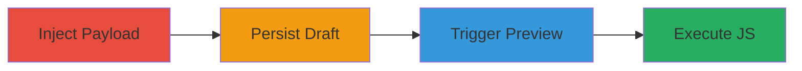

---
tags:
  - xss
  - stored-xss
  - wordpress
  - admin-compromise
  - javascript-execution
type: attack_chain
tools: []
tactics:
  - '[[Execution]]'
  - '[[Collection]]'
verified: false
platforms:
  - Web
  - WordPress
submitted: true
complexity: medium
created_at: '2023-10-01T00:00:00Z'
procedures:
  - '[[procedures/Inject-Malicious-Shortcode-into-WordPress-Post]]'
  - '[[procedures/Save-WordPress-Post-as-Draft]]'
  - '[[procedures/Trigger-XSS-via-Admin-Post-Preview]]'
step_count: 3
techniques:
  - '[[JavaScript]]'
updated_at: '2025-12-14T00:11:09.640Z'
description: >-
  A multi-step attack exploiting a stored XSS vulnerability in WordPress 5.0's
  Post Shortcode function to inject and execute malicious JavaScript in the
  admin preview interface, targeting authenticated users for session hijacking.
skill_level: intermediate
impact_level: high
id: 10594455-15a9-4810-85b5-041ce8081bac
validated: true
mitre_tactics:
  - '[[Execution]]'
  - '[[Collection]]'
mitre_techniques:
  - '[[JavaScript]]'
---
# Stored XSS in WordPress Post Shortcode for Admin JavaScript Execution

Multi-stage attack chain demonstrating a complete attack workflow exploiting a stored XSS vulnerability in WordPress 5.0.

## Chain Metrics Dashboard

| Metric | Value |
|--------|-------|
| Chain Status | Unverified |
| Total Steps | 3 |
| Execution Time | ~5 minutes |
| Skill Level | Intermediate |
| Complexity | Medium |
| Impact Level | High |

## Attack Flow Visualization

## Prerequisites & Requirements

### Required Tools

- None (manual via WordPress admin interface)

### Target Environment

- WordPress 5.0 or vulnerable version
- Access to WordPress admin with Contributor or higher permissions
- Gutenberg editor enabled

### Initial Access Requirements

- Attacker account with Contributor role or higher
- Victim with admin access to preview posts
- No network restrictions (local or internal access to WP admin)

## Detailed Attack Procedures

### Step 1: Inject Malicious Shortcode
procedure: [[procedures/Inject-Malicious-Shortcode-into-WordPress-Post]]

**Objective**: Insert a malicious shortcode payload into a WordPress post to enable XSS execution during preview.

**Instructions**: Log in to the WordPress admin dashboard, create a new post or edit an existing one, and insert the payload `">` directly into the post content using the Gutenberg block editor. Ensure the payload breaks out of any shortcode context and injects executable HTML/JS.

**Expected Output**: The payload appears in the post editor without immediate execution.

**Success Indicators**:
- Payload successfully added to post content
- No editor errors on insertion

### Step 2: Persist the Payload
procedure: [[procedures/Save-WordPress-Post-as-Draft]]

**Objective**: Save the modified post as a draft to store the malicious payload persistently without publishing.

**Instructions**: In the WordPress editor, click the "Save Draft" button to persist the post with the injected shortcode.

**Expected Output**: Confirmation that the post is saved as a draft; payload remains in the content.

**Success Indicators**:
- Draft saved successfully
- Post can be accessed via admin dashboard

### Step 3: Trigger Execution
procedure: [[procedures/Trigger-XSS-via-Admin-Post-Preview]]

**Objective**: Cause the victim to preview the draft, triggering the XSS payload in the admin interface.

**Instructions**: Share the draft post link with a victim (e.g., via email or notification). When the victim previews the post in the WordPress admin, the invalid block preview renders the payload, executing the JavaScript (e.g., prompt(1) or more malicious code like session theft).

**Expected Output**: JavaScript alert or action executes in the victim's browser; potential session hijacking if payload is adapted.

**Success Indicators**:
- Payload executes on preview (e.g., alert box appears)
- Access to victim's session cookies or admin actions

## Attack Chain Summary

### Key Achievements

1. Successful injection of stored XSS payload in WordPress post shortcode
2. Persistence via draft saving without alerting admins
3. Execution of arbitrary JS in admin context for compromise

## Technique & Tactic Coverage

### MITRE ATT&CK Techniques

- [[JavaScript]]

### MITRE ATT&CK Tactics

- [[Execution]]
- [[Collection]]

---
*Last updated: 2023-10-01T00:00:00Z*
