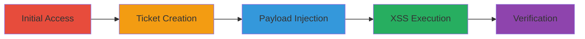

---
tags:
  - xss
  - stored-xss
  - wordpress
  - trac
type: attack_chain
tools:
  - '[[tools/Git]]'
tactics:
  - '[[Initial Access]]'
  - '[[Execution]]'
commands:
  - '[[commands/git-clone-trac-repo]]'
platforms:
  - Web
complexity: medium
procedures:
  - '[[procedures/Access-and-Login-to-Trac-Site]]'
  - '[[procedures/Navigate-to-New-Ticket-Creation]]'
  - '[[procedures/Inject-Malicious-Payload-into-Workflow-Keyword]]'
  - '[[procedures/Create-Ticket-and-Observe-XSS-Execution]]'
  - '[[procedures/Verify-Stored-XSS-with-Another-Account]]'
step_count: 5
techniques:
  - '[[Exploit Public-Facing Application]]'
  - '[[JavaScript]]'
description: >-
  Multi-stage attack exploiting a stored XSS vulnerability in WordPress Trac
  ticket creation to execute arbitrary JavaScript and potentially steal cookies
skill_level: intermediate
impact_level: high
id: dffeb648-aed4-4417-9719-12709c73c4e5
created_at: '2025-12-14T00:11:25.238Z'
updated_at: '2025-12-14T00:11:25.238Z'
verified: false
validated: true
submitted: true
mitre_tactics:
  - '[[Initial Access]]'
  - '[[Execution]]'
mitre_techniques:
  - '[[Exploit Public-Facing Application]]'
  - '[[JavaScript]]'
---
# Stored XSS in WordPress Trac via Workflow Keywords

Multi-stage attack chain demonstrating the exploitation of a stored XSS vulnerability in the WordPress Trac ticket creation workflow by injecting a malicious SVG payload into the keyword field, leading to JavaScript execution on ticket viewing and potential cookie theft.

## Chain Metrics Dashboard

| Metric | Value |
|--------|-------|
| Chain Status | Unverified |
| Total Steps | 5 |
| Execution Time | ~5 minutes |
| Skill Level | Intermediate |
| Complexity | Medium |
| Impact Level | High |

## Attack Flow Visualization

## Prerequisites & Requirements

### Required Tools

- [[tools/Git]]

### Target Environment

- Web platform
- Trac service running on https://core.trac.wordpress.org/
- JavaScript and jQuery in the tech stack

### Initial Access Requirements

- Valid WordPress Trac account credentials
- Network access to the Trac site
- Optional: Secondary account for verification

## Detailed Attack Procedures

### Step 1: Access and Login
procedure: [[procedures/Access-and-Login-to-Trac-Site]]

**Objective**: Gain authenticated access to the Trac instance to initiate ticket creation.

**Instructions**: Navigate to https://core.trac.wordpress.org/ and log in with your account credentials. For testing, you can use a private window to log in with another account.

**Expected Output**: Successful login and access to the Trac dashboard.

**Success Indicators**:
- Logged-in session established
- Ability to navigate to ticket creation page

### Step 2: Navigate to New Ticket Creation
procedure: [[procedures/Navigate-to-New-Ticket-Creation]]

**Objective**: Prepare the ticket creation form for payload injection.

**Instructions**: Go to https://core.trac.wordpress.org/newticket and enter a summary and description for the ticket.

**Expected Output**: Ticket creation form populated with basic details.

**Success Indicators**:
- Form ready for keyword selection
- No errors in form submission preparation

### Step 3: Inject Malicious Payload
procedure: [[procedures/Inject-Malicious-Payload-into-Workflow-Keyword]]

**Objective**: Insert the XSS payload into the workflow keyword field to exploit the vulnerability.

**Instructions**: Select a Workflow Keyword, enable manual entry, and paste the payload: "><svg/onload=alert(document.domain)>.

**Expected Output**: Payload successfully entered into the keyword field.

**Success Indicators**:
- Payload accepted without immediate sanitization errors
- Form proceeds to submission

### Step 4: Create Ticket and Observe Execution
procedure: [[procedures/Create-Ticket-and-Observe-XSS-Execution]]

**Objective**: Submit the ticket to store the XSS payload and trigger execution upon viewing.

**Instructions**: Click the enter button, then the Create Ticket button. The XSS alert will execute upon ticket creation and viewing.

**Expected Output**: Ticket created with XSS payload executed, showing an alert with document.domain.

**Success Indicators**:
- Alert popup confirming JavaScript execution
- Payload stored in the ticket

### Step 5: Verify with Another Account
procedure: [[procedures/Verify-Stored-XSS-with-Another-Account]]

**Objective**: Confirm the stored nature of the XSS by viewing the ticket with a different user session.

**Instructions**: Copy the ticket URL, open it in a private window with another logged-in account, and observe the XSS alert executing.

**Expected Output**: XSS alert executes in the context of the second account's browser.

**Success Indicators**:
- Alert popup in the second session
- Confirmation of cross-user impact

## Attack Chain Summary

### Key Achievements

1. Successful injection and storage of XSS payload in Trac tickets
2. Execution of arbitrary JavaScript across user sessions
3. Potential for cookie theft and session hijacking

## Technique & Tactic Coverage

### MITRE ATT&CK Techniques

- [[Exploit Public-Facing Application]]
- [[JavaScript]]

### MITRE ATT&CK Tactics

- [[Initial Access]]
- [[Execution]]

*Last updated: [TIMESTAMP]*
