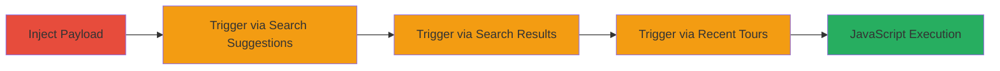

# Stored XSS in Zaption Gallery Titles for Arbitrary JavaScript Execution

Multi-stage attack chain demonstrating a complete stored XSS exploitation workflow in Zaption's gallery feature, allowing arbitrary JavaScript execution on any user's browser without direct interaction.

## Chain Metrics Dashboard

| Metric | Value |
|--------|-------|
| Chain Status | Unverified |
| Total Steps | 4 |
| Execution Time | ~5 minutes |
| Skill Level | Intermediate |
| Complexity | Medium |
| Impact Level | High |

## Attack Flow Visualization

## Prerequisites & Requirements

### Required Tools

- Web browser (e.g., Chrome with developer tools)

### Target Environment

- Zaption web application
- Access to gallery feature for editing videos/tours
- No special services or ports required beyond standard HTTPS (443)

### Initial Access Requirements

- Authenticated user account on Zaption
- Ability to create or edit videos/tours in the gallery
- No prior privileged access needed

## Detailed Attack Procedures

### Step 1: Inject XSS Payload
procedure: [[procedures/Inject-XSS-Payload-into-Zaption-Gallery-Title]]

**Objective**: Insert a malicious JavaScript payload into a video or tour title to store the XSS vulnerability.

**Instructions**: Log in to Zaption, navigate to the gallery, select an existing video or tour, and edit its title with the payload. For example, use a payload like `xyz123">` to break out of HTML context and execute JavaScript on load.

Save the changes. This stores the payload server-side without sanitization.

**Expected Output**: The title is updated successfully, and the payload is persisted in the database.

**Success Indicators**:
- Title edit confirmation
- Payload visible in the edit preview without errors

### Step 2: Trigger via Search Suggestions
procedure: [[procedures/Trigger-XSS-via-Zaption-Search-Suggestions]]

**Objective**: Execute the stored payload automatically when the search suggestion dropdown loads the malicious title.

**Instructions**: In the gallery search box, begin typing a portion of the malicious title (e.g., `xyz123`). The dropdown suggestions will fetch and render the title, triggering the XSS payload in the attacker's or any user's browser.

Monitor the browser console for the `prompt("XSS")` alert or any executed JavaScript.

**Expected Output**: JavaScript alert or console log indicating execution.

**Success Indicators**:
- Alert box appears
- Network request to search endpoint shows unsanitized title

### Step 3: Trigger via Search Results URL
procedure: [[procedures/Trigger-XSS-via-Zaption-Search-Results-URL]]

**Objective**: Directly access the search results page to render and execute the payload in the results listing.

**Instructions**: Construct and visit a direct URL to the search endpoint, such as `https://www.zaption.com/gallery/search?q=xyz123`. The results page will display the malicious title, executing the JavaScript without further interaction.

Use browser developer tools to inspect the rendered HTML for the injected `` tag.

**Expected Output**: Payload execution on page load, visible via alert or dev tools.

**Success Indicators**:
- JavaScript executes on URL access
- No additional user input required

### Step 4: Trigger via Recent Tours Listing
procedure: [[procedures/Trigger-XSS-via-Zaption-Recent-Tours-Listing]]

**Objective**: Exploit automatic listing in the recent tours section for passive execution on any viewer.

**Instructions**: Navigate to the gallery's 'Recent Tours' section. The listing will include the video/tour with the malicious title, rendering it and executing the XSS payload immediately upon page load.

This affects all users viewing the section without searching.

**Expected Output**: Automatic JavaScript execution in the browser viewing recent tours.

**Success Indicators**:
- Payload triggers on recent tours page
- Global impact confirmed by testing in incognito or another account

## Attack Chain Summary

### Key Achievements

1. Successful injection of stored XSS payload into gallery titles without new content upload.
2. Multiple low-interaction triggers (search, URL, listings) enabling widespread execution.
3. Potential for session hijacking, data theft, or phishing affecting all Zaption users globally.

## Technique & Tactic Coverage

### MITRE ATT&CK Techniques

- [[JavaScript]]

### MITRE ATT&CK Tactics

- [[Execution]]

---
*Last updated: 2023-10-01T00:00:00Z*
