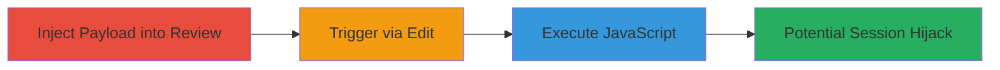

---
tags:
  - xss
  - stored-xss
  - javascript
  - web-vulnerability
type: attack_chain
tools: []
tactics:
  - '[[Execution]]'
  - '[[Collection]]'
verified: false
platforms:
  - Web
submitted: true
complexity: medium
created_at: '2023-10-01T00:00:00Z'
procedures:
  - '[[procedures/Inject-Malicious-Payload-into-Zomato-Review]]'
  - '[[procedures/Trigger-XSS-via-Review-Edit]]'
  - '[[procedures/Execute-Stored-XSS-Payload]]'
step_count: 3
techniques:
  - '[[JavaScript]]'
updated_at: '2025-12-14T03:16:37.452Z'
description: >-
  A multi-step attack exploiting a stored XSS vulnerability in Zomato's
  restaurant review system to inject and execute malicious JavaScript, enabling
  session hijacking or client-side attacks on viewers.
skill_level: intermediate
impact_level: high
id: b797eb8a-bb1e-45c2-bcea-31e23bcb4d59
validated: true
mitre_tactics:
  - '[[Execution]]'
  - '[[Collection]]'
mitre_techniques:
  - '[[JavaScript]]'
---
# Stored XSS in Zomato Review Feature for Arbitrary JavaScript Execution

Multi-stage attack chain demonstrating exploitation of a stored XSS vulnerability in Zomato's review feature, allowing injection of malicious JavaScript that executes on restaurant pages viewed by users.

## Chain Metrics Dashboard

| Metric | Value |
|--------|-------|
| Chain Status | Unverified |
| Total Steps | 3 |
| Execution Time | ~5 minutes |
| Skill Level | Intermediate |
| Complexity | Medium |
| Impact Level | High |

## Attack Flow Visualization

## Prerequisites & Requirements

### Required Tools

- Web browser (e.g., Chrome with developer tools)

### Target Environment

- Zomato website (restaurant pages, e.g., https://www.zomato.com/beirut/garcias-dbayeh-metn)
- User account on Zomato for submitting reviews

### Initial Access Requirements

- Valid Zomato account
- Access to a restaurant page
- No special privileges needed beyond standard user

## Detailed Attack Procedures

### Step 1: Inject Malicious Payload into Review
procedure: [[procedures/Inject-Malicious-Payload-into-Zomato-Review]]

**Objective**: Submit a review containing a stored XSS payload that evades sanitization and gets stored in the database.

**Instructions**: Navigate to a restaurant page on Zomato, such as https://www.zomato.com/beirut/garcias-dbayeh-metn. Locate the review submission form and enter the malicious payload in the review text field.

**Expected Output**: Review submitted successfully without immediate errors, payload stored server-side.

**Success Indicators**:
- Review appears in the list on the restaurant page
- No alert or block during submission

### Step 2: Trigger XSS via Review Edit
procedure: [[procedures/Trigger-XSS-via-Review-Edit]]

**Objective**: Access the edit function for the submitted review, which renders the unsanitized content and triggers payload evaluation.

**Instructions**: On the restaurant page, find the submitted review and click the 'Edit' button. This loads the review content into the edit interface, potentially executing the payload during rendering.

**Expected Output**: Edit interface opens, and if vulnerable, the payload begins to execute.

**Success Indicators**:
- Edit button accessible
- Page renders without sanitizing the injected script

### Step 3: Execute Stored XSS Payload
procedure: [[procedures/Execute-Stored-XSS-Payload]]

**Objective**: Demonstrate arbitrary JavaScript execution, such as alerting the document domain, to confirm control over the victim's browser context.

**Instructions**: Upon triggering, the payload executes via an event like onmouseover on an injected img tag, prompting the domain to prove XSS success. In a real attack, replace with code to steal cookies or redirect.

**Expected Output**: Browser alert or console log showing execution, e.g., prompt displaying 'www.zomato.com'.

**Success Indicators**:
- JavaScript alert fires
- Ability to run custom JS in user sessions viewing the page

## Attack Chain Summary

### Key Achievements

1. Successful injection and storage of XSS payload in review system
2. Triggering execution via standard user actions like editing
3. Achievement of arbitrary JS execution, enabling session theft or phishing on affected restaurant pages

## Technique & Tactic Coverage

### MITRE ATT&CK Techniques

- [[JavaScript]]

### MITRE ATT&CK Tactics

- [[Execution]]
- [[Collection]]

---
*Last updated: 2023-10-01T00:00:00Z*
