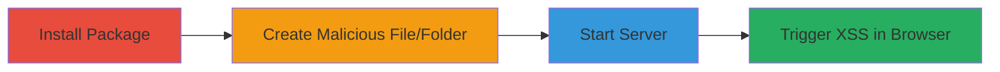

---
tags:
  - xss
  - stored-xss
  - node-js
  - javascript
type: attack_chain
tools:
  - '[[tools/npm]]'
  - '[[tools/dy-server2]]'
tactics:
  - '[[Execution]]'
verified: false
platforms:
  - Web
  - Node.js
submitted: true
created_at: '2023-10-01T00:00:00Z'
procedures:
  - '[[procedures/Install-dy-server2-Package]]'
  - '[[procedures/Create-Malicious-File-or-Folder]]'
  - '[[procedures/Start-dy-server2-Server]]'
  - '[[procedures/Trigger-XSS-via-Browser-Access]]'
step_count: 4
techniques:
  - '[[JavaScript]]'
updated_at: '2025-12-14T03:15:26.478Z'
description: >-
  A multi-stage attack exploiting a stored XSS vulnerability in the dy-server2
  Node.js HTTP server by injecting malicious JavaScript into file or folder
  names, leading to arbitrary code execution in victims' browsers.
id: c7a0f0ad-8c98-4634-93c4-6cb195232006
validated: true
mitre_tactics:
  - '[[Execution]]'
mitre_techniques:
  - '[[JavaScript]]'
---
# Stored XSS in dy-server2 via Malicious File or Folder Names

Multi-stage attack chain demonstrating a complete attack workflow exploiting a stored Cross-Site Scripting (XSS) vulnerability in the dy-server2 Node.js package, a lightweight HTTP server used for file transfer and frontend previews. The attack involves installing the package, creating a file or folder with an embedded JavaScript payload in its name, starting the server to serve the directory, and accessing it via a browser to execute the payload. This allows attackers to steal session cookies, deface pages, or run arbitrary JavaScript when victims view the served content.

## Chain Metrics Dashboard

| Metric | Value |
|--------|-------|
| Chain Status | Unverified |
| Total Steps | 4 |
| Execution Time | ~5 minutes |
| Skill Level | Beginner |
| Complexity | Low |
| Impact Level | Medium |

## Attack Flow Visualization



## Prerequisites & Requirements

### Required Tools

- [[tools/npm]]
- [[tools/dy-server2]]

### Target Environment

- Node.js runtime environment
- Local file system access
- Web browser (e.g., Firefox, Chrome)
- Ports: 8888 (or custom)

### Initial Access Requirements

- Local machine access with npm installed
- No network credentials needed; attack is local but can be shared via served files
- Prior access: Administrative privileges for global npm install (optional)

## Detailed Attack Procedures

### Step 1: Install dy-server2 Package
procedure: [[procedures/Install-dy-server2-Package]]

**Objective**: Set up the vulnerable dy-server2 HTTP server by installing it via npm.

**Instructions**: Install the package globally using [[commands/npm-install-dy-server2]] to make it available system-wide.

```bash
npm i -g dy-server2
```

**Expected Output**: Confirmation of package installation, with dy-server2 added to the global PATH.

**Success Indicators**:
- dy-server2 command is executable from the terminal
- No errors during npm installation

### Step 2: Create Malicious File or Folder
procedure: [[procedures/Create-Malicious-File-or-Folder]]

**Objective**: Inject a stored XSS payload into a file or folder name to be served by the HTTP server.

**Instructions**: Create a new folder or file named with the malicious payload, such as ``, which embeds JavaScript that triggers an alert on load error.

Use standard file creation commands (e.g., mkdir or touch in bash):

```bash
mkdir ''
```

**Expected Output**: A file or folder created with the exact malicious name in the current directory.

**Success Indicators**:
- File or folder exists with the payload in its name
- Name is not sanitized or escaped by the system

### Step 3: Start dy-server2 Server
procedure: [[procedures/Start-dy-server2-Server]]

**Objective**: Launch the HTTP server to serve the directory containing the malicious file or folder.

**Instructions**: Start the server on port 8888 using [[commands/dy-server2-start-server]] from the directory with the malicious item.

```bash
dy-server2 -p 8888
```

**Expected Output**: Server startup message indicating it's listening on http://localhost:8888.

**Success Indicators**:
- Server runs without errors
- Directory listing is accessible via the local URL

### Step 4: Trigger XSS via Browser Access
procedure: [[procedures/Trigger-XSS-via-Browser-Access]]

**Objective**: Access the served directory in a browser to execute the injected JavaScript payload.

**Instructions**: Open the server's URL in a web browser to view the directory, triggering the XSS in the rendered file/folder name. No specific command needed; use browser navigation.

Navigate to: http://localhost:8888

**Expected Output**: The malicious JavaScript executes, e.g., an alert box pops up displaying '1'.

**Success Indicators**:
- JavaScript alert or other payload effect observed
- Browser console shows script execution errors or logs

## Attack Chain Summary

### Key Achievements

1. Successful installation and setup of the vulnerable dy-server2 server
2. Injection of persistent XSS payload via file/folder naming
3. Server-side serving of unsanitized content leading to client-side execution
4. Demonstration of arbitrary JavaScript execution for potential cookie theft or defacement

## Technique & Tactic Coverage

### MITRE ATT&CK Techniques

- [[JavaScript]]

### MITRE ATT&CK Tactics

- [[Execution]]

---

*Last updated: 2023-10-01T00:00:00Z*
