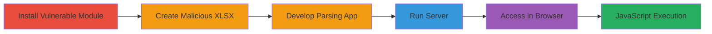

---
tags:
  - xss
  - stored-xss
  - node-js
  - exceljs
  - javascript-execution
  - file-upload
type: attack_chain
tools:
  - '[[tools/npm]]'
  - '[[tools/Node-js]]'
  - '[[tools/exceljs]]'
  - '[[tools/LibreOffice]]'
  - '[[tools/Chromium]]'
tactics:
  - '[[Execution]]'
verified: false
platforms:
  - Node.js
  - Web
  - Linux
submitted: true
complexity: medium
created_at: '2023-10-01T00:00:00Z'
procedures:
  - '[[procedures/Install-Vulnerable-exceljs-Module]]'
  - '[[procedures/Create-Malicious-XLSX-File-with-XSS-Payload]]'
  - '[[procedures/Develop-Node-js-App-to-Parse-and-Serve-XLSX-as-HTML]]'
  - '[[procedures/Execute-Vulnerable-Node-js-Server]]'
  - '[[procedures/Trigger-XSS-by-Accessing-Served-Page-in-Browser]]'
step_count: 5
techniques:
  - '[[JavaScript]]'
updated_at: '2025-12-14T03:15:46.860Z'
description: >-
  Demonstrates a stored XSS vulnerability in the exceljs Node.js module by
  embedding malicious JavaScript in an XLSX file, parsing it without escaping,
  and serving the content as HTML to execute code in the browser.
skill_level: intermediate
impact_level: high
id: 32e5a717-2469-4682-bad1-29830234d638
validated: true
mitre_tactics:
  - '[[Execution]]'
mitre_techniques:
  - '[[JavaScript]]'
---
# Stored XSS in exceljs via Malicious XLSX File Leading to Arbitrary JavaScript Execution

Multi-stage attack chain demonstrating a complete attack workflow for exploiting a stored XSS vulnerability in the exceljs Node.js module. An attacker crafts an XLSX file with embedded HTML/JavaScript payload in a cell, which is parsed without validation or escaping. The content is then inserted directly into an HTML table served by a Node.js application, allowing arbitrary JavaScript execution when viewed in a browser. This can lead to session hijacking, data theft, or further client-side attacks.

## Chain Metrics Dashboard

| Metric | Value |
|--------|-------|
| Chain Status | Unverified |
| Total Steps | 5 |
| Execution Time | ~10 minutes |
| Skill Level | Intermediate |
| Complexity | Medium |
| Impact Level | High |

## Attack Flow Visualization



## Prerequisites & Requirements

### Required Tools

- [[tools/npm]]
- [[tools/LibreOffice]]
- [[tools/Node-js]]
- [[tools/exceljs]]
- [[tools/Chromium]]

### Target Environment

- Node.js runtime (version 8.11.1 or compatible)
- Local HTTP server on port 8080
- Web browser for payload execution
- No specific remote services required; local demonstration

### Initial Access Requirements

- Local machine with Node.js and npm installed
- LibreOffice for file creation
- No credentials or prior network access needed; simulates attacker-controlled file upload in a web app

## Detailed Attack Procedures

### Step 1: Install Vulnerable Module
procedure: [[procedures/Install-Vulnerable-exceljs-Module]]

**Objective**: Set up the vulnerable exceljs module to parse XLSX files without XSS protections.

**Instructions**: Use [[commands/npm-install-exceljs]] to install the vulnerable version:

```bash
npm i exceljs
```

**Expected Output**: Installation logs confirming exceljs version 1.4.6 is added to node_modules.

**Success Indicators**:
- exceljs package installed in project directory
- No errors in npm output

### Step 2: Create Malicious XLSX File
procedure: [[procedures/Create-Malicious-XLSX-File-with-XSS-Payload]]

**Objective**: Embed a JavaScript payload in an XLSX cell to exploit lack of escaping during parsing.

**Instructions**: Open LibreOffice Calc and create a new spreadsheet named testsheet.xlsx. In cell A1, enter the payload `<script>alert(`xss!`)</script>`. Add sample data in other cells (e.g., A2: 'test', B1: 'another', A3: '1'). Save as XLSX format.

**Expected Output**: testsheet.xlsx file created with embedded HTML/script in cell A1.

**Success Indicators**:
- File saves without errors
- Payload visible in cell when reopened in LibreOffice

### Step 3: Develop Parsing Application
procedure: [[procedures/Develop-Node-js-App-to-Parse-and-Serve-XLSX-as-HTML]]

**Objective**: Write a Node.js script that reads the XLSX, inserts cell values unescaped into HTML, and serves it via HTTP.

**Instructions**: Create app.js with the following code using exceljs to parse testsheet.xlsx and generate an HTML table:

```javascript
const ExcelJS = require('exceljs');
const http = require('http');

const workbook = new ExcelJS.Workbook();
workbook.xlsx.readFile('testsheet.xlsx').then(() => {
  const worksheet = workbook.getWorksheet(1);
  let html = '<table><tr>';
  worksheet.eachRow((row, rowNumber) => {
    html += '<tr>';
    row.eachCell({ includeEmpty: true }, (cell) => {
      html += `<td>${cell.value}</td>`;
    });
    html += '</tr>';
  });
  html += '</table>';

  http.createServer((req, res) => {
    res.writeHead(200, { 'Content-Type': 'text/html' });
    res.end(html);
  }).listen(8080);
  console.log('server is listening on 8080');
});
```

**Expected Output**: app.js file created; no runtime errors on initial parse.

**Success Indicators**:
- Script parses XLSX without crashing
- HTML string contains unescaped payload

### Step 4: Execute the Server
procedure: [[procedures/Execute-Vulnerable-Node-js-Server]]

**Objective**: Start the HTTP server to host the vulnerable HTML content.

**Instructions**: Run the application using [[commands/node-run-app]]:

```bash
node app.js
```

**Expected Output**: Console output: 'server is listening on 8080'.

**Success Indicators**:
- Server starts on port 8080
- No parsing errors from exceljs

### Step 5: Trigger XSS in Browser
procedure: [[procedures/Trigger-XSS-by-Accessing-Served-Page-in-Browser]]

**Objective**: Load the page to execute the embedded JavaScript payload.

**Instructions**: Open http://localhost:8080 in Chromium. The unescaped script from the XLSX cell will execute automatically.

**Expected Output**: Alert popup displaying 'xss!'; page source shows `<script>alert(`xss!`)</script>` in the table cell.

**Success Indicators**:
- JavaScript alert triggers
- Script tag visible in browser inspector

## Attack Chain Summary

### Key Achievements

1. Successful installation and use of vulnerable exceljs module
2. Creation and parsing of XLSX with embedded XSS payload
3. Serving unescaped content leading to client-side JavaScript execution
4. Demonstration of potential for arbitrary code execution in web app contexts

## Technique & Tactic Coverage

### MITRE ATT&CK Techniques

- [[JavaScript]]

### MITRE ATT&CK Tactics

- [[Execution]]

---

*Last updated: 2023-10-01T00:00:00Z*
