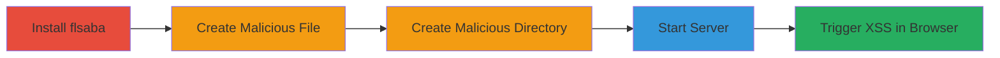

---
tags:
  - xss
  - stored-xss
  - node-js
  - web-vulnerability
  - directory-listing
type: attack_chain
tools:
  - '[[tools/npm]]'
  - '[[tools/touch]]'
  - '[[tools/mkdir]]'
  - '[[tools/flsaba]]'
  - '[[tools/Firefox]]'
tactics:
  - '[[Initial Access]]'
  - '[[Execution]]'
verified: false
platforms:
  - Web
  - Linux
submitted: true
created_at: '2023-10-01T00:00:00Z'
procedures:
  - '[[procedures/Install-flsaba-Module]]'
  - '[[procedures/Create-Malicious-XSS-File]]'
  - '[[procedures/Create-Malicious-XSS-Directory]]'
  - '[[procedures/Start-flsaba-Server]]'
  - '[[procedures/Trigger-XSS-in-Browser]]'
step_count: 5
techniques:
  - '[[Exploit Public-Facing Application]]'
  - '[[JavaScript]]'
updated_at: '2025-12-14T03:15:26.385Z'
description: >-
  A multi-stage attack exploiting stored XSS in the flsaba Node.js module by
  creating files and directories with JavaScript payloads, serving them via the
  vulnerable HTTP server, and triggering execution in a browser.
id: 7e69b214-ca21-4dcd-a7de-de1448f3a29c
validated: true
mitre_tactics:
  - '[[Initial Access]]'
  - '[[Execution]]'
mitre_techniques:
  - '[[Exploit Public-Facing Application]]'
  - '[[JavaScript]]'
---
---

# Stored XSS in flsaba HTTP Server via Malicious File and Directory Names

Multi-stage attack chain demonstrating exploitation of stored XSS in the flsaba Node.js module version 1.1.0, where unsanitized file and directory names are rendered in HTML directory listings, allowing arbitrary JavaScript execution in visiting browsers.

## Chain Metrics Dashboard

| Metric | Value |
|--------|-------|
| Chain Status | Unverified |
| Total Steps | 5 |
| Execution Time | ~5 minutes |
| Skill Level | Intermediate |
| Complexity | Medium |
| Impact Level | High |

## Attack Flow Visualization



## Prerequisites & Requirements

### Required Tools

- [[tools/npm]]
- [[tools/touch]]
- [[tools/mkdir]]
- [[tools/flsaba]]
- [[tools/Firefox]]

### Target Environment

- Linux OS for command execution
- Node.js installed (for npm and flsaba)
- Port 3000 available
- Local network access to http://localhost:3000

### Initial Access Requirements

- Local machine access with shell privileges
- No remote credentials needed; exploits local server setup

## Detailed Attack Procedures

### Step 1: Install flsaba Module
procedure: [[procedures/Install-flsaba-Module]]

**Objective**: Set up the vulnerable flsaba HTTP server module globally for use.

**Instructions**: Install the flsaba module version 1.1.0 using npm to make the server command available system-wide. Execute [[commands/npm-install-flsaba]]:

```bash
npm install -g flsaba
```

**Expected Output**: Installation success message indicating the module is available as a global command.

**Success Indicators**:
- flsaba command is executable in shell
- No errors during npm installation

### Step 2: Create Malicious XSS File
procedure: [[procedures/Create-Malicious-XSS-File]]

**Objective**: Store a JavaScript payload in a file name to exploit the lack of sanitization in directory listings.

**Instructions**: Use the touch command to create an empty file with an XSS payload in its name. Execute [[commands/touch-xss-file]]:

```bash
touch '>'
```

**Expected Output**: File created without errors; verify with `ls` to see the file name.

**Success Indicators**:
- File with payload name exists in current directory
- No shell escaping issues

### Step 3: Create Malicious XSS Directory
procedure: [[procedures/Create-Malicious-XSS-Directory]]

**Objective**: Store another JavaScript payload in a directory name for additional XSS exploitation.

**Instructions**: Use the mkdir command to create a directory with an XSS payload in its name. Execute [[commands/mkdir-xss-directory]]:

```bash
mkdir '>'
```

**Expected Output**: Directory created successfully; verify with `ls`.

**Success Indicators**:
- Directory with payload name exists
- Payload intact in name

### Step 4: Start flsaba Server
procedure: [[procedures/Start-flsaba-Server]]

**Objective**: Launch the vulnerable server to serve the current directory, exposing the malicious names in HTML listings.

**Instructions**: Run the flsaba command in the directory containing the malicious files. Execute [[commands/flsaba-start]]:

```bash
flsaba
```

**Expected Output**: Server starts and listens on port 3000, with message like "flsaba v1.1.0 server listening on port 3000".

**Success Indicators**:
- Server running without errors
- Directory listing accessible locally

### Step 5: Trigger XSS in Browser
procedure: [[procedures/Trigger-XSS-in-Browser]]

**Objective**: Visit the server endpoint to render the unsanitized directory listing and execute the payloads.

**Instructions**: Open a browser and navigate to the local server URL. No command needed; use Firefox or similar to access http://localhost:3000/.

**Expected Output**: Browser loads directory listing; JavaScript alerts pop up with "xss" and "xss2".

**Success Indicators**:
- Alert dialogs appear in browser
- Arbitrary JavaScript executes (e.g., confirm session hijacking potential)

## Attack Chain Summary

### Key Achievements

1. Successful installation and setup of vulnerable flsaba server
2. Creation of stored XSS payloads in file and directory names
3. Exposure of payloads via unsanitized HTML rendering
4. Execution of JavaScript in victim browser, enabling further attacks like data theft

## Technique & Tactic Coverage

### MITRE ATT&CK Techniques

- [[Exploit Public-Facing Application]]
- [[JavaScript]]

### MITRE ATT&CK Tactics

- [[Initial Access]]
- [[Execution]]

---

*Last updated: 2023-10-01T00:00:00Z*
