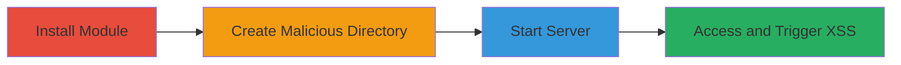

---
tags:
  - xss
  - stored-xss
  - node-js
  - directory-listing
type: attack_chain
tools:
  - '[[tools/npm]]'
  - '[[tools/html-pages]]'
  - '[[tools/Firefox-Browser]]'
tactics:
  - '[[Execution]]'
  - '[[Collection]]'
verified: false
platforms:
  - Web
  - Node.js
submitted: true
complexity: medium
created_at: '2024-01-01T00:00:00Z'
procedures:
  - '[[procedures/Install-html-pages-Module]]'
  - '[[procedures/Create-Malicious-Directory-for-XSS]]'
  - '[[procedures/Start-html-pages-Server]]'
  - '[[procedures/Trigger-Stored-XSS-via-Directory-Access]]'
step_count: 4
techniques:
  - '[[JavaScript]]'
updated_at: '2025-12-14T03:16:02.831Z'
description: >-
  Demonstrates a stored XSS vulnerability in the html-pages Node.js module by
  creating a malicious directory name that injects JavaScript into directory
  listings, leading to arbitrary code execution in the browser.
skill_level: intermediate
impact_level: high
id: c26900f9-ce1a-440c-8b66-167e4cfc08a0
validated: true
mitre_tactics:
  - '[[Execution]]'
  - '[[Collection]]'
mitre_techniques:
  - '[[JavaScript]]'
---
# Stored XSS in html-pages via Unsanitized Directory Names

Multi-stage attack chain demonstrating a complete exploitation of a stored XSS vulnerability in the html-pages Node.js module, where malicious directory names are injected into HTML without sanitization, enabling JavaScript execution when victims view directory listings.

## Chain Metrics Dashboard

| Metric | Value |
|--------|-------|
| Chain Status | Unverified |
| Total Steps | 4 |
| Execution Time | ~5 minutes |
| Skill Level | Intermediate |
| Complexity | Medium |
| Impact Level | High |

## Attack Flow Visualization



## Prerequisites & Requirements

### Required Tools

- [[tools/npm]]
- [[tools/html-pages]]
- [[tools/Firefox-Browser]]

### Target Environment

- Node.js runtime (v8+ inferred)
- Local development setup for html-pages v2.1.1
- Port 6060 available
- Network access to localhost

### Initial Access Requirements

- Local machine with npm installed
- No remote credentials needed; local exploitation
- Administrative access not required

## Detailed Attack Procedures

### Step 1: Install html-pages Module
procedure: [[procedures/Install-html-pages-Module]]

**Objective**: Set up the vulnerable html-pages module in the local environment to enable server operations and directory listing.

**Instructions**: Use [[commands/npm-install-html-pages]] to install the package:

```bash
npm install html-pages
```

**Expected Output**: Package installation logs, creation of node_modules directory with html-pages v2.1.1.

**Success Indicators**:
- node_modules/html-pages directory exists
- No installation errors

### Step 2: Create Malicious Directory for XSS
procedure: [[procedures/Create-Malicious-Directory-for-XSS]]

**Objective**: Introduce a stored payload by creating a directory with an unsanitized JavaScript injection string, which will be reflected in HTML output.

**Instructions**: Use [[commands/mkdir-malicious-directory]] to create the directory:

```bash
mkdir "><svg onload=alert(5);>
```

**Expected Output**: Directory created successfully without errors.

**Success Indicators**:
- Directory `"><svg onload=alert(5);>` appears in the working directory (use `ls` to verify)
- No filesystem errors due to special characters

### Step 3: Start html-pages Server
procedure: [[procedures/Start-html-pages-Server]]

**Objective**: Launch the vulnerable HTTP server to serve files and generate directory listings that embed the malicious directory name.

**Instructions**: Execute [[commands/html-pages-start-server]] to start the server on port 6060:

```bash
./node_modules/html-pages/bin/index.js -p 6060
```

**Expected Output**: Server output indicating it's listening on http://127.0.0.1:6060/.

**Success Indicators**:
- Server process running without errors
- Accessible via browser at localhost:6060

### Step 4: Trigger Stored XSS via Directory Access
procedure: [[procedures/Trigger-Stored-XSS-via-Directory-Access]]

**Objective**: Access the directory listing to execute the injected JavaScript payload in the browser, demonstrating arbitrary code execution.

**Instructions**: Open [[tools/Firefox-Browser]] and navigate to http://127.0.0.1:6060/, then click the malicious directory, or directly visit http://127.0.0.1:6060/%22%3E%3Csvg%20onload=alert(5);%3E/.

**Expected Output**: Alert popup with '5' due to onload execution in <svg> tag.

**Success Indicators**:
- JavaScript alert triggers
- Payload executes in HTML elements like <title> or <span>

## Attack Chain Summary

### Key Achievements

1. Successful installation and setup of vulnerable module
2. Injection of stored XSS payload via directory name
3. Server-side reflection without sanitization
4. Client-side execution leading to potential session hijacking or data theft

## Technique & Tactic Coverage

### MITRE ATT&CK Techniques

- [[JavaScript]]

### MITRE ATT&CK Tactics

- [[Execution]]
- [[Collection]]

---
*Last updated: 2024-01-01T00:00:00Z*
