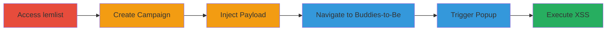

---
tags:
  - xss
  - stored-xss
  - javascript-injection
  - session-hijacking
type: attack_chain
tools: []
tactics:
  - '[[Execution]]'
verified: false
platforms:
  - Web
submitted: true
complexity: medium
created_at: '2023-10-01T00:00:00Z'
procedures:
  - '[[procedures/Access-and-Setup-lemlist-Campaign]]'
  - '[[procedures/Inject-SVG-XSS-Payload-into-Campaign-Name]]'
  - '[[procedures/Trigger-XSS-in-Buddies-to-Be-Popup]]'
step_count: 6
techniques:
  - '[[JavaScript]]'
updated_at: '2025-12-14T03:46:37.332Z'
description: >-
  A multi-step attack exploiting a stored XSS vulnerability in the lemlist
  application's Campaign Name field to inject and execute malicious JavaScript,
  enabling cookie theft and session hijacking for authenticated users.
skill_level: intermediate
impact_level: high
id: 253dbcf8-841d-432a-8172-eeb01718899a
validated: true
mitre_tactics:
  - '[[Execution]]'
mitre_techniques:
  - '[[JavaScript]]'
---
# Stored XSS in lemlist Campaign Name Leading to Session Hijacking

Multi-stage attack chain demonstrating a complete attack workflow exploiting a stored Cross-Site Scripting (XSS) vulnerability in the lemlist application. The attack involves injecting a malicious SVG payload into the Campaign Name field, which is stored without sanitization and executed when rendered in a popup in the Buddies-to-Be tab, allowing arbitrary JavaScript execution for cookie theft and session hijacking.

## Chain Metrics Dashboard

| Metric | Value |
|--------|-------|
| Chain Status | Unverified |
| Total Steps | 6 |
| Execution Time | ~5 minutes |
| Skill Level | Intermediate |
| Complexity | Medium |
| Impact Level | High |

## Attack Flow Visualization

## Prerequisites & Requirements

### Required Tools

- Web browser (e.g., Chrome with developer tools for payload testing)

### Target Environment

- lemlist web application
- Authenticated user session
- No specific ports or services beyond standard HTTPS access

### Initial Access Requirements

- Valid credentials for a lemlist account
- Direct network access to the lemlist domain (https://app.lemlist.com)
- No prior access needed beyond authentication

## Detailed Attack Procedures

### Step 1: Access the lemlist Application
procedure: [[procedures/Access-and-Setup-lemlist-Campaign]]

**Objective**: Gain authenticated access to the lemlist dashboard to prepare for campaign creation.

**Instructions**: Open a web browser and navigate to the lemlist login page. Enter valid credentials to log in and access the main dashboard.

**Expected Output**: Successful login redirecting to the campaigns section.

**Success Indicators**:
- Dashboard loads without errors
- User is authenticated and can view campaigns

### Step 2: Create or Edit a Campaign
procedure: [[procedures/Access-and-Setup-lemlist-Campaign]]

**Objective**: Navigate to the campaigns area to set up a new or existing campaign for payload injection.

**Instructions**: From the dashboard, click on the 'Campaigns' menu and select 'Create a new campaign' or choose an existing one to edit.

**Expected Output**: Campaign creation/editing interface opens, including the Campaign Name input field.

**Success Indicators**:
- Campaign form is accessible
- Name field is editable

### Step 3: Inject Payload into Campaign Name
procedure: [[procedures/Inject-SVG-XSS-Payload-into-Campaign-Name]]

**Objective**: Insert the malicious SVG payload into the Campaign Name field to store the XSS vector.

**Instructions**: In the Campaign Name field, enter the payload: `/><svg src=x onload=confirm(document.domain);>`. Save the campaign to store the payload.

**Expected Output**: Campaign saves successfully without immediate errors; the name appears altered in the list.

**Success Indicators**:
- Campaign is created/updated
- No validation errors on save

### Step 4: Visit the Buddies-to-Be Tab
procedure: [[procedures/Trigger-XSS-in-Buddies-to-Be-Popup]]

**Objective**: Navigate to the section where the stored campaign name will be rendered unsanitized.

**Instructions**: After saving, go to the 'Buddies-to-Be' tab in the application interface.

**Expected Output**: Buddies-to-Be section loads, showing contact-related options.

**Success Indicators**:
- Tab opens without issues
- Interface elements for contacts are visible

### Step 5: Interact with Contacts or Add Button
procedure: [[procedures/Trigger-XSS-in-Buddies-to-Be-Popup]]

**Objective**: Trigger the popup that renders the campaign name, executing the stored payload.

**Instructions**: Click the 'Add one' button in the top right or select a contact list to open a popup.

**Expected Output**: Popup appears, rendering the campaign name.

**Success Indicators**:
- Popup opens
- Campaign name is displayed in the popup

### Step 6: Observe the XSS Execution
procedure: [[procedures/Trigger-XSS-in-Buddies-to-Be-Popup]]

**Objective**: Confirm JavaScript execution from the injected payload.

**Instructions**: Upon popup render, the SVG onload triggers the confirm dialog showing the document domain.

**Expected Output**: Browser alert/confirm dialog pops up with the domain (e.g., app.lemlist.com).

**Success Indicators**:
- JavaScript executes (confirm dialog appears)
- No blocking by browser security

## Attack Chain Summary

### Key Achievements

1. Successful injection of stored XSS payload without detection
2. Triggering of arbitrary JavaScript in victim context
3. Demonstration of potential for cookie theft and session hijacking

## Technique & Tactic Coverage

### MITRE ATT&CK Techniques

- [[JavaScript]]

### MITRE ATT&CK Tactics

- [[Execution]]

---
*Last updated: 2023-10-01T00:00:00Z*
