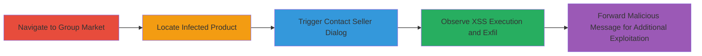

# Stored XSS in ok.ru Group Market Product Titles and Message Forwarding for Session Hijacking

Multi-stage attack chain demonstrating exploitation of stored Cross-Site Scripting (XSS) vulnerabilities in the mobile version of ok.ru (m.ok.ru). The attack targets group market product titles and private message forwarding features, allowing arbitrary JavaScript execution in the victim's browser context. This can lead to session hijacking by stealing cookies or performing other malicious actions on behalf of the user.

## Chain Metrics Dashboard

| Metric | Value |
|--------|-------|
| Chain Status | Unverified |
| Total Steps | 4 |
| Execution Time | ~5 minutes |
| Skill Level | Intermediate |
| Complexity | Medium |
| Impact Level | High |

## Attack Flow Visualization

## Prerequisites & Requirements

### Required Tools

- Web browser (e.g., Chrome with developer tools for payload verification)

### Target Environment

- Platform: Web (mobile version of ok.ru)
- Required services/ports: HTTPS on port 443
- Network access requirements: Internet access to m.ok.ru

### Initial Access Requirements

- No credentials required for viewing public group markets
- Attacker must have previously stored the XSS payload in a product title (assumed via group admin access or prior compromise)
- Victim must be a logged-in user viewing the affected group or receiving forwarded messages

## Detailed Attack Procedures

### Step 1: Navigate to Group Market Page
procedure: [[procedures/Exploit-Stored-XSS-in-Group-Market-Product-Titles]]

**Objective**: Access the vulnerable group market page containing a product with an injected XSS payload in its title.

**Instructions**: Open a web browser and navigate to the specific group market URL where the malicious product is listed. For example, use the browser's address bar to visit the page.

**Expected Output**: The group market page loads, displaying listed products including the one with the unsanitized title.

**Success Indicators**:
- Page loads without errors
- Product list is visible

### Step 2: Locate the Infected Product
procedure: [[procedures/Exploit-Stored-XSS-in-Group-Market-Product-Titles]]

**Objective**: Identify the product whose title contains the stored XSS payload, such as a breakout from HTML attributes.

**Instructions**: Scan the product listings on the page to find the single affected product. Visually inspect titles for anomalies or use browser developer tools to inspect elements for injected code like `'>`.

**Expected Output**: The malicious product is identified among the listings.

**Success Indicators**:
- Product title shows signs of injection (e.g., broken HTML)
- No immediate execution occurs on page load

### Step 3: Trigger XSS via Contact Seller Dialog
procedure: [[procedures/Trigger-XSS-via-Contact-Seller-Dialog]]

**Objective**: Click the 'Contact seller' button to open a dialog that renders the unsanitized product title, executing the XSS payload.

**Instructions**: Select the infected product and click the 'Связаться с продавцом' (Contact seller) button. This opens a modal dialog that displays the product title without proper escaping, triggering the JavaScript payload.

**Expected Output**: A dialog appears, and the XSS payload executes, such as displaying an alert box or stealing cookies via `alert(document.cookie)`.

**Success Indicators**:
- Dialog opens with malformed HTML in the title
- JavaScript alert or network request for exfiltration occurs

### Step 4: Exploit XSS in Private Message Forwarding
procedure: [[procedures/Exploit-XSS-in-Private-Message-Forwarding]]

**Objective**: Forward a message containing a stored/reflected XSS payload to a victim, executing code upon receipt and viewing.

**Instructions**: As the attacker, forward a private message via the forwarding feature (e.g., https://m.ok.ru/dk?st.cmd=forwardReceiver) with an injected payload like `'>`. The recipient views the forwarded message, triggering execution in their browser context.

**Expected Output**: Victim's browser executes the script, potentially sending cookies to an attacker-controlled server.

**Success Indicators**:
- Message forwards successfully
- Victim reports alert or anomalous behavior upon viewing
- Attacker receives exfiltrated data (e.g., cookies)

## Attack Chain Summary

### Key Achievements

1. Successful execution of stored XSS in group market dialogs, confirming lack of sanitization in product titles.
2. Demonstration of arbitrary JavaScript execution leading to potential session hijacking.
3. Extension to private message forwarding for broader victim targeting via social engineering.

## Technique & Tactic Coverage

### MITRE ATT&CK Techniques

- [[JavaScript]]

### MITRE ATT&CK Tactics

- [[Execution]]

---
*Last updated: 2023-10-01T00:00:00Z*
