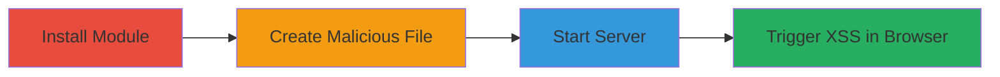

---
tags:
  - xss
  - stored-xss
  - node.js
  - directory-listing
type: attack_chain
tools:
  - '[[tools/npm]]'
  - '[[tools/Firefox-ESR]]'
tactics:
  - '[[Execution]]'
verified: false
platforms:
  - Web
  - Node.js
submitted: true
complexity: medium
created_at: '2023-10-01T00:00:00Z'
procedures:
  - '[[procedures/Install-seeftl-Module-Globally]]'
  - '[[procedures/Create-Malicious-Filename-for-XSS]]'
  - '[[procedures/Start-seeftl-Server]]'
  - '[[procedures/Trigger-XSS-in-Directory-Listing]]'
step_count: 4
techniques:
  - '[[JavaScript]]'
updated_at: '2025-12-14T00:11:09.699Z'
description: >-
  Demonstrates a stored XSS vulnerability in the seeftl Node.js module by
  injecting JavaScript via unsanitized filenames in directory listings, leading
  to arbitrary code execution in the victim's browser.
skill_level: intermediate
impact_level: high
id: 212c6763-52f1-4018-a093-cf3d20c963d9
validated: true
mitre_tactics:
  - '[[Execution]]'
mitre_techniques:
  - '[[JavaScript]]'
---
# Stored XSS in seeftl Directory Listing via Malicious Filename

Multi-stage attack chain demonstrating a complete attack workflow for exploiting a stored XSS vulnerability in the seeftl Node.js module (version 0.1.1).

## Chain Metrics Dashboard

| Metric | Value |
|--------|-------|
| Chain Status | Unverified |
| Total Steps | 4 |
| Execution Time | ~5 minutes |
| Skill Level | Intermediate |
| Complexity | Medium |
| Impact Level | High |

## Attack Flow Visualization



## Prerequisites & Requirements

### Required Tools

- [[tools/npm]]
- [[tools/Firefox-ESR]]

### Target Environment

- Node.js runtime
- Local web server access on port 8000
- File system access for creating files

### Initial Access Requirements

- Local machine with Node.js and npm installed
- No network credentials needed; local exploitation
- Prior access to install packages

## Detailed Attack Procedures

### Step 1: Install seeftl Module
procedure: [[procedures/Install-seeftl-Module-Globally]]

**Objective**: Install the vulnerable seeftl module to enable the static file server with directory listings.

**Instructions**: Use [[commands/npm-install-seeftl-global]] to install the module globally:

```bash
npm install seeftl -g
```

**Expected Output**: Installation logs ending with a success message indicating the package is installed.

**Success Indicators**:
- 'seeftl' command becomes available in the terminal
- No errors during npm installation

### Step 2: Create Malicious Filename
procedure: [[procedures/Create-Malicious-Filename-for-XSS]]

**Objective**: Create a file with a filename that injects JavaScript payload to exploit the lack of sanitization in directory listings.

**Instructions**: Manually create a file named with the XSS payload, such as a empty file named ' onmouseover=alert("xss") ' (including leading and trailing spaces to break out of HTML attributes). Use touch or any editor:

```bash
touch ' onmouseover=alert("xss") '
```

**Expected Output**: File created successfully in the current directory.

**Success Indicators**:
- File exists with the exact malicious name
- Filename includes spaces and JavaScript attributes

### Step 3: Start seeftl Server
procedure: [[procedures/Start-seeftl-Server]]

**Objective**: Launch the seeftl server in the directory containing the malicious file to generate an vulnerable directory listing.

**Instructions**: Run [[commands/seeftl-start-server]] from the directory with the malicious file:

```bash
seeftl
```

**Expected Output**: Server starts and outputs "Running at http://127.0.0.1:8000/".

**Success Indicators**:
- Server listens on port 8000
- No startup errors

### Step 4: Trigger XSS in Browser
procedure: [[procedures/Trigger-XSS-in-Directory-Listing]]

**Objective**: Access the directory listing in a browser to execute the injected JavaScript via mouse hover.

**Instructions**: Open http://localhost:8000/ in [[tools/Firefox-ESR]] and hover over the malicious filename in the listing.

**Expected Output**: JavaScript alert "xss" pops up on hover.

**Success Indicators**:
- Alert dialog appears confirming script execution
- Arbitrary JavaScript runs in the browser context

## Attack Chain Summary

### Key Achievements

1. Successful installation of the vulnerable module
2. Injection of XSS payload via filename
3. Server-side rendering of unsanitized listing
4. Client-side execution of malicious script

## Technique & Tactic Coverage

### MITRE ATT&CK Techniques

- [[JavaScript]]

### MITRE ATT&CK Tactics

- [[Execution]]

---
*Last updated: 2023-10-01T00:00:00Z*
