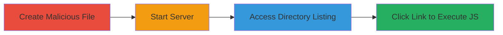

# Stored XSS in simplehttpserver via Malicious File Names Leading to JavaScript Execution

Multi-stage attack chain demonstrating a complete attack workflow exploiting a stored XSS vulnerability in the simplehttpserver Node.js module.

## Chain Metrics Dashboard

| Metric | Value |
|--------|-------|
| Chain Status | Unverified |
| Total Steps | 4 |
| Execution Time | ~2 minutes |
| Skill Level | Beginner |
| Complexity | Low |
| Impact Level | Medium |

## Attack Flow Visualization



## Prerequisites & Requirements

### Required Tools

- Node.js and npm installed
- A web browser

### Target Environment

- Node.js environment with simplehttpserver module installed via npm
- Local directory to serve files
- Port 8000 available

### Initial Access Requirements

- Local access to the Node.js project directory
- No network credentials required; runs on localhost
- Prior installation of simplehttpserver: `npm install simplehttpserver`

## Detailed Attack Procedures

### Step 1: Create Malicious File
procedure: [[procedures/Create-Malicious-File-Name-for-XSS]]

**Objective**: Embed malicious JavaScript in a file name to exploit the lack of sanitization in directory listings.

**Instructions**: Create an empty file with a name that uses the javascript: URI scheme to execute code on click.

**Expected Output**: A file named `javascript:alert('You are pwned!')` (or similar) in the target directory.

**Success Indicators**:
- File created successfully without errors
- File name verified via `ls` command showing the exact malicious string

### Step 2: Start the Server
procedure: [[procedures/Start-simplehttpserver-with-Malicious-File]]

**Objective**: Launch the simplehttpserver to serve the directory containing the malicious file, generating an unsanitized HTML listing.

**Instructions**: Execute the server CLI from the directory with the malicious file using [[commands/start-simplehttpserver]]:

```bash
./node_modules/simplehttpserver/cli.js
```

**Expected Output**: Server starts and outputs "Listening 0.0.0.0:8000 web root dir [path]".

**Success Indicators**:
- Server listens on port 8000 without errors
- No immediate crashes or sanitization warnings

### Step 3: Access Directory Listing
procedure: [[procedures/Access-Directory-Listing-in-Browser]]

**Objective**: View the generated HTML directory listing that includes the unsanitized malicious file name.

**Instructions**: Open a web browser and navigate to the local server URL.

**Expected Output**: Browser displays an HTML page listing files, including a link with href="javascript:alert('You are pwned!')".

**Success Indicators**:
- Directory listing loads without errors
- Malicious file name appears in the listing as a clickable link

### Step 4: Trigger XSS Execution
procedure: [[procedures/Trigger-XSS-by-Clicking-Malicious-Link]]

**Objective**: Execute the embedded JavaScript by interacting with the vulnerable link.

**Instructions**: Click the malicious file link in the browser's directory listing.

**Expected Output**: JavaScript alert pops up displaying "You are pwned!".

**Success Indicators**:
- Alert dialog appears confirming JS execution
- Browser console shows no blocking errors; potential for further payloads like iframes or drive-by downloads

## Attack Chain Summary

### Key Achievements

1. Successfully embedded and stored malicious JS in a file name without detection
2. Generated an exploitable directory listing via the vulnerable server
3. Achieved client-side JS execution, demonstrating potential for malware delivery or data exfiltration

## Technique & Tactic Coverage

### MITRE ATT&CK Techniques

- [[Exploit Public-Facing Application]] Exploit Public-Facing Application
- [[JavaScript]] JavaScript

### MITRE ATT&CK Tactics

- [[Initial Access]] Initial Access
- [[Execution]] Execution

---
*Last updated: 2024-01-01T00:00:00Z*
