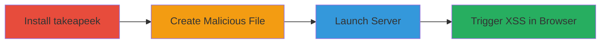

---
tags:
  - xss
  - stored-xss
  - node.js
  - directory-listing
type: attack_chain
tools:
  - '[[tools/npm]]'
  - '[[tools/touch]]'
  - '[[tools/takeapeek]]'
  - '[[tools/Chrome]]'
tactics:
  - '[[Execution]]'
  - '[[Collection]]'
verified: false
platforms:
  - Linux
  - Web
submitted: true
complexity: medium
created_at: '2024-10-01T00:00:00Z'
procedures:
  - '[[procedures/Install-takeapeek-Module]]'
  - '[[procedures/Create-Malicious-Filename-for-XSS]]'
  - '[[procedures/Launch-takeapeek-Server]]'
  - '[[procedures/Trigger-XSS-in-Browser]]'
step_count: 4
techniques:
  - '[[Exploit Public-Facing Application]]'
  - '[[JavaScript]]'
updated_at: '2025-12-14T00:11:16.259Z'
description: >-
  Demonstrates exploitation of stored XSS in the takeapeek module's directory
  listing by creating a file with a javascript: URL payload, leading to
  arbitrary JavaScript execution in users' browsers.
skill_level: intermediate
impact_level: high
id: 99b6117c-5661-48b9-8186-f8309f932d12
validated: true
mitre_tactics:
  - '[[Execution]]'
  - '[[Collection]]'
mitre_techniques:
  - '[[Exploit Public-Facing Application]]'
  - '[[JavaScript]]'
---
# Stored XSS in takeapeek Node.js Module via Unsanitized Filenames

Multi-stage attack chain demonstrating exploitation of a stored XSS vulnerability in the takeapeek Node.js module (version 0.2.2), where unsanitized filenames in the directory listing allow injection of javascript: URLs that execute arbitrary JavaScript when clicked by users viewing the listing.

## Chain Metrics Dashboard

| Metric | Value |
|--------|-------|
| Chain Status | Unverified |
| Total Steps | 4 |
| Execution Time | ~5 minutes |
| Skill Level | Intermediate |
| Complexity | Medium |
| Impact Level | High |

## Attack Flow Visualization



## Prerequisites & Requirements

### Required Tools

- [[tools/npm]]
- [[tools/touch]]
- [[tools/takeapeek]]
- [[tools/Chrome]]

### Target Environment

- Linux OS for command execution
- Node.js runtime (version compatible with takeapeek 0.2.2)
- Port 3141 available
- Web browser for triggering

### Initial Access Requirements

- Local machine access with npm and basic Unix tools
- No network credentials needed; local server simulation
- Prior knowledge of Node.js modules

## Detailed Attack Procedures

### Step 1: Install takeapeek Module
procedure: [[procedures/Install-takeapeek-Module]]

**Objective**: Set up the vulnerable takeapeek module globally to enable the static web server with directory listing.

**Instructions**: Use [[commands/npm-install-takeapeek]] to install the module via npm.

```bash
npm install -g takeapeek
```

**Expected Output**: npm installation logs confirming successful global installation of takeapeek version 0.2.2.

**Success Indicators**:
- takeapeek command available in PATH
- No errors in npm output

### Step 2: Create Malicious Filename for XSS
procedure: [[procedures/Create-Malicious-Filename-for-XSS]]

**Objective**: Generate a file with a javascript: URL payload that will be rendered as an executable link in the directory listing.

**Instructions**: Execute [[commands/touch-malicious-filename]] in the target directory to create the file.

```bash
touch 'javascript:alert(1)'
```

**Expected Output**: No output; verify with `ls` showing the file 'javascript:alert(1)'.

**Success Indicators**:
- Malicious file created in current directory
- Filename contains unsanitized javascript: payload

### Step 3: Launch takeapeek Server
procedure: [[procedures/Launch-takeapeek-Server]]

**Objective**: Start the vulnerable HTTP server to serve the directory listing containing the malicious file.

**Instructions**: Run [[commands/takeapeek-launch]] from the directory with the malicious file.

```bash
takeapeek
```

**Expected Output**: Server startup message: "takeapeek listening at http://localhost:3141".

**Success Indicators**:
- Server running on port 3141
- Directory listing accessible at http://localhost:3141

### Step 4: Trigger XSS in Browser
procedure: [[procedures/Trigger-XSS-in-Browser]]

**Objective**: Access the directory listing and interact with the malicious link to execute the JavaScript payload.

**Instructions**: Open http://localhost:3141 in [[tools/Chrome]] and click the link for 'javascript:alert(1)'.

**Expected Output**: Browser alert box displaying "1", confirming XSS execution.

**Success Indicators**:
- JavaScript alert triggered
- Arbitrary code execution in browser context

## Attack Chain Summary

### Key Achievements

1. Installed vulnerable takeapeek module without issues
2. Injected stored XSS payload via filename
3. Served directory listing exposing the payload
4. Executed JavaScript in victim browser context

## Technique & Tactic Coverage

### MITRE ATT&CK Techniques

- [[Exploit Public-Facing Application]]
- [[JavaScript]]

### MITRE ATT&CK Tactics

- [[Execution]]
- [[Collection]]

---
*Last updated: 2024-10-01T00:00:00Z*
