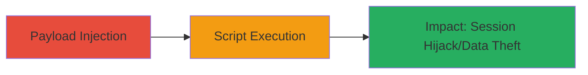

# Stored XSS on Informatica Marketplace for Arbitrary Script Execution

Multi-stage attack chain demonstrating a complete attack workflow.

## Chain Metrics Dashboard

| Metric | Value |
|--------|-------|
| Chain Status | Unverified |
| Total Steps | 1 |
| Execution Time | ~5 minutes |
| Skill Level | Intermediate |
| Complexity | Medium |
| Impact Level | High |

## Attack Flow Visualization

## Prerequisites & Requirements

### Required Tools

- Browser developer tools for payload testing
- Proxy tool like Burp Suite for request manipulation (optional)

### Target Environment

- Web platform
- Access to marketplace.informatica.com
- No specific ports or services beyond standard HTTPS (443)

### Initial Access Requirements

- Valid user account on the marketplace (or public submission if applicable)
- Network access to the internet
- No prior privileged access needed

## Detailed Attack Procedures

### Step 1: Inject and Trigger Stored XSS
procedure: [[procedures/Exploit-Stored-XSS-on-Informatica-Marketplace]]

**Objective**: Submit a malicious JavaScript payload to a vulnerable input field on marketplace.informatica.com, store it persistently, and execute it in the context of other users' browsers when they view the affected page.

**Instructions**: Identify a user-controlled input field (e.g., comment or description field) that lacks proper sanitization. Craft a payload such as `` or more advanced like ``. Submit the payload via the web form. Then, have a victim (or wait for users) view the stored content to trigger execution.

For testing, use browser dev tools to inspect and confirm execution, or intercept requests with a proxy if needed.

**Expected Output**: Malicious script executes in the victim's browser, displaying an alert or sending data to attacker-controlled server.

**Success Indicators**:
- Payload stored without sanitization (visible in page source)
- Script executes on page load for viewers
- Potential cookie theft or session hijack confirmed via attacker server logs

## Attack Chain Summary

### Key Achievements

1. Persistent storage of malicious JavaScript on the target site
2. Execution in multiple users' browsers without further interaction
3. High-impact outcomes like session hijacking or data exfiltration

## Technique & Tactic Coverage

### MITRE ATT&CK Techniques

- [[JavaScript]]

### MITRE ATT&CK Tactics

- [[Execution]]
- [[Collection]]

---
*Last updated: 2023-10-01T00:00:00Z*
