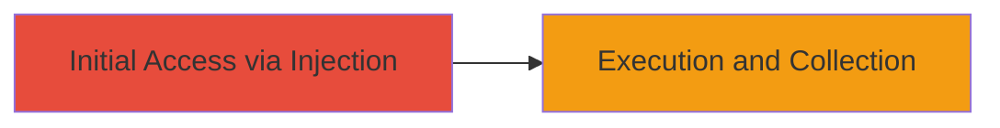

# Stored XSS on U.S. Department of Defense Website for Session Hijacking

Multi-stage attack chain demonstrating a complete attack workflow.

## Chain Metrics Dashboard

| Metric | Value |
|--------|-------|
| Chain Status | Unverified |
| Total Steps | 1 |
| Execution Time | ~5 minutes |
| Skill Level | Intermediate |
| Complexity | Medium |
| Impact Level | High |

## Attack Flow Visualization



## Prerequisites & Requirements

### Required Tools

- Browser developer tools for payload crafting
- Proxy tool like Burp Suite for URL manipulation (optional)

### Target Environment

- Web platform
- Publicly accessible DoD website with user input fields (e.g., forms or comments)
- No specific ports required; standard HTTP/HTTPS

### Initial Access Requirements

- No credentials needed for anonymous submission if the site allows it
- Network access to the target website
- Basic knowledge of JavaScript payloads

## Detailed Attack Procedures

### Step 1: Inject Malicious Payload
procedure: [[procedures/Inject-Malicious-Script-via-Stored-XSS]]

**Objective**: Inject and store a malicious JavaScript payload on the DoD website to execute on other users' browsers, enabling session theft or content modification.

**Instructions**: Craft a URL with a malicious payload targeting a vulnerable input field (e.g., a search parameter or form submission). Submit the payload to store it persistently on the server. Verify execution by accessing the stored content.

For example, use a payload like `<script>alert(document.cookie)</script>` injected via a URL parameter:

```bash
# No direct command; use browser or curl to submit
curl -X GET "https://target-dod-site.com/vulnerable-page?input=<script>alert(document.cookie)</script>"
```

Monitor for the alert or exfiltrated data in subsequent visits.

**Expected Output**: The script executes in the victim's browser, displaying an alert with session cookies or sending data to an attacker-controlled server.

**Success Indicators**:
- Payload is stored and reflected without sanitization
- JavaScript executes on page load for other users
- Session cookies are captured or content is altered

## Attack Chain Summary

### Key Achievements

1. Successful injection of persistent XSS payload on a high-value DoD target
2. Potential for session hijacking and unauthorized data access
3. Demonstration of impact on web content modification for all site visitors

## Technique & Tactic Coverage

### MITRE ATT&CK Techniques

- [[Exploit Public-Facing Application]]
- [[JavaScript]]

### MITRE ATT&CK Tactics

- [[Initial Access]]
- [[Execution]]
- [[Collection]]

---
*Last updated: 2023-10-01T12:00:00Z*
