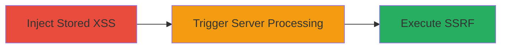

---
tags:
  - xss
  - stored-xss
  - ssrf
  - lark-docs
type: attack_chain
tools: []
tactics:
  - '[[Execution]]'
  - '[[Initial Access]]'
verified: false
platforms:
  - Web
submitted: true
complexity: medium
created_at: '2023-10-01T00:00:00Z'
procedures:
  - '[[procedures/Inject-Stored-XSS-in-Lark-Docs]]'
  - '[[procedures/Trigger-SSRF-via-Headless-Browser-Processing]]'
step_count: 2
techniques:
  - '[[JavaScript]]'
  - '[[Exploit Public-Facing Application]]'
updated_at: '2025-12-13T23:56:19.929Z'
description: >-
  A multi-stage attack exploiting a stored XSS vulnerability in Lark Docs to
  inject persistent scripts, which escalate to SSRF when documents are processed
  server-side in a headless browser.
skill_level: intermediate
impact_level: high
id: f8b33f24-d834-47e3-862d-fd9988010fae
validated: true
mitre_tactics:
  - '[[Execution]]'
  - '[[Initial Access]]'
mitre_techniques:
  - '[[JavaScript]]'
  - '[[Exploit Public-Facing Application]]'
---
# Stored XSS to SSRF Escalation in Lark Docs

Multi-stage attack chain demonstrating a complete attack workflow exploiting persistent script injection in collaborative documents to achieve server-side request forgery.

## Chain Metrics Dashboard

| Metric | Value |
|--------|-------|
| Chain Status | Unverified |
| Total Steps | 2 |
| Execution Time | ~5 minutes |
| Skill Level | Intermediate |
| Complexity | Medium |
| Impact Level | High |

## Attack Flow Visualization

## Prerequisites & Requirements

### Required Tools

- Web browser for payload injection
- Burp Suite or similar proxy for testing payloads (optional)

### Target Environment

- Web platform
- Lark Docs service accessible
- Authenticated access to create/edit documents

### Initial Access Requirements

- Valid user credentials for Lark Docs
- Network access to Lark's web interface
- No prior server access needed

## Detailed Attack Procedures

### Step 1: Inject Malicious Script
procedure: [[procedures/Inject-Stored-XSS-in-Lark-Docs]]

**Objective**: Inject a persistent JavaScript payload into a Lark Docs document that executes when viewed or processed.

**Instructions**: Create a new document in Lark Docs and insert a script tag in the content, such as ``. For escalation, craft a payload that triggers SSRF when processed server-side, e.g., embedding a URL that fetches internal resources.

**Expected Output**: The script persists in the document and executes in viewers' browsers.

**Success Indicators**:
- Alert or payload execution on document view
- Document saves without sanitization errors

### Step 2: Escalate to SSRF via Processing
procedure: [[procedures/Trigger-SSRF-via-Headless-Browser-Processing]]

**Objective**: Cause the server to process the malicious document in a headless browser, leading to unauthorized requests to internal/external resources.

**Instructions**: Share or open the document to trigger server-side rendering. The headless browser on the Lark server will execute the injected script, forging requests (e.g., to `http://169.254.169.254/latest/meta-data/` for AWS metadata if applicable).

**Expected Output**: Server logs or responses indicating SSRF execution, such as fetched internal data.

**Success Indicators**:
- Unauthorized request traces in server logs
- Data exfiltration or access to restricted resources

## Attack Chain Summary

### Key Achievements

1. Persistent script injection bypassing client-side sanitization
2. Escalation from client-side XSS to server-side SSRF
3. Potential data exposure via forged requests in headless browser context

## Technique & Tactic Coverage

### MITRE ATT&CK Techniques

- [[JavaScript]]
- [[Exploit Public-Facing Application]]

### MITRE ATT&CK Tactics

- [[Execution]]
- [[Initial Access]]

---
*Last updated: 2023-10-01T00:00:00Z*
