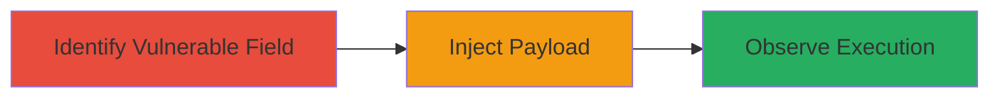

---
tags:
  - xss
  - stored-xss
  - angular
  - javascript-injection
type: attack_chain
tools: []
tactics:
  - '[[Execution]]'
  - '[[Collection]]'
commands: []
platforms:
  - Web
complexity: medium
procedures:
  - '[[procedures/Identify-Vulnerable-Subject-Field-in-FetLife]]'
  - '[[procedures/Inject-Angular-Expression-Payload-into-Message-Subject]]'
  - '[[procedures/Observe-Payload-Execution-on-Recipients-Browser]]'
step_count: 3
techniques:
  - '[[JavaScript]]'
description: >-
  A multi-step attack exploiting a stored XSS vulnerability in FetLife's private
  messaging feature through Angular expression injection in the subject field,
  allowing arbitrary JavaScript execution in the recipient's browser.
skill_level: intermediate
impact_level: high
id: b043a7e8-882a-4355-844e-3e93bd1e7ad1
created_at: '2025-12-13T23:55:20.675Z'
updated_at: '2025-12-13T23:55:20.675Z'
verified: false
validated: true
submitted: true
mitre_tactics:
  - '[[Execution]]'
  - '[[Collection]]'
mitre_techniques:
  - '[[JavaScript]]'
---
# Stored XSS via Angular Expression Injection in FetLife Private Messaging Subject

Multi-stage attack chain demonstrating a complete attack workflow exploiting unsanitized user input in FetLife's private messaging system.

## Chain Metrics Dashboard

| Metric | Value |
|--------|-------|
| Chain Status | Unverified |
| Total Steps | 3 |
| Execution Time | ~5 minutes |
| Skill Level | Intermediate |
| Complexity | Medium |
| Impact Level | High |

## Attack Flow Visualization

## Prerequisites & Requirements

### Required Tools

- Web browser (e.g., Chrome with developer tools)

### Target Environment

- FetLife web application
- Private messaging feature
- Angular-based frontend

### Initial Access Requirements

- Valid FetLife user account
- Ability to initiate private conversations
- Recipient user account for testing

## Detailed Attack Procedures

### Step 1: Identify Vulnerable Subject Field
procedure: [[procedures/Identify-Vulnerable-Subject-Field-in-FetLife]]

**Objective**: Locate and confirm the Subject field in the private messaging interface that lacks proper sanitization for Angular expressions.

**Instructions**: Log in to FetLife, navigate to the private messaging section, and inspect the form for starting a new conversation. Use browser developer tools to examine how the Subject field input is rendered in the recipient's view, confirming that Angular expressions are not escaped.

**Expected Output**: Identification of the Subject field as vulnerable to Angular expression injection, with no sanitization visible in the DOM.

**Success Indicators**:
- Subject field accepts arbitrary input without immediate rejection
- DOM inspection shows raw user input rendered in Angular templates

### Step 2: Inject Angular Expression Payload
procedure: [[procedures/Inject-Angular-Expression-Payload-into-Message-Subject]]

**Objective**: Send a private message with a malicious Angular expression in the Subject field to store and trigger the payload on the recipient's side.

**Instructions**: While composing a new private message, enter an Angular expression payload (e.g., `{{constructor.constructor('alert(1)')()}}`) into the Subject field. Complete the message and send it to a test recipient account.

**Expected Output**: Message sent successfully without errors, with the payload stored in the backend and visible in the conversation list.

**Success Indicators**:
- Message appears in recipient's inbox with the injected subject
- No server-side validation blocks the expression syntax

### Step 3: Observe Payload Execution
procedure: [[procedures/Observe-Payload-Execution-on-Recipients-Browser]]

**Objective**: Verify that the injected payload executes as JavaScript when the recipient views the message, demonstrating the stored XSS.

**Instructions**: Have the recipient open the private conversation and view the message. Monitor the browser console for execution of the payload, such as an alert dialog or logged output.

**Expected Output**: JavaScript code from the Angular expression runs in the recipient's browser context, potentially popping an alert or performing other actions.

**Success Indicators**:
- Alert or console log appears on recipient's side
- DOM manipulation or network requests triggered by the payload

## Attack Chain Summary

### Key Achievements

1. Successful identification of the unsanitized Subject field in FetLife's private messaging.
2. Injection and storage of Angular expression payload without detection.
3. Execution of arbitrary JavaScript in the victim's browser, enabling session compromise or data exfiltration.

## Technique & Tactic Coverage

### MITRE ATT&CK Techniques

- [[JavaScript]]

### MITRE ATT&CK Tactics

- [[Execution]]
- [[Collection]]

---
*Last updated: 2023-10-01*
