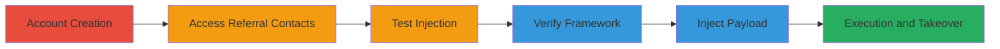

# Stored XSS via AngularJS Template Injection in Referral Contacts for Account Takeover

Multi-stage attack chain demonstrating a complete attack workflow exploiting a stored XSS vulnerability in the drchrono referral contacts feature via AngularJS template injection.

## Chain Metrics Dashboard

| Metric | Value |
|--------|-------|
| Chain Status | Unverified |
| Total Steps | 5 |
| Execution Time | ~5 minutes |
| Skill Level | Intermediate |
| Complexity | Medium |
| Impact Level | High |

## Attack Flow Visualization



## Prerequisites & Requirements

### Required Tools

- Browser with developer console (e.g., Chrome DevTools)

### Target Environment

- Web application: drchrono platform
- Required services/ports: HTTPS on port 443
- Network access requirements: Internet access to https://1337test.drchrono.com

### Initial Access Requirements

- No prior credentials needed; requires ability to register a doctor's account
- Network position: External attacker
- Prior access needed: None

## Detailed Attack Procedures

### Step 1: Create Doctor's Account

**Objective**: Gain access to the referral contacts feature by registering an account with appropriate permissions.

**Instructions**: Navigate to the registration page and create a new doctor's account to enable access to the referral contacts functionality.

**Expected Output**: Successful login and access to the dashboard.

**Success Indicators**:
- Account created and logged in
- Referral contacts menu visible

### Step 2: Access Referral Contacts Page
procedure: [[procedures/Exploit-Stored-XSS-via-AngularJS-Template-Injection]]

**Objective**: Navigate to the vulnerable endpoint where the address field can be manipulated.

**Instructions**: After logging in, go to the referral contacts section at https://1337test.drchrono.com/messages/referrals/contacts/.

**Expected Output**: The contacts overview page loads without errors.

**Success Indicators**:
- Page loads successfully
- Form for adding new contacts is available

### Step 3: Test for Template Injection
procedure: [[procedures/Exploit-Stored-XSS-via-AngularJS-Template-Injection]]

**Objective**: Confirm AngularJS template injection vulnerability in the address field.

**Instructions**: In the add new contact form, enter `[[5*5]]` in the address field, save the contact, and check the overview page where the address should evaluate to 25.

**Expected Output**: Address displays as "25" instead of the literal string.

**Success Indicators**:
- Mathematical expression evaluates on display
- Template injection confirmed

### Step 4: Verify AngularJS Version
procedure: [[procedures/Exploit-Stored-XSS-via-AngularJS-Template-Injection]]

**Objective**: Determine the AngularJS version to craft an effective payload.

**Instructions**: Open the browser developer console and execute [[commands/angular-version-check]] to retrieve the framework version.

```javascript
angular.version
```

**Expected Output**: Version information, e.g., { full: '1.1.5', major: 1, minor: 1, dot: 5 }.

**Success Indicators**:
- AngularJS version 1.1.5 confirmed
- Payload compatibility verified

### Step 5: Inject and Execute XSS Payload
procedure: [[procedures/Exploit-Stored-XSS-via-AngularJS-Template-Injection]]

**Objective**: Inject a malicious payload to execute arbitrary JavaScript, enabling data theft or account takeover.

**Instructions**: In the address field, enter the payload `[[constructor.constructor('alert(document.cookie)')()]]`, save the contact, and reload the page to trigger execution.

**Expected Output**: Alert popup displaying document cookies.

**Success Indicators**:
- JavaScript alert fires with cookies
- Potential for further exploitation like sending data to a remote endpoint

## Attack Chain Summary

### Key Achievements

1. Confirmed AngularJS template injection in stored user input
2. Executed arbitrary JavaScript via stored XSS
3. Enabled account takeover for admin viewers through cookie theft

## Technique & Tactic Coverage

### MITRE ATT&CK Techniques

- [[JavaScript]]

### MITRE ATT&CK Tactics

- [[Execution]]
- [[Collection]]

---
*Last updated: 2023-10-01T12:00:00Z*
