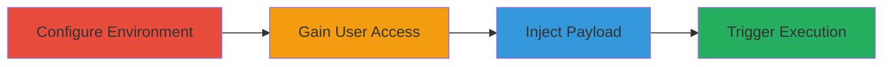

---
tags:
  - xss
  - stored-xss
  - wordpress
  - buddypress
  - attribute-injection
type: attack_chain
tools: []
tactics:
  - '[[Execution]]'
commands: []
platforms:
  - Web
  - WordPress
complexity: medium
procedures:
  - '[[procedures/Enable-BuddyPress-User-Bio-Display]]'
  - '[[procedures/Create-Unprivileged-User-Account]]'
  - '[[procedures/Inject-XSS-Payload-into-User-Bio]]'
  - '[[procedures/Trigger-XSS-on-Profile-View]]'
step_count: 4
techniques:
  - '[[JavaScript]]'
description: >-
  A multi-step attack exploiting a stored XSS vulnerability in WordPress's
  wp_targeted_link_rel function by injecting malicious attributes into a user
  bio, leading to JavaScript execution on profile views in BuddyPress.
skill_level: intermediate
impact_level: high
id: 3cf063f9-a6f5-4b10-844a-e24d8321c541
created_at: '2025-12-13T23:55:20.658Z'
updated_at: '2025-12-13T23:55:20.658Z'
verified: false
validated: true
submitted: true
mitre_tactics:
  - '[[Execution]]'
mitre_techniques:
  - '[[JavaScript]]'
---
# Stored XSS via Attribute Injection in WordPress User Bio

Multi-stage attack chain demonstrating a complete attack workflow exploiting improper attribute parsing in WordPress's wp_targeted_link_rel function, allowing stored XSS in user bios displayed via BuddyPress.

## Chain Metrics Dashboard

| Metric | Value |
|--------|-------|
| Chain Status | Unverified |
| Total Steps | 4 |
| Execution Time | ~10 minutes |
| Skill Level | Intermediate |
| Complexity | Medium |
| Impact Level | High |

## Attack Flow Visualization

## Prerequisites & Requirements

### Required Tools

- Web browser for manual interactions
- Administrative access to WordPress for initial setup (attacker may need temporary admin if not already present)

### Target Environment

- WordPress installation with BuddyPress plugin
- PHP-based web platform
- User registration enabled

### Initial Access Requirements

- Administrative credentials for configuration (or social engineering to gain them)
- Ability to register a standard user account
- Network access to the WordPress site

## Detailed Attack Procedures

### Step 1: Configure BuddyPress to Display User Bio
procedure: [[procedures/Enable-BuddyPress-User-Bio-Display]]

**Objective**: Ensure user bios are visible on profile pages to facilitate XSS payload display and execution.

**Instructions**: Log in as an administrator and navigate to the BuddyPress settings to enable bio display. This step prepares the environment for the payload to be rendered.

**Expected Output**: User bios now appear on profile pages when viewed.

**Success Indicators**:
- Bio field is visible in the WordPress customizer for BuddyPress
- Profile pages show user descriptions after saving changes

### Step 2: Create Unprivileged User Account
procedure: [[procedures/Create-Unprivileged-User-Account]]

**Objective**: Establish a low-privilege account to inject the XSS payload without requiring elevated access.

**Instructions**: Register a new standard user account on the WordPress site. This account will be used to edit the profile and insert the malicious payload.

**Expected Output**: Confirmation of account creation and ability to log in.

**Success Indicators**:
- Successful registration email or on-screen confirmation
- Login successful with the new account

### Step 3: Inject XSS Payload into User Bio
procedure: [[procedures/Inject-XSS-Payload-into-User-Bio]]

**Objective**: Exploit the wp_targeted_link_rel function by crafting an <a> tag that injects a malicious onmouseover attribute due to improper regex parsing of the rel attribute.

**Instructions**: Log in with the created account, edit the user profile, and paste the crafted payload into the description/bio field. The payload leverages attribute injection by placing rel inside the title attribute's value, bypassing delimiter checks.

**Expected Output**: Profile updated successfully with the injected <a> tag.

**Success Indicators**:
- No errors during profile save
- Payload visible in the bio when viewing the profile (but not yet triggered)

### Step 4: Trigger XSS on Profile View
procedure: [[procedures/Trigger-XSS-on-Profile-View]]

**Objective**: Execute the injected JavaScript by interacting with the malicious link on the profile page, demonstrating arbitrary code execution.

**Instructions**: Visit the target user's profile page and hover over the injected link to trigger the onmouseover event, executing the alert.

**Expected Output**: JavaScript alert box displaying "XSS" pops up.

**Success Indicators**:
- Alert executes on hover
- Potential for further exploitation, such as wormable spread if payload is modified to cover the page

## Attack Chain Summary

### Key Achievements

1. Bypassed WordPress's link filtering to inject executable attributes
2. Achieved stored XSS affecting all viewers of the profile
3. Demonstrated potential for self-propagating attacks via page-spanning links

## Technique & Tactic Coverage

### MITRE ATT&CK Techniques

- [[JavaScript]]

### MITRE ATT&CK Tactics

- [[Execution]]

---
*Last updated: 2023-10-01T00:00:00Z*
