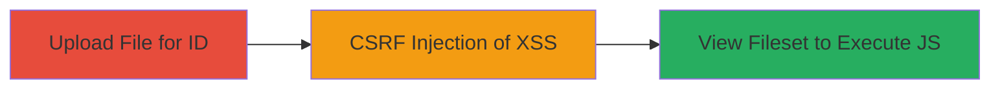

# Stored XSS via CSRF in Concrete CMS Fileset Addition

Multi-stage attack chain demonstrating exploitation of a CSRF vulnerability to store an XSS payload in Concrete CMS 5.7.3 fileset management, resulting in arbitrary JavaScript execution for authenticated users.

## Chain Metrics Dashboard

| Metric | Value |
|--------|-------|
| Chain Status | Unverified |
| Total Steps | 3 |
| Execution Time | ~5 minutes |
| Skill Level | Intermediate |
| Complexity | Medium |
| Impact Level | High |

## Attack Flow Visualization

## Prerequisites & Requirements

### Required Tools

- Web browser (e.g., Chrome with developer tools)
- Optional: Proxy tool like Burp Suite for crafting requests

### Target Environment

- Concrete CMS 5.7.3 running on PHP
- Web platform accessible via HTTP/HTTPS
- Authenticated user session required for viewing filesets

### Initial Access Requirements

- Ability to upload files as an authenticated user
- Victim (authenticated user) must visit the attacker's malicious page
- Network access to the target CMS instance

## Detailed Attack Procedures

### Step 1: Upload File to Obtain ID

procedure: [[procedures/Upload-File-to-Obtain-ID-in-Concrete-CMS]]

**Objective**: Gain a valid file ID (fID) by uploading a benign file, which is needed to associate the malicious fileset.

**Instructions**: Log in to the Concrete CMS dashboard and navigate to the file manager. Upload any small file (e.g., a text file) to receive an fID, typically starting from 1 for the first upload.

**Expected Output**: Successful upload confirmation with the file listed and an assigned fID visible in the URL or page source (e.g., fID=1).

**Success Indicators**:
- File appears in /dashboard/files
- fID extracted from the file details or network requests

### Step 2: Deliver CSRF Payload for Malicious Fileset Addition

procedure: [[procedures/Deliver-CSRF-Payload-for-Malicious-Fileset-Addition]]

**Objective**: Trick an authenticated victim into submitting a POST request via CSRF to add a fileset with an embedded XSS payload in the name.

**Instructions**: Host a malicious HTML page on an attacker-controlled server. The page contains a form that auto-submits to the target endpoint with the XSS payload. Use the fID from Step 1 in the form fields. Example payload in fsNewText: ">".

**Expected Output**: The fileset is added silently without user interaction on the victim side; verify by checking the filesets list in the dashboard (requires separate access).

**Success Indicators**:
- Network request intercepted showing POST to /tools/required/files/add_to
- New fileset appears in /dashboard/files/sets with the malicious name

### Step 3: Trigger Stored XSS by Viewing Fileset

procedure: [[procedures/Trigger-Stored-XSS-by-Viewing-Fileset]]

**Objective**: Cause the stored XSS payload to execute JavaScript in the victim's browser context when they access the fileset management page.

**Instructions**: As the victim (or attacker with access), navigate to /dashboard/files/sets. The unsanitized fileset name renders the XSS payload, triggering the onerror handler.

**Expected Output**: JavaScript alert pops up displaying the current page location (e.g., alert(http://target/conc573/index.php/dashboard/files/sets)).

**Success Indicators**:
- Alert box appears on page load
- Browser console shows JavaScript execution errors or alerts

## Attack Chain Summary

### Key Achievements

1. Bypassed CSRF protections to inject unsanitized input into fileset storage
2. Stored persistent XSS payload exploitable by any authenticated viewer
3. Achieved arbitrary JavaScript execution for potential session theft or further attacks

## Technique & Tactic Coverage

### MITRE ATT&CK Techniques

- [[JavaScript]]
- [[Drive-by Compromise]]
- [[Exploit Public-Facing Application]]

### MITRE ATT&CK Tactics

- [[Execution]]
- [[Collection]]

---
*Last updated: 2023-10-01T00:00:00Z*
