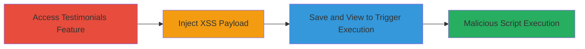

---
tags:
  - xss
  - stored-xss
  - concrete-cms
  - php
  - web-vulnerability
type: attack_chain
tools: []
tactics:
  - '[[Execution]]'
  - '[[Initial Access]]'
verified: false
platforms:
  - Web
submitted: true
complexity: low
created_at: '2023-10-01T00:00:00Z'
procedures:
  - '[[procedures/Access-Testimonials-Feature-in-Concrete-CMS]]'
  - '[[procedures/Inject-XSS-Payload-into-Company-URL]]'
  - '[[procedures/Trigger-Stored-XSS-by-Viewing-Testimonial]]'
step_count: 3
techniques:
  - '[[Exploit Public-Facing Application]]'
  - '[[JavaScript]]'
updated_at: '2025-12-14T03:15:35.423Z'
description: >-
  A multi-step attack exploiting insufficient input sanitization in the Concrete
  CMS testimonials feature to inject and execute malicious JavaScript via the
  Company URL field.
skill_level: low
impact_level: high
id: bb2a91ab-7ccb-4c5e-90be-ab7e8a9dc8c0
validated: true
mitre_tactics:
  - '[[Execution]]'
  - '[[Initial Access]]'
mitre_techniques:
  - '[[Exploit Public-Facing Application]]'
  - '[[JavaScript]]'
---
# Stored XSS via Company URL Field in Concrete CMS Testimonials

Multi-stage attack chain demonstrating a complete attack workflow exploiting a stored cross-site scripting vulnerability in the testimonials feature of Concrete CMS.

## Chain Metrics Dashboard

| Metric | Value |
|--------|-------|
| Chain Status | Unverified |
| Total Steps | 3 |
| Execution Time | ~1 minute |
| Skill Level | Low |
| Complexity | Low |
| Impact Level | High |

## Attack Flow Visualization

## Prerequisites & Requirements

### Required Tools

- Web browser (e.g., Chrome, Firefox)

### Target Environment

- Concrete CMS instance (PHP-based web application)
- Access to the testimonials management interface (requires authenticated user privileges, such as admin or editor role)
- No specific ports or services beyond standard HTTP/HTTPS (ports 80/443)

### Initial Access Requirements

- Valid credentials to log into the Concrete CMS dashboard
- Network access to the target web application
- No prior access needed beyond authentication

## Detailed Attack Procedures

### Step 1: Access Testimonials Feature
procedure: [[procedures/Access-Testimonials-Feature-in-Concrete-CMS]]

**Objective**: Locate and access the Company URL input field in the testimonials feature to prepare for payload injection.

**Instructions**: Log into the Concrete CMS dashboard and navigate to the testimonials section. Identify the form for adding or editing a testimonial, focusing on the Company URL field which accepts user input without validation.

**Expected Output**: The testimonials management page loads, displaying the input form with the vulnerable Company URL field.

**Success Indicators**:
- Testimonials feature accessible
- Company URL input field visible and editable

### Step 2: Inject XSS Payload
procedure: [[procedures/Inject-XSS-Payload-into-Company-URL]]

**Objective**: Insert a malicious JavaScript payload into the Company URL field to bypass sanitization and store executable code.

**Instructions**: In the Company URL field, enter the payload `'>`. This payload closes the HTML attribute and injects an image tag that triggers JavaScript on error.

**Expected Output**: The payload is accepted without error and can be saved.

**Success Indicators**:
- Payload entered successfully
- No immediate validation errors

### Step 3: Save and View Testimonial
procedure: [[procedures/Trigger-Stored-XSS-by-Viewing-Testimonial]]

**Objective**: Persist the injected payload and execute it in the browser context when the testimonial is viewed, demonstrating script execution.

**Instructions**: Save the testimonial entry. Then, navigate to view the testimonial page. The payload executes automatically, popping an alert box with '1'.

**Expected Output**: JavaScript alert box appears, confirming execution. The script is now stored and will run for any user viewing the page.

**Success Indicators**:
- Testimonial saves without issues
- Alert box triggers on page view
- Potential for further exploitation like session hijacking

## Attack Chain Summary

### Key Achievements

1. Successful identification of the vulnerable input field in Concrete CMS testimonials.
2. Injection and storage of malicious JavaScript payload without sanitization.
3. Execution of the payload leading to client-side script control, enabling attacks like data theft or phishing.

## Technique & Tactic Coverage

### MITRE ATT&CK Techniques

- [[Exploit Public-Facing Application]] Exploit Public-Facing Application
- [[JavaScript]] JavaScript

### MITRE ATT&CK Tactics

- [[Execution]] Execution
- [[Initial Access]] Initial Access

---
*Last updated: 2023-10-01T00:00:00Z*
