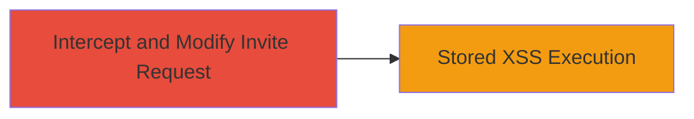

---
tags:
  - xss
  - stored-xss
  - web-vulnerability
  - injection
type: attack_chain
tools:
  - '[[tools/Burp-Suite]]'
tactics:
  - '[[Execution]]'
verified: false
platforms:
  - Web
submitted: true
complexity: medium
created_at: '2023-10-01T00:00:00Z'
procedures:
  - '[[procedures/Inject-Malicious-Payload-into-Crew-Invite-Message]]'
step_count: 1
techniques:
  - '[[JavaScript]]'
updated_at: '2025-12-14T00:11:09.201Z'
description: >-
  A stored XSS attack exploiting insufficient input filtering in the Crew Invite
  mechanism, allowing injection of malicious scripts via modified requests.
skill_level: intermediate
impact_level: high
id: 392151c1-9a4e-41f5-86a5-07acf169ff17
validated: true
mitre_tactics:
  - '[[Execution]]'
mitre_techniques:
  - '[[JavaScript]]'
---
# Stored XSS via Crew Invite Message Injection in Rockstar Games Platform

Multi-stage attack chain demonstrating a complete attack workflow targeting the Crew Invite feature on Rockstar Games' platform.

## Chain Metrics Dashboard

| Metric | Value |
|--------|-------|
| Chain Status | Unverified |
| Total Steps | 1 |
| Execution Time | ~5 minutes |
| Skill Level | Intermediate |
| Complexity | Medium |
| Impact Level | High |

## Attack Flow Visualization



## Prerequisites & Requirements

### Required Tools

- [[tools/Burp-Suite]]

### Target Environment

- Web platform (Rockstar Games Crew Invite endpoint)
- Required services/ports: HTTPS (443)
- Network access requirements: Ability to send authenticated requests to the Crew Invite API

### Initial Access Requirements

- Valid user account on Rockstar Games platform
- Network position: Direct internet access
- Prior access needed: Logged-in session for sending invites

## Detailed Attack Procedures

### Step 1: Intercept and Inject Payload
procedure: [[procedures/Inject-Malicious-Payload-into-Crew-Invite-Message]]

**Objective**: Modify an in-flight request to the Crew Invite endpoint to inject control characters and escape filters, storing a malicious XSS payload in the invitation message.

**Instructions**: Use [[tools/Burp-Suite]] to intercept the request. Set up a proxy and configure your browser to route traffic through it. Navigate to the Crew Invite feature, enter a normal invite message, and intercept the POST request to the invite endpoint. In the message body parameter, append unexpected control characters (e.g., null bytes or non-printable Unicode) followed by a JavaScript payload like `<script>alert('XSS')</script>`. Forward the modified request and view the invite to trigger execution.

Execute a simulated request modification using [[commands/modify-crew-invite-request]] for testing:

```bash
curl -X POST 'https://platform.rockstargames.com/crew/invite' \
  -H 'Authorization: Bearer YOUR_TOKEN' \
  -H 'Content-Type: application/json' \
  -d '{"message": "Normal invite\\x00<script>alert(\\"XSS\\")</script>"}'
```

Then, access the invite link to verify payload execution.

**Expected Output**: The invite is created successfully, and viewing it executes the script (e.g., alert popup).

**Success Indicators**:
- Request accepted without error
- Malicious script executes on invite view
- No filter blocking observed

## Attack Chain Summary

### Key Achievements

1. Bypassed input filters using control characters in the message body
2. Stored malicious JavaScript payload for persistent XSS
3. Demonstrated potential for session hijacking or data theft upon invite access

## Technique & Tactic Coverage

### MITRE ATT&CK Techniques

- [[JavaScript]]

### MITRE ATT&CK Tactics

- [[Execution]]

---
*Last updated: 2023-10-01T00:00:00Z*
