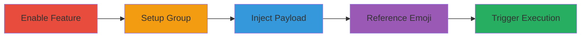

---
tags:
  - xss
  - stored-xss
  - gitlab
  - graphql
  - injection
type: attack_chain
tools:
  - '[[tools/gitlab-rails-console]]'
  - '[[tools/GraphQL-Explorer]]'
  - '[[tools/Web-Browser]]'
  - '[[tools/gitlab-rake]]'
tactics:
  - '[[Execution]]'
  - '[[Collection]]'
verified: false
platforms:
  - Web
  - Linux
submitted: true
complexity: medium
created_at: '2023-10-01T00:00:00Z'
procedures:
  - '[[procedures/Enable-Custom-Emoji-Feature-Flag-in-GitLab]]'
  - '[[procedures/Create-Group-for-Custom-Emojis-in-GitLab]]'
  - '[[procedures/Create-Malicious-Custom-Emoji-via-GraphQL]]'
  - '[[procedures/Create-Project-and-Reference-Emoji-in-File]]'
  - '[[procedures/Trigger-XSS-by-Viewing-Project-File]]'
step_count: 5
techniques:
  - '[[JavaScript]]'
updated_at: '2025-12-13T23:56:03.686Z'
description: >-
  A multi-stage attack exploiting a stored XSS vulnerability in GitLab's custom
  emoji feature to inject and execute malicious JavaScript payloads in users'
  browsers.
skill_level: intermediate
impact_level: high
id: 5256edbd-a99b-44bc-99e9-b794f58b3e54
validated: true
mitre_tactics:
  - '[[Execution]]'
  - '[[Collection]]'
mitre_techniques:
  - '[[JavaScript]]'
---
# Stored XSS via Custom Emoji Injection in GitLab

Multi-stage attack chain demonstrating a complete attack workflow exploiting a stored XSS vulnerability in GitLab's custom emoji feature.

## Chain Metrics Dashboard

| Metric | Value |
|--------|-------|
| Chain Status | Unverified |
| Total Steps | 5 |
| Execution Time | ~10 minutes |
| Skill Level | Intermediate |
| Complexity | Medium |
| Impact Level | High |

## Attack Flow Visualization



## Prerequisites & Requirements

### Required Tools

- [[tools/gitlab-rails-console]]
- [[tools/GraphQL-Explorer]]
- [[tools/Web-Browser]]
- [[tools/gitlab-rake]]

### Target Environment

- GitLab self-managed installation (e.g., version with custom emoji feature flag)
- Required services: GitLab, PostgreSQL, Redis, Sidekiq
- Tech stack: Ruby 2.7.2, Rails 6.0.3.6, PostgreSQL 12.6
- Network access: Local or internal access to GitLab instance

### Initial Access Requirements

- Administrative or developer credentials to access Rails console and GraphQL API
- Ability to create groups and projects in GitLab
- Browser access to view project files

## Detailed Attack Procedures

### Step 1: Enable Custom Emoji Feature
procedure: [[procedures/Enable-Custom-Emoji-Feature-Flag-in-GitLab]]

**Objective**: Activate the custom emoji feature flag to enable the vulnerable functionality.

**Instructions**: Access the GitLab Rails console and execute the feature enable command using [[commands/enable-custom-emoji-flag]]:

```ruby
gitlab-rails console
Feature.enable(:custom_emoji)
```

**Expected Output**: The command returns `true`, indicating the feature is enabled.

**Success Indicators**:
- Feature flag status shows as enabled
- No errors in Rails console output

### Step 2: Create Group for Emojis
procedure: [[procedures/Create-Group-for-Custom-Emojis-in-GitLab]]

**Objective**: Set up a group to host custom emojis, providing a namespace for the injection.

**Instructions**: Use the GitLab UI to create a new group named 'xss_target'. No specific command-line tool is required; navigate to the groups section and create it manually.

**Expected Output**: New group 'xss_target' appears in the GitLab dashboard.

**Success Indicators**:
- Group created successfully
- Permissions allow adding custom emojis to the group

### Step 3: Inject Malicious Emoji
procedure: [[procedures/Create-Malicious-Custom-Emoji-via-GraphQL]]

**Objective**: Create a custom emoji with an XSS payload in the URL to inject malicious JavaScript.

**Instructions**: Use the GraphQL Explorer to send a mutation with [[commands/create-custom-emoji-graphql]]:

```graphql
mutation { createCustomEmoji(input: { groupPath: "xss_target", name:"xssreplace", url:"http://aaa#'>" }) { customEmoji { id name url } } }
```

**Expected Output**: JSON response containing the custom emoji details, including ID, name, and the injected URL.

**Success Indicators**:
- Emoji created without validation errors
- Payload URL is stored as provided

### Step 4: Reference Emoji in Project
procedure: [[procedures/Create-Project-and-Reference-Emoji-in-File]]

**Objective**: Create a project within the group and embed the malicious emoji reference in a visible file like README.md.

**Instructions**: In the GitLab UI, create a new project in the 'xss_target' group and add a README.md file with content ':xssreplace:'. Commit the file to the repository.

**Expected Output**: File committed and visible in the project repository.

**Success Indicators**:
- Emoji reference ':xssreplace:' appears in the file
- File is accessible to other users (public or internal repo)

### Step 5: Trigger XSS Execution
procedure: [[procedures/Trigger-XSS-by-Viewing-Project-File]]

**Objective**: View the project file in a browser to render the emoji and execute the injected XSS payload.

**Instructions**: Open a web browser and navigate to the project file URL (e.g., https://gitlab.example.com/xss_target/project/-/blob/main/README.md). The emoji renders, triggering the onerror event in the img tag.

**Expected Output**: Alert box pops up displaying the current location, confirming XSS execution; potential for session hijacking or data theft.

**Success Indicators**:
- JavaScript alert executes
- Payload impacts viewer without direct interaction

## Attack Chain Summary

### Key Achievements

1. Enabled vulnerable feature and injected stored XSS payload via GraphQL API
2. Persisted the payload in a custom emoji referenced in project files
3. Achieved arbitrary JavaScript execution in browsers of users viewing affected content, enabling session theft or phishing

## Technique & Tactic Coverage

### MITRE ATT&CK Techniques

- [[JavaScript]]

### MITRE ATT&CK Tactics

- [[Execution]]
- [[Collection]]

---

*Last updated: 2023-10-01T00:00:00Z*
