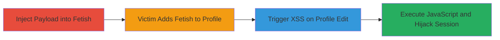

---
tags:
  - xss
  - stored-xss
  - javascript
  - session-hijacking
  - web-exploitation
type: attack_chain
tools: []
tactics:
  - '[[Execution]]'
verified: false
platforms:
  - Web
submitted: true
complexity: low
created_at: '2024-10-04T00:00:00Z'
procedures:
  - '[[procedures/Inject-Malicious-Payload-into-Fetish-Name]]'
  - '[[procedures/Incorporate-Malicious-Fetish-into-Victim-Profile]]'
  - '[[procedures/Trigger-XSS-Execution-via-Profile-Edit]]'
step_count: 3
techniques:
  - '[[Exploit Public-Facing Application]]'
  - '[[JavaScript]]'
updated_at: '2025-12-13T23:55:37.814Z'
description: >-
  A multi-stage stored XSS attack exploiting the unsanitized 'fetish' field in
  FetLife's Create a Fetish section to inject and persist malicious JavaScript,
  which executes when victims add the fetish to their profiles and edit it,
  enabling session hijacking or data theft.
skill_level: intermediate
impact_level: high
id: 717c4ca6-ed2f-44cc-bc98-0cc4e8cba477
validated: true
mitre_tactics:
  - '[[Execution]]'
mitre_techniques:
  - '[[Exploit Public-Facing Application]]'
  - '[[JavaScript]]'
---
# Stored XSS via Fetish Field for Profile Edit Execution on FetLife

Multi-stage attack chain demonstrating a complete stored XSS workflow on FetLife, where an attacker injects malicious JavaScript into a fetish name, persists it in the database, and triggers execution in victims' browsers during profile editing, potentially leading to session theft or client-side attacks.

## Chain Metrics Dashboard

| Metric | Value |
|--------|-------|
| Chain Status | Unverified |
| Total Steps | 3 |
| Execution Time | ~5 minutes |
| Skill Level | Intermediate |
| Complexity | Low |
| Impact Level | High |

## Attack Flow Visualization

## Prerequisites & Requirements

### Required Tools

- Web browser (e.g., Chrome with developer tools)

### Target Environment

- FetLife web application
- Required services/ports: HTTPS on port 443
- Network access requirements: Internet access to fetlife.com

### Initial Access Requirements

- Attacker requires a registered FetLife account with ability to create fetishes
- No special credentials beyond standard user account
- Victims require FetLife accounts and interaction with fetishes

## Detailed Attack Procedures

### Step 1: Inject Malicious Payload
procedure: [[procedures/Inject-Malicious-Payload-into-Fetish-Name]]

**Objective**: Create a new fetish with an embedded XSS payload that persists in the database without sanitization.

**Instructions**: Log in to your FetLife account, navigate to the 'Create a Fetish' section, and enter a malicious JavaScript payload in the 'fetish' name field, such as ``, then submit the form to store it.

**Expected Output**: The fetish is created successfully and appears in the fetish list with the payload intact.

**Success Indicators**:
- Fetish creation confirmation
- Payload visible in fetish directory without alteration

### Step 2: Incorporate Malicious Fetish into Victim Profile
procedure: [[procedures/Incorporate-Malicious-Fetish-into-Victim-Profile]]

**Objective**: Induce the victim to add the malicious fetish to their profile, incorporating the stored payload into their personal data.

**Instructions**: Share the malicious fetish link via social engineering (e.g., forum post, direct message) encouraging the victim to add it to their interests. The victim navigates to their profile settings and adds the fetish from the directory.

**Expected Output**: Victim's profile updates to include the fetish, with the payload now associated with their account data.

**Success Indicators**:
- Victim confirms addition of fetish to profile
- Attacker observes or infers addition via platform interactions

### Step 3: Trigger XSS Execution
procedure: [[procedures/Trigger-XSS-Execution-via-Profile-Edit]]

**Objective**: Cause the victim to edit their profile, rendering the unsanitized fetish name and executing the JavaScript in their browser context.

**Instructions**: Encourage the victim (via social engineering) to edit their profile settings where fetishes are listed. Upon loading the edit interface, the browser renders the fetish name, triggering the XSS payload.

**Expected Output**: JavaScript executes, e.g., alert pops up showing cookies, or payload steals session data and sends it to attacker-controlled server.

**Success Indicators**:
- Alert or network request to attacker server from victim's browser
- Captured session cookies or other data

## Attack Chain Summary

### Key Achievements

1. Successful injection and persistence of XSS payload in fetish field
2. Victim incorporation of malicious fetish into profile
3. Arbitrary JavaScript execution leading to potential account compromise

## Technique & Tactic Coverage

### MITRE ATT&CK Techniques

- [[Exploit Public-Facing Application]]
- [[JavaScript]]

### MITRE ATT&CK Tactics

- [[Execution]]

---
*Last updated: 2024-10-04T00:00:00Z*
