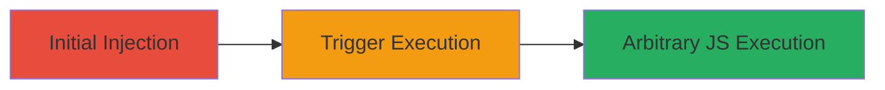

---
tags:
  - xss
  - stored-xss
  - web-vulnerability
  - javascript-execution
type: attack_chain
tools:
  - '[[tools/Burp-Suite]]'
tactics:
  - '[[Initial Access]]'
  - '[[Execution]]'
commands:
  - '[[commands/inject-xss-payload-via-curl]]'
platforms:
  - Web
complexity: medium
procedures:
  - '[[procedures/Inject-Stored-XSS-Payload-in-Friend-Request-Message]]'
  - '[[procedures/Trigger-Stored-XSS-via-Friend-Request-Acceptance]]'
step_count: 2
techniques:
  - '[[JavaScript]]'
description: >-
  Exploitation of a stored XSS vulnerability in the Add Friend functionality on
  socialclub.rockstargames.com by injecting malicious payloads into the Message
  field, leading to arbitrary JavaScript execution upon acceptance.
skill_level: intermediate
impact_level: high
id: c551fb50-cca9-4199-ac7b-126f5ef682d5
created_at: '2025-12-13T23:56:20.013Z'
updated_at: '2025-12-13T23:56:20.013Z'
verified: false
validated: true
submitted: true
mitre_tactics:
  - '[[Initial Access]]'
  - '[[Execution]]'
mitre_techniques:
  - '[[JavaScript]]'
---
# Stored XSS via Friend Request Message for Arbitrary JS Execution on Rockstar Social Club

Multi-stage attack chain demonstrating the exploitation of a stored XSS vulnerability in the Rockstar Games Social Club platform. The attack involves injecting a malicious payload into the optional Message field during a friend request, which executes when the victim accepts the request, potentially enabling session hijacking or data exfiltration.

## Chain Metrics Dashboard

| Metric | Value |
|--------|-------|
| Chain Status | Unverified |
| Total Steps | 2 |
| Execution Time | ~5 minutes |
| Skill Level | Intermediate |
| Complexity | Medium |
| Impact Level | High |

## Attack Flow Visualization



## Prerequisites & Requirements

### Required Tools

- [[tools/Burp-Suite]]

### Target Environment

- Web platform: Rockstar Social Club (socialclub.rockstargames.com)
- Required services/ports: HTTPS web access
- Network access requirements: Internet access to the platform

### Initial Access Requirements

- Credential requirements: Valid attacker and victim accounts on Social Club
- Network position: External access
- Prior access needed: Ability to send friend requests

## Detailed Attack Procedures

### Step 1: Inject Malicious XSS Payload
procedure: [[procedures/Inject-Stored-XSS-Payload-in-Friend-Request-Message]]

**Objective**: Send a friend request containing a stored XSS payload in the Message field to persist the malicious code.

**Instructions**: Use a web proxy like [[tools/Burp-Suite]] to intercept the friend request or simulate via [[commands/inject-xss-payload-via-curl]]. Inject the payload using an SVG object tag with character escaping, such as: `<svg><object data="javascript:alert('XSS')">`.

```bash
curl -X POST 'https://socialclub.rockstargames.com/friends/add' -d 'friendId=victim_id&message=<svg><object data="javascript:alert(\'XSS\')">' -H 'Cookie: your_session_cookie'
```

**Expected Output**: Friend request sent successfully with the payload stored in the Message field.

**Success Indicators**:
- Request appears in victim's notifications
- Payload is stored without sanitization

### Step 2: Trigger Payload Execution
procedure: [[procedures/Trigger-Stored-XSS-via-Friend-Request-Acceptance]]

**Objective**: Have the victim accept the friend request to execute the stored JavaScript payload in their browser.

**Instructions**: The victim navigates to their friend requests on socialclub.rockstargames.com and clicks the Accept button. No specific command is needed as this is user interaction, but monitor for execution using browser developer tools.

**Expected Output**: Alert or arbitrary JS executes in the victim's browser, confirming vulnerability.

**Success Indicators**:
- JavaScript payload triggers (e.g., alert box appears)
- Potential for session hijacking or data exfiltration

## Attack Chain Summary

### Key Achievements

1. Successful storage of XSS payload in friend request message
2. Execution of arbitrary JavaScript upon acceptance
3. Potential for client-side attacks like session theft

## Technique & Tactic Coverage

### MITRE ATT&CK Techniques

- [[JavaScript]]

### MITRE ATT&CK Tactics

- [[Initial Access]]
- [[Execution]]

*Last updated: 2023-10-01*
