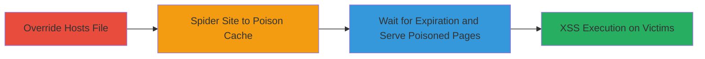

---
tags:
  - stored-xss
  - concrete-cms
  - full-page-caching
  - hostname-manipulation
  - web-exploit
type: attack_chain
tools:
  - '[[tools/Link-Spider]]'
tactics:
  - '[[Execution]]'
  - '[[Initial Access]]'
commands:
  - '[[commands/edit-hosts-file]]'
  - '[[commands/wget-spider-crawl]]'
  - '[[commands/curl-check-expires]]'
platforms:
  - Web
  - PHP
complexity: medium
procedures:
  - '[[procedures/Override-Hosts-File-for-Fake-Domain-Mapping]]'
  - '[[procedures/Spider-Site-to-Generate-Poisoned-Cache-Files]]'
  - '[[procedures/Wait-for-Cache-Expiration-and-Serve-to-Victims]]'
step_count: 3
techniques:
  - '[[Exploit Public-Facing Application]]'
  - '[[JavaScript]]'
description: >-
  A multi-stage attack exploiting the lack of canonical URL in Concrete CMS to
  poison full page caches with a fake domain, leading to stored XSS execution on
  subsequent visitors.
skill_level: intermediate
impact_level: high
id: 723e1d0a-00a6-4d1a-a1a9-92af27aef8c0
created_at: '2025-12-14T03:15:26.559Z'
updated_at: '2025-12-14T03:15:26.559Z'
verified: false
validated: true
submitted: true
mitre_tactics:
  - '[[Execution]]'
  - '[[Initial Access]]'
mitre_techniques:
  - '[[Exploit Public-Facing Application]]'
  - '[[JavaScript]]'
---
# Stored XSS via Full Page Caching Hostname Manipulation in Concrete CMS

## Overview

This attack chain demonstrates how to exploit a Stored XSS vulnerability in Concrete CMS's full page caching mechanism when no canonical URL is configured. By overriding the local hosts file to map the target's IP to a fake domain and spidering the site, attackers can generate cache files embedding the fake domain in local links and as the BASE_URL. Subsequent visitors then receive these poisoned cached pages, allowing XSS payloads to execute by redirecting relative links to malicious resources, potentially leading to script injection, defacement, or data theft.

## Chain Metrics Dashboard

| Metric | Value |
|--------|-------|
| Chain Status | Unverified |
| Total Steps | 3 |
| Execution Time | ~10-30 minutes |
| Skill Level | Intermediate |
| Complexity | Medium |
| Impact Level | High |

## Attack Flow Visualization



## Prerequisites & Requirements

### Required Tools

- [[tools/Link-Spider]]

### Target Environment

- Concrete CMS instance without canonical URL configured
- Full page caching enabled
- Web server supporting non-name-based virtual hosting
- Accessible via IP address

### Initial Access Requirements

- Local machine with administrative access to edit hosts file
- Network access to the target's IP (no authentication needed for public site)
- No prior access to the target; attack is external

## Detailed Attack Procedures

### Step 1: Override Hosts File for Fake Domain Mapping
procedure: [[procedures/Override-Hosts-File-for-Fake-Domain-Mapping]]

**Objective**: Map the target's IP to a fake domain locally to trick the site's URL resolver into using the attacker-controlled hostname.

**Instructions**: Edit the local hosts file to add an entry mapping the target's IP to your fake domain, such as 'fake-site.com' which you control.

Use [[commands/edit-hosts-file]] to append the entry:

```bash
echo "11.22.33.44 fake-site.com" | sudo tee -a /etc/hosts
```

Verify the entry with [[commands/cat-hosts]]:

```bash
cat /etc/hosts | grep fake-site.com
```

**Expected Output**: The hosts file now resolves the target's IP to fake-site.com locally.

**Success Indicators**:
- Fake domain resolves to target IP (test with `ping fake-site.com`)
- No DNS resolution issues

### Step 2: Spider Site to Generate Poisoned Cache Files
procedure: [[procedures/Spider-Site-to-Generate-Poisoned-Cache-Files]]

**Objective**: Crawl the site using the fake domain to trigger full page caching, embedding the fake hostname in absolute URLs and BASE_URL within cache files.

**Instructions**: Use a link spider tool to recursively crawl the site, forcing the caching mechanism to store pages with the manipulated hostname in local links.

Launch the spider with [[commands/wget-spider-crawl]] configured for the fake domain:

```bash
wget --spider --recursive --no-parent -U "Mozilla/5.0" -e robots=off https://fake-site.com/
```

Monitor the crawl to ensure pages are loaded and cached.

**Expected Output**: HTTP responses indicating pages are fetched; cache files generated on the server with fake-site.com in URLs.

**Success Indicators**:
- Crawl completes without errors
- Server logs (if observable) show cache hits/misses turning to hits

### Step 3: Wait for Cache Expiration and Serve to Victims
procedure: [[procedures/Wait-for-Cache-Expiration-and-Serve-to-Victims]]

**Objective**: Allow the poisoned cache to expire into serving state and verify it delivers XSS payloads to unsuspecting visitors.

**Instructions**: Check the cache expiration via HTTP headers, wait the required time, then access the site normally to confirm poisoned content is served.

Use [[commands/curl-check-expires]] to inspect headers:

```bash
curl -I https://target-ip-or-domain/page
```

Wait for the 'Expires' time, then re-request to trigger serving the cache.

**Expected Output**: Response includes fake-site.com in BASE_URL or links, executing XSS if payload is embedded (e.g., <script>alert('XSS')</script> in a link).

**Success Indicators**:
- Poisoned page served with fake domain
- XSS payload executes in browser (alert or console log)

## Attack Chain Summary

### Key Achievements

1. Successful hostname manipulation via local hosts override
2. Generation of poisoned cache files embedding attacker-controlled domain
3. Delivery of stored XSS to subsequent site visitors without further interaction

## Technique & Tactic Coverage

### MITRE ATT&CK Techniques

- [[Exploit Public-Facing Application]]
- [[JavaScript]]

### MITRE ATT&CK Tactics

- [[Execution]]
- [[Initial Access]]

---
*Last updated: 2023-10-01*
