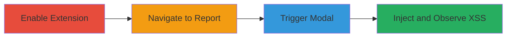

---
tags:
  - xss
  - html-injection
  - chrome-extension
  - hackerone
  - stored-xss
type: attack_chain
tools:
  - '[[tools/H1-Triage-Wizard-Chrome-Extension]]'
tactics:
  - '[[Execution]]'
  - '[[Collection]]'
verified: false
platforms:
  - Web
  - Chrome Browser Extension
submitted: true
complexity: medium
created_at: '2023-10-01T00:00:00Z'
procedures:
  - '[[procedures/Enable-H1-Triage-Wizard-Extension]]'
  - '[[procedures/Navigate-to-Vulnerable-Report-Page]]'
  - '[[procedures/Trigger-Triage-Questionnaire-Modal]]'
  - '[[procedures/Observe-HTML-Payload-Injection]]'
step_count: 4
techniques:
  - '[[JavaScript]]'
updated_at: '2025-12-14T00:11:09.509Z'
description: >-
  Demonstrates HTML injection leading to stored XSS in the H1 Triage Wizard
  Chrome Extension by interpolating unsanitized user inputs into HTML templates
  on HackerOne report pages.
skill_level: intermediate
impact_level: high
id: 7ded0a1b-a7b4-4c93-9810-3977c7fcd740
validated: true
mitre_tactics:
  - '[[Execution]]'
  - '[[Collection]]'
mitre_techniques:
  - '[[JavaScript]]'
---
# Stored XSS via HTML Injection in H1 Triage Wizard Chrome Extension

Multi-stage attack chain demonstrating a complete attack workflow exploiting unsanitized user inputs in the H1 Triage Wizard Chrome Extension to achieve stored XSS on HackerOne.com.

## Chain Metrics Dashboard

| Metric | Value |
|--------|-------|
| Chain Status | Unverified |
| Total Steps | 4 |
| Execution Time | ~5 minutes |
| Skill Level | Intermediate |
| Complexity | Medium |
| Impact Level | High |

## Attack Flow Visualization

## Prerequisites & Requirements

### Required Tools

- [[tools/H1-Triage-Wizard-Chrome-Extension]]

### Target Environment

- Chrome Browser with extensions enabled
- Access to HackerOne.com reports
- No specific ports or services beyond standard web access

### Initial Access Requirements

- Valid browser session on HackerOne.com
- No credentials required for public report pages
- Extension installed and enabled

## Detailed Attack Procedures

### Step 1: Enable Extension
procedure: [[procedures/Enable-H1-Triage-Wizard-Extension]]

**Objective**: Install and activate the H1 Triage Wizard Chrome Extension to prepare for vulnerability exploitation.

**Instructions**: Install the extension from the Chrome Web Store and enable it in the browser's extensions menu. Ensure it is active for HackerOne domains.

**Expected Output**: Extension icon appears in the browser toolbar, and it is listed as enabled in chrome://extensions/.

**Success Indicators**:
- Extension installed without errors
- Activation confirmed in browser settings

### Step 2: Navigate to Report Page
procedure: [[procedures/Navigate-to-Vulnerable-Report-Page]]

**Objective**: Access a specific HackerOne report page that triggers the extension's functionality via URL parameters.

**Instructions**: Open Chrome and navigate to https://hackerone.com/reports/1622449?subject=security&/bugs=1. The 'subject' parameter sets the handle in the upcoming modal.

**Expected Output**: The report page loads, displaying the vulnerability report content.

**Success Indicators**:
- Page loads successfully
- URL includes the subject parameter

### Step 3: Trigger Questionnaire Modal
procedure: [[procedures/Trigger-Triage-Questionnaire-Modal]]

**Objective**: Invoke the triage questionnaire feature to load user-controlled inputs into the extension's HTML template.

**Instructions**: Right-click on the report page and select 'View Triage Questionnaire (Beta)' from the context menu provided by the extension.

**Expected Output**: A modal dialog opens, attempting to render the triage questionnaire with interpolated responses.

**Success Indicators**:
- Context menu option available
- Modal launches without crashing

### Step 4: Inject and Observe Payload
procedure: [[procedures/Observe-HTML-Payload-Injection]]

**Objective**: Confirm the injection of malicious HTML payload into the modal, leading to XSS execution.

**Instructions**: With a pre-configured HTML payload (e.g., ) in the questionnaire responses, observe the modal rendering. The payload is injected via .replace() in the buildTriageQuestionnaireModal function.

**Expected Output**: Malicious HTML renders in the modal, executing JavaScript in the browser context.

**Success Indicators**:
- Payload executes (e.g., alert box appears)
- Browser console shows no sanitization errors

## Attack Chain Summary

### Key Achievements

1. Successful installation and activation of the vulnerable extension
2. Triggering of unsanitized input interpolation in the modal
3. Demonstration of stored XSS execution on HackerOne.com
4. Potential compromise of user sessions viewing the modal

## Technique & Tactic Coverage

### MITRE ATT&CK Techniques

- [[JavaScript]]

### MITRE ATT&CK Tactics

- [[Execution]]
- [[Collection]]

---

*Last updated: 2023-10-01T00:00:00Z*
