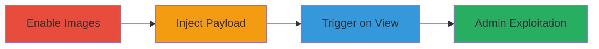

---
tags:
  - xss
  - stored-xss
  - web
  - cookie-theft
  - phishing
type: attack_chain
tools: []
tactics:
  - '[[Execution]]'
  - '[[Credential Access]]'
verified: false
platforms:
  - Web
submitted: true
complexity: medium
created_at: '2023-10-01T00:00:00Z'
procedures:
  - '[[procedures/Enable-Image-Support-in-Intense-Debate-Comments]]'
  - '[[procedures/Submit-Malicious-XSS-Comment-in-Intense-Debate]]'
  - '[[procedures/Trigger-Stored-XSS-by-Viewing-Comment]]'
  - '[[procedures/Target-Admin-Panels-for-XSS-Exploitation]]'
step_count: 4
techniques:
  - '[[JavaScript]]'
  - '[[Steal Web Session Cookie]]'
updated_at: '2025-12-13T23:52:44.532Z'
description: >-
  A multi-stage attack exploiting a stored XSS vulnerability in the Intense
  Debate comment system to inject malicious JavaScript via img tags, enabling
  cookie theft and phishing when admins view comments.
skill_level: intermediate
impact_level: high
id: c975f358-06d5-4b61-8875-c781de507a09
validated: true
mitre_tactics:
  - '[[Execution]]'
  - '[[Credential Access]]'
mitre_techniques:
  - '[[JavaScript]]'
  - '[[Steal Web Session Cookie]]'
---
# Stored XSS via Image onload Attribute in Intense Debate Comments for Admin Cookie Theft

Multi-stage attack chain demonstrating a complete attack workflow exploiting insufficient input sanitization in the Intense Debate comment system.

## Chain Metrics Dashboard

| Metric | Value |
|--------|-------|
| Chain Status | Unverified |
| Total Steps | 4 |
| Execution Time | ~5 minutes |
| Skill Level | Intermediate |
| Complexity | Medium |
| Impact Level | High |

## Attack Flow Visualization

## Prerequisites & Requirements

### Required Tools

- Web browser (e.g., Chrome with developer tools)

### Target Environment

- Intense Debate comment system integrated with a blog
- Access to a blog using Intense Debate for comments
- Moderator or user account on the blog

### Initial Access Requirements

- Valid user account to post comments
- Moderator access to enable image support (if not already enabled)
- No special credentials needed beyond standard user login

## Detailed Attack Procedures

### Step 1: Enable Image Support
procedure: [[procedures/Enable-Image-Support-in-Intense-Debate-Comments]]

**Objective**: Configure the comment system to allow image tags, which is necessary for the img-based XSS payload to be accepted.

**Instructions**: Log in to the Intense Debate moderation panel and navigate to the comments settings to enable image support.

**Expected Output**: Confirmation that images are now permitted in comments.

**Success Indicators**:
- Settings updated successfully
- No errors in the moderation interface

### Step 2: Submit Malicious Comment
procedure: [[procedures/Submit-Malicious-XSS-Comment-in-Intense-Debate]]

**Objective**: Inject a stored XSS payload using an img tag with an onload attribute to execute JavaScript when the comment is loaded.

**Instructions**: Post a comment on the target blog containing the payload ``. Replace alert() with more malicious code like document.cookie stealing in a real attack.

**Expected Output**: Comment posted successfully without sanitization errors.

**Success Indicators**:
- Comment appears in the blog's comment section
- Payload is stored without modification

### Step 3: Trigger Stored XSS
procedure: [[procedures/Trigger-Stored-XSS-by-Viewing-Comment]]

**Objective**: Cause the XSS payload to execute by viewing the comment, demonstrating arbitrary JavaScript execution.

**Instructions**: Visit the blog post where the malicious comment was posted. The img tag will load, triggering the onload event.

**Expected Output**: Alert box or JavaScript execution (e.g., alert popup).

**Success Indicators**:
- JavaScript executes on page load
- No blocking by browser security

### Step 4: Target Admin Exploitation
procedure: [[procedures/Target-Admin-Panels-for-XSS-Exploitation]]

**Objective**: Direct the attack towards admin users by targeting interfaces where comments are reviewed, leading to higher-impact actions like cookie theft.

**Instructions**: Lure or wait for an admin to access pages like the comment history (e.g., https://www.intensedebate.com/commenthistory/{{blog-id}}/{{comment-id}}), where the payload executes in their context.

**Expected Output**: Admin's session cookies or tokens stolen via the executed JavaScript.

**Success Indicators**:
- Malicious script runs in admin's browser
- Data exfiltration to attacker-controlled endpoint

## Attack Chain Summary

### Key Achievements

1. Successful injection of unsanitized HTML attributes in comments
2. Execution of arbitrary JavaScript on any viewer, including admins
3. Potential for session hijacking and phishing attacks

## Technique & Tactic Coverage

### MITRE ATT&CK Techniques

- [[JavaScript]] JavaScript
- [[Steal Web Session Cookie]] Steal Web Session Cookie

### MITRE ATT&CK Tactics

- [[Execution]] Execution
- [[Credential Access]] Credential Access

---
*Last updated: 2023-10-01T00:00:00Z*
