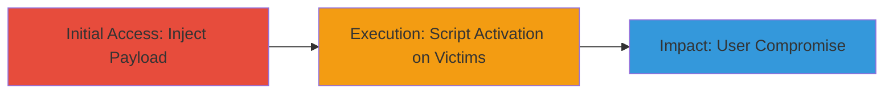

---
tags:
  - xss
  - stored-xss
  - web-vulnerability
type: attack_chain
tools: []
tactics:
  - '[[Initial Access]]'
  - '[[Execution]]'
verified: false
platforms:
  - Web
submitted: true
complexity: medium
created_at: '2023-10-01T00:00:00Z'
procedures:
  - '[[procedures/Inject-Malicious-Script-via-Error-Handling]]'
step_count: 1
techniques:
  - '[[Exploit Public-Facing Application]]'
  - '[[JavaScript]]'
updated_at: '2025-12-13T23:52:24.765Z'
description: >-
  A multi-stage attack exploiting a stored XSS vulnerability on the Acronis
  website through improper error handling, allowing malicious scripts to be
  stored and executed on users viewing affected cached pages.
skill_level: intermediate
impact_level: medium
id: 30480a4e-4d27-467c-927e-82be5919cc28
validated: true
mitre_tactics:
  - '[[Initial Access]]'
  - '[[Execution]]'
mitre_techniques:
  - '[[Exploit Public-Facing Application]]'
  - '[[JavaScript]]'
---
# Stored XSS via Improper Error Handling in Cacheable Response

Multi-stage attack chain demonstrating exploitation of a stored XSS vulnerability on https://www.acronis.com/ due to improper error handling in cacheable responses. This allows attackers to inject malicious JavaScript that is stored and served to users, potentially leading to session hijacking, data theft, or further attacks. The vulnerability was reported on October 18, 2020, triaged, rewarded with a bounty, and resolved by November 4, 2020, with a medium severity rating (4-6.9).

## Chain Metrics Dashboard

| Metric | Value |
|--------|-------|
| Chain Status | Unverified |
| Total Steps | 1 |
| Execution Time | ~5 minutes |
| Skill Level | Intermediate |
| Complexity | Medium |
| Impact Level | Medium |

## Attack Flow Visualization



## Prerequisites & Requirements

### Required Tools

- Browser Developer Tools
- Proxy tool like Burp Suite (optional for interception)

### Target Environment

- Web platform
- Access to https://www.acronis.com/
- No specific ports or services required beyond standard HTTPS (443)

### Initial Access Requirements

- Public internet access to the target site
- No credentials needed for injection if error handling is unauthenticated
- Knowledge of the error handling endpoint (inferred as a form or API for reporting errors)

## Detailed Attack Procedures

### Step 1: Inject and Verify Stored XSS Payload
procedure: [[procedures/Inject-Malicious-Script-via-Error-Handling]]

**Objective**: Submit a malicious JavaScript payload through the site's error handling mechanism to store it in a cacheable response, enabling execution when other users access the page.

**Instructions**: Identify the error handling input (e.g., a feedback or error report form on https://www.acronis.com/). Craft a payload like `<script>alert('XSS');</script>` or more advanced ones for data exfiltration. Use a tool like curl to submit the payload if it's an API endpoint, or manually via the browser. After submission, access the affected page to verify if the script executes in the context of viewing users.

First, test the injection point with a simple payload using [[commands/curl-inject-xss]]:

```bash
curl -X POST https://www.acronis.com/error-report \
  -d "error_details=<script>alert('XSS Test');</script>" \
  -H "Content-Type: application/x-www-form-urlencoded"
```

Then, visit the cached page (e.g., https://www.acronis.com/affected-page) in a browser to check for execution.

**Expected Output**: The alert box pops up or console logs the payload execution when the page loads for any user.

**Success Indicators**:
- Payload stored without sanitization
- Script executes on page load for subsequent visitors
- Cached response reflects the injected content (check via browser dev tools or proxy)

## Attack Chain Summary

### Key Achievements

1. Successful injection of persistent XSS payload via error handling
2. Demonstration of script execution on unauthenticated users viewing cached pages
3. Potential for broader impact like cookie theft or phishing

## Technique & Tactic Coverage

### MITRE ATT&CK Techniques

- [[Exploit Public-Facing Application]] Exploit Public-Facing Application
- [[JavaScript]] JavaScript

### MITRE ATT&CK Tactics

- [[Initial Access]] Initial Access
- [[Execution]] Execution

---
*Last updated: 2023-10-01T00:00:00Z*
