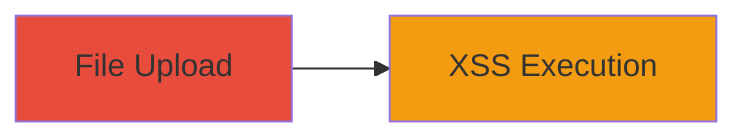

# Stored XSS via Insecure File Upload on xiaoai.mi.com

Multi-stage attack chain demonstrating a complete attack workflow.

## Chain Metrics Dashboard

| Metric | Value |
|--------|-------|
| Chain Status | Unverified |
| Total Steps | 1 |
| Execution Time | ~1 minutes |
| Skill Level | Beginner |
| Complexity | Low |
| Impact Level | Low |

## Attack Flow Visualization

## Prerequisites & Requirements

### Required Tools

- Browser with developer tools (e.g., Chrome DevTools)

### Target Environment

- Web platform
- Access to xiaoai.mi.com file upload feature
- No specific services/ports required beyond standard HTTPS (443)

### Initial Access Requirements

- Valid user account on xiaoai.mi.com (authenticated session)
- Network access to the internet
- No prior access needed beyond registration

## Detailed Attack Procedures

### Step 1: Exploit File Upload for Stored XSS
procedure: [[procedures/Exploit-Insecure-File-Upload-for-Stored-XSS]]

**Objective**: Upload a malicious file containing JavaScript payload to trigger stored self-XSS in the uploader's browser context.

**Instructions**: Navigate to the file upload feature on xiaoai.mi.com. Prepare a malicious file, such as an HTML file with an embedded script (e.g., ). Upload the file without proper validation, then access or view the uploaded file to execute the payload.

**Expected Output**: Alert box or script execution confirming XSS in the browser console.

**Success Indicators**:
- Malicious file uploads successfully without rejection
- Script executes upon viewing the uploaded content, visible in browser dev tools

## Attack Chain Summary

### Key Achievements

1. Successful upload of unsanitized file containing XSS payload
2. Execution of stored self-XSS affecting the uploader's session
3. Demonstration of vulnerability leading to potential script injection in user context

## Technique & Tactic Coverage

### MITRE ATT&CK Techniques

- [[JavaScript]]

### MITRE ATT&CK Tactics

- [[Execution]]

---
*Last updated: 2023-10-01T00:00:00Z*
